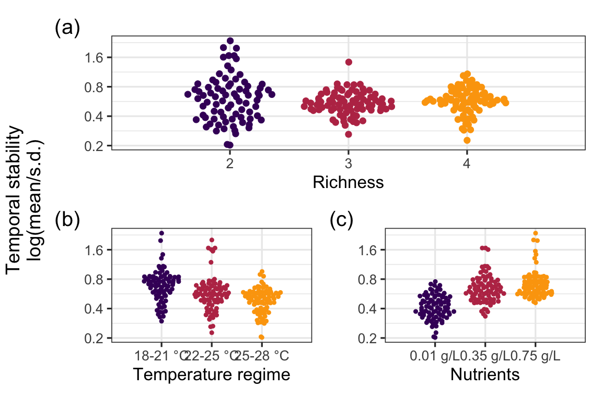
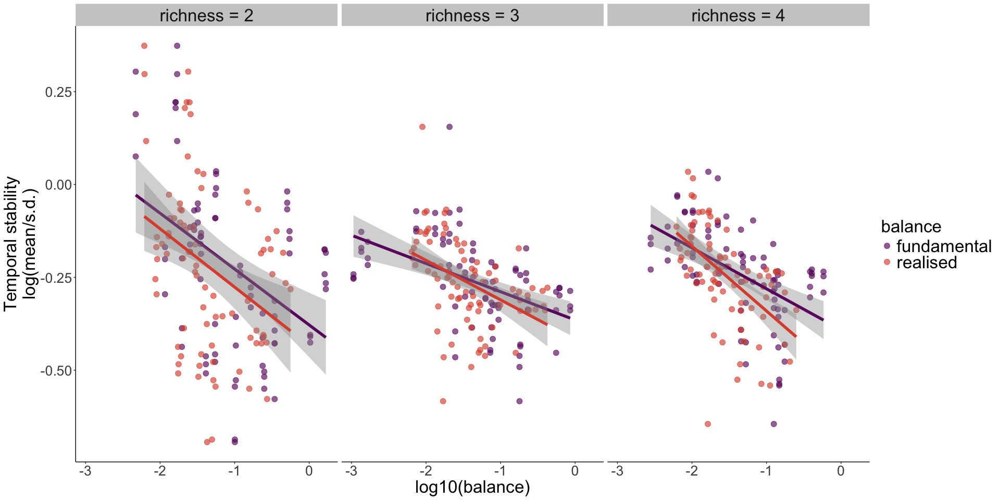
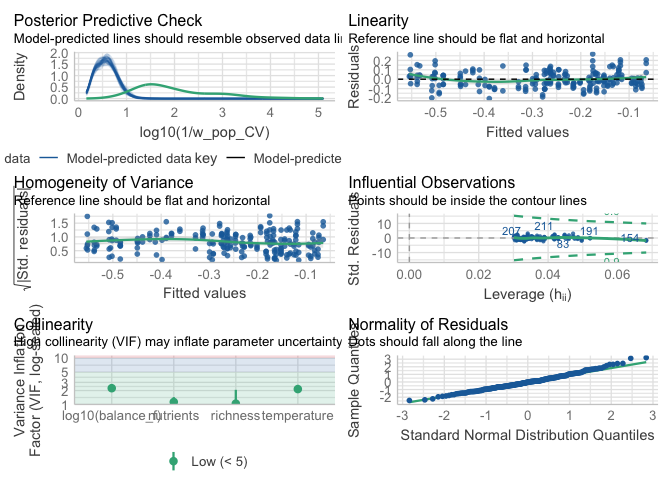
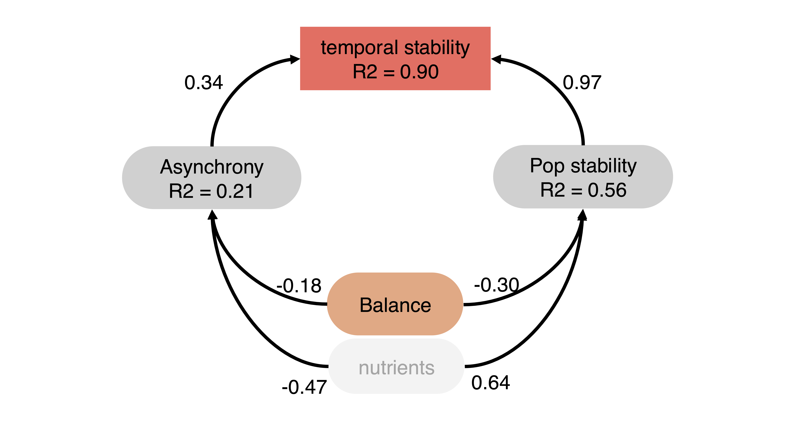
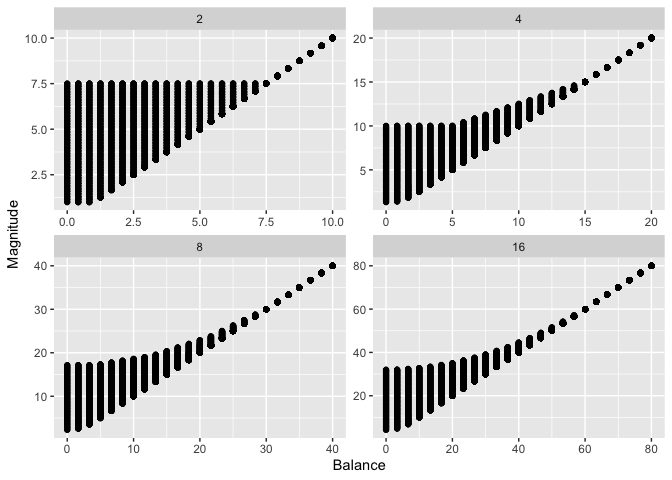
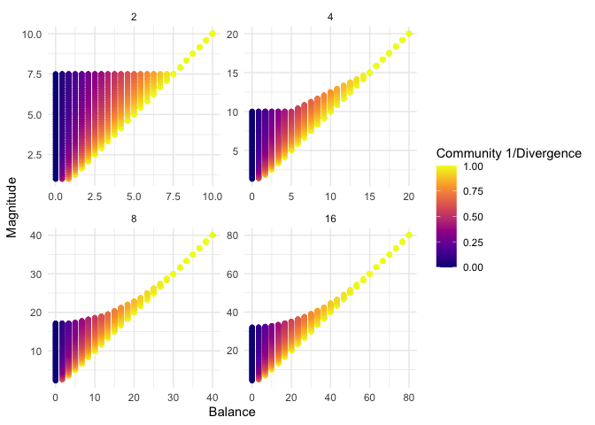

# Introduction

The purpose of this document is to provide a reproducible record of all analyses and figures in the main article. The main article is focused on the effect of response diversity on community stability in fluctuating environments. We are going to look at the effect of response diversity, richness, temperature and nutrients on community temporal stability. Specifically, we are going to look at the effect of fundamental balance (our measurement of stability) on temporal stability. Then, as response diversity is thought to stabilize temporal stability of aggregate community properties via asynchrony, we are going to look at the relationship between response diversity and asynchrony. 
Finally, as multiple evidence suggests that compensatory dynamics and temporal stability are determine by species interactions, we are going to analyse the effect of species interactions on stability to understand if they are more important than response diversity in driving temporal stability of community biomass.

This document is produced by an Rmarkdown file that includes code to reproduce from data all results presented in the main article.


# Load datasets, Data wrangling and balance calculation


``` r
divergence_df <- read_csv("Data/divergence_df.csv")
load("Data/dens_biomass_poly.RData")

dd_all_pred<-read.csv("Data/morph_dd_pred.csv")
dd_all_pred_nonoise<-read.csv("Data/morph_dd_pred_nonoise.csv")

load("Data/ciliate_traits.Rdata")

df_slopes <- read_csv("Data/df_slopes_cor.csv")

# needs to have id_new variable
ciliate_traits <- ciliate_traits %>%
  dplyr::mutate(
    # Remove dots from the date
    cleaned_date = gsub("\\.", "", date),
    # Extract the part of id after the underscore
    id_suffix = sub(".*_(.*)", "\\1", id),
    # Combine cleaned_date, id_suffix, and species_initial into a new variable
    id_new = paste0(cleaned_date, id_suffix, composition)
  ) %>%
  # Optionally, remove the intermediate columns to clean up
  dplyr::select(-cleaned_date, -id_suffix,-new_id)

uniqueN(ciliate_traits$id_new)==nrow(ciliate_traits) # all unique  ;)

id_dd<-full_join(dd_all_pred,dplyr::select(ciliate_traits,id_new,biomass),join_by("id_new"))


## add day variable

#create a day variable from the date variable

id_dd<-dplyr::mutate(id_dd,date=as.Date(date,format = "%d.%m.%y"))

earliest_date<-min(id_dd$date)
days_since_earliest<-as.numeric(id_dd$date-earliest_date)+1
id_dd<-id_dd%>%dplyr::mutate(day=days_since_earliest)

#create a summarised df on microcosm level with each species seperate
# Make sure, that we have n_frames and not N_frames
names(id_dd)[names(id_dd) == "N_frames"] <- "n_frames"

#extrapolation_factor <- 9.301902  # for 16 x magnification 
extrapolation_factor <- 9.828125  # for 25 x magnification 
video_biomass_species <- c( "C", "P", "S","D","L","T")

biomasses <- id_dd %>%
  dplyr::group_by( day,temperature,nutrients,sample_ID,composition,predict_spec) %>% # group  by xxx
  dplyr::summarize(
    biomass = sum(biomass * n_frames, na.rm = TRUE) / (1 * 125) # if not 3 videos corrections is done below with dens_factor
  ) %>%
  dplyr::mutate(
    biomass = biomass * extrapolation_factor,
    )

biomasses<-biomasses%>%dplyr::mutate(biomass=biomass*1000)

dd_ts_id<-biomasses

#fill up missing dates with biomass<-0

fill_dd<-expand.grid(sample_ID=unique(dd_ts_id$sample_ID),day=unique(dd_ts_id$day),predict_spec=unique(dd_ts_id$predict_spec))
complete_ts<-full_join(fill_dd,dd_ts_id,join_by(sample_ID,day,predict_spec))

complete_ts$biomass[is.na(complete_ts$biomass)]<-0
complete_ts<-complete_ts%>%dplyr::mutate(composition=sub("_.*", "", sample_ID))
complete_ts<-complete_ts %>%
  dplyr::mutate(temperature = sapply(strsplit(as.character(sample_ID), "_"), function(x) paste(x[3], x[4], sep = "-")))
complete_ts<- dplyr::mutate(complete_ts,nutrients = gsub(".*Nut(.*?)_.*", "\\1", sample_ID))

# Now remove wrong combinations of composition and predict_spec / predict_spec

complete_ts<- complete_ts %>%
  rowwise() %>%
  dplyr::filter(predict_spec %in% unlist(strsplit(composition, ""))) %>%
  ungroup()  
complete_ts<-dplyr::mutate(complete_ts,temperature=as.character(temperature),
                    nutrients=as.character(nutrients),
                    richness=nchar(composition))

complete_ts<-complete_ts%>%group_by(sample_ID,composition,day)%>%dplyr::mutate(tot_biomass=sum(biomass))
complete_ts<-complete_ts%>%dplyr::mutate(biom_contribution=biomass/tot_biomass)

df_biomass_mod <- complete_ts

complete_ts<-complete_ts%>%dplyr::mutate(temperature=paste0(temperature," °C"),
                                      nutrients=paste0(nutrients," g/L"))


# introduce slopes of 
names(df_slopes)[names(df_slopes)=="species_initial"]<-"predict_spec"

slope_ts<-full_join(dplyr::select(df_slopes,nutrients,predict_spec,temperature,slope),complete_ts)
slope_ts<-slope_ts%>%dplyr::mutate(w_slope=biom_contribution*slope,
                            sign=sign(slope))

slope_ts<-slope_ts%>%group_by(sample_ID,temperature,nutrients,richness,composition,day,tot_biomass)%>%dplyr::summarize(
  sum_w_slopes=abs(sum(w_slope)),
                   mean_abs_slope=mean(abs(slope)),
  sum_abs_slope=sum(abs(slope)),
  abs_sum_slope=abs(sum(slope)),
  symmetry=abs(sum(sign)))


slope_ts<-slope_ts%>%dplyr::mutate(richness=as.factor(richness))


##create new variable where it checks, where the last observation =0 is; with complete_ts
aggr_ts <- slope_ts %>%
  group_by( sample_ID) %>%
  arrange(day) %>%
  mutate(
    # Create a flag for non-zero tot_biomass
    non_zero_biomass = tot_biomass != 0,
    # Find the last non-zero day
    last_non_zero_day = ifelse(any(non_zero_biomass), max(day[non_zero_biomass], na.rm = TRUE), NA),
    # Find the first zero day after the last non-zero day
    first_zero_day = ifelse(
      !is.na(last_non_zero_day),
      min(day[!non_zero_biomass & day > last_non_zero_day], na.rm = TRUE),
      NA
    ),
    # Flag for days after the first zero day
    is_after_first_zero_day = ifelse(!is.na(first_zero_day), day > first_zero_day, FALSE)
  ) %>%
  ungroup()

aggr_ts<-aggr_ts%>%mutate(rep_var=sub("_[^_]+$", "", sample_ID))

biomass_ts<-aggr_ts%>%group_by(day,temperature,nutrients,richness)%>%summarize(tot_biom=mean(tot_biomass),se_tot_biom=sd(tot_biomass)/sqrt(as.numeric(length(tot_biomass))))
```


# Biomass

Let's have a look at the biomass dynamics in the different environmental treatments.

### tot biomass plot


 **Figure 1** : Community total biomass during the experiment in different environmental treatments. Different color represent richness levels.


# Main Results 

We now look at the main results of the experiment. We are going to look first at the effect of richness, temperature and nutrients on community temporal stability. Then, we are going to look at the relationship between divergence (original response diversity metric) and temporal stability. Finally, we are going to look at the relationship between response diversity and temporal stability.

In the whole analysis, we calculated the temporal stability of total community biomass as the inverse of the coefficient of variation (ICV) (i.e. $\frac{\sigma}{\mu}$). 


### Effect of T, N and R

**Figure 2**: Effects of richness (a), temperature (b), and nutrients (c) on community total biomass temporal stability.


We can see that richness does not have a clear effect on community temporal stability, while stability was higher at lower temperature, and nutrients increased community temporal stability.

### Effect of Divergence

We look at the relationship between divergence (our original response diversity metric) and stability


**Figure 3**: Relationship between Divergence and temporal stability of total community biomass.


Divergence is positively related to temporal stability, suggesting that response diversity promotes stability. However, the relationship between divergence and stability becomes weaker as richness increases. We think that this is due to divergence considering only the responses of the 2 most "responding" species. Thus, when species richness increases, disregarding the responses of the other species in the community except the 2 responding the most makes the relationship between response diversity and stability weaker. 

This is why, after running the experiment, we developed another metric to measure response diversity, which we called **balance**, and that is presented in the main text of the publication. 
Balance has several desirable features that makes it a more suitable metric than divergence: Independence of richness, higher predictive power, and accounts for the responses of all species in the community (as opposed to divergence that accounts for only the 2 most "responding" species).

Here, we provide extensive evidence of why balance is a better metric to measure response diversity than divergence, and thus justifying focusing the analysis around balance.

# Comparing Divergence and Balance

## Predictive power of Divergence and Balance

We first compare how well divergence and balance predict stability (predictive power). 


### Balance


``` r
# 

mod1 <- lm(data=complete_aggr,log10(stability)~log10(balance_f))

# Check model assumptions
#check_model(mod1)
```


### Divergence

``` r
mod2 <- lm(data=complete_aggr,log10(stability)~(divergence))

# Check model assumptions
#check_model(mod2)
```


**Table 1**: Comparison of model performance of divergence and balance as predictors of stability. Model 1 has balance as predictor and model 2 has divergence as predictor.
<table class="table" style="color: black; width: auto !important; margin-left: auto; margin-right: auto;">
 <thead>
  <tr>
   <th style="text-align:left;"> model </th>
   <th style="text-align:right;"> AIC </th>
   <th style="text-align:right;"> AICc </th>
   <th style="text-align:right;"> BIC </th>
   <th style="text-align:right;"> R2 </th>
   <th style="text-align:right;"> R2_adjusted </th>
   <th style="text-align:right;"> RMSE </th>
   <th style="text-align:right;"> Sigma </th>
  </tr>
 </thead>
<tbody>
  <tr>
   <td style="text-align:left;"> 1 </td>
   <td style="text-align:right;"> -89.27328 </td>
   <td style="text-align:right;"> -89.17286 </td>
   <td style="text-align:right;"> -78.79409 </td>
   <td style="text-align:right;"> 0.1917679 </td>
   <td style="text-align:right;"> 0.1884142 </td>
   <td style="text-align:right;"> 0.1510344 </td>
   <td style="text-align:right;"> 0.1516599 </td>
  </tr>
  <tr>
   <td style="text-align:left;"> 2 </td>
   <td style="text-align:right;"> -55.71579 </td>
   <td style="text-align:right;"> -55.61538 </td>
   <td style="text-align:right;"> -45.23661 </td>
   <td style="text-align:right;"> 0.0720796 </td>
   <td style="text-align:right;"> 0.0682293 </td>
   <td style="text-align:right;"> 0.1618316 </td>
   <td style="text-align:right;"> 0.1625017 </td>
  </tr>
</tbody>
</table>

A model with Balance as predictor performs better than one with divergence as predictor, and it explains more of the variance in stability than divergence.


Moreover, from **Figure 3**, it looks like divergence declines in performance as richness increases. Let's test this analytically.
To do than we build a linear model having stability as response variable and either log10(balance) or divergence as predictor for each richness level. We then extract the R squared of the models and their *standardised* estimates. (standardized estimates were calculated centering divergence and balance using the function scale()).


``` r
# getting model estimates for each richness level
lm_divergence_richness_E <- complete_aggr %>%
  nest(data = -richness) %>%
  mutate(
    model = map(data, ~ lm(log10(stability) ~ scale(divergence), data = .x)),
    results = map(model, broom::tidy)
  ) %>%
  unnest(results) %>% dplyr::filter(term=="scale(divergence)") 


# getting model R squared for each richness level

lm_divergence_richness_R <- complete_aggr %>%
  nest(data = -richness) %>%
  mutate(
    model = map(data, ~ lm(log10(stability) ~ scale(divergence), data = .x)),
    results = map(model, broom::glance)
  ) %>%
  unnest(results) 
```


``` r
# getting model estimatesf or each richness level
lm_balance_richness_E <- complete_aggr %>%
  nest(data = -richness) %>%
  mutate(
    model = map(data, ~ lm(log10(stability) ~ scale(log10(balance_f)), data = .x)),
    results = map(model, broom::tidy)
  ) %>%
  unnest(results) %>% dplyr::filter(term=="scale(log10(balance_f))") 


# getting model R squared for each richness level
lm_balance_richness_R <- complete_aggr %>%
  nest(data = -richness) %>%
  mutate(
    model = map(data, ~ lm(log10(stability) ~ scale(log10(balance_f)), data = .x)),
    results = map(model, broom::glance)
  ) %>%
  unnest(results) 
```


**Figure 4**: Performance comparison of divergence vs balance. In (a), the R squared of linear models for divergence and balance are shown for each richness level. In (b), the estimates of the linear models for divergence and balance are shown for each richness level.


We can see that the R squared of divergence as predictor of stability becomes smaller as richness increases, while the R squared of balance as predictor of stability does not (actually increases slightly). 


## Comparing unique explanatory power of balance and divergence

Now we build a linear model were stability is modeled as a function of balance and divergence. 
Then, we compared the variance explained by the full model compared to a model containing either only balance or only divergence.


### Full model - balance and divergence


``` r
lm_div_balance <- lm(data=complete_aggr,log10(stability)~log10(balance_f)+divergence)

# Check model assumptions
# check_model(lm_div_balance)
```


### model with only divergence

``` r
lm_div <- lm(data=complete_aggr,log10(stability)~divergence)

# Check model assumptions
# check_model(lm_div)
```


### model with only balance

``` r
lm_balance <- lm(data=complete_aggr,log10(stability)~log10(balance_f))

# Check model assumptions
# check_model(lm_balance)
```


### Comparision full model vs divergence only and balance only


**Table 2**: Comparison of model performance of divergence, balance and both as predictors of stability. Model 1 has both balance and divergence as predictors, model 2 has divergence as predictor, and model 3 has balance as predictor.
<table class="table" style="color: black; width: auto !important; margin-left: auto; margin-right: auto;">
 <thead>
  <tr>
   <th style="text-align:left;"> model </th>
   <th style="text-align:right;"> AIC </th>
   <th style="text-align:right;"> AICc </th>
   <th style="text-align:right;"> BIC </th>
   <th style="text-align:right;"> R2 </th>
   <th style="text-align:right;"> R2_adjusted </th>
   <th style="text-align:right;"> RMSE </th>
   <th style="text-align:right;"> Sigma </th>
  </tr>
 </thead>
<tbody>
  <tr>
   <td style="text-align:left;"> 1 </td>
   <td style="text-align:right;"> -88.97683 </td>
   <td style="text-align:right;"> -88.80876 </td>
   <td style="text-align:right;"> -75.00458 </td>
   <td style="text-align:right;"> 0.1974141 </td>
   <td style="text-align:right;"> 0.1907259 </td>
   <td style="text-align:right;"> 0.1505060 </td>
   <td style="text-align:right;"> 0.1514437 </td>
  </tr>
  <tr>
   <td style="text-align:left;"> 1 </td>
   <td style="text-align:right;"> -55.71579 </td>
   <td style="text-align:right;"> -55.61538 </td>
   <td style="text-align:right;"> -45.23661 </td>
   <td style="text-align:right;"> 0.0720796 </td>
   <td style="text-align:right;"> 0.0682293 </td>
   <td style="text-align:right;"> 0.1618316 </td>
   <td style="text-align:right;"> 0.1625017 </td>
  </tr>
  <tr>
   <td style="text-align:left;"> 2 </td>
   <td style="text-align:right;"> -89.27328 </td>
   <td style="text-align:right;"> -89.17286 </td>
   <td style="text-align:right;"> -78.79409 </td>
   <td style="text-align:right;"> 0.1917679 </td>
   <td style="text-align:right;"> 0.1884142 </td>
   <td style="text-align:right;"> 0.1510344 </td>
   <td style="text-align:right;"> 0.1516599 </td>
  </tr>
</tbody>
</table>


### Comparision full model vs balance only

**Table 3**: Anova table: a model with both balance and divergence as predictors is not significantly different from a model with only balance as predictor.

``` r
anova1 <- anova(lm_div_balance,  lm_balance)

# Convert to tidy format
anova_tidy1 <- broom::tidy(anova1)
# Display the tidy ANOVA table using gt with formatted p-values and adjusted size
anova_tidy1 %>%
  gt() %>%
  cols_label(
    term = "Term",
    sumsq = "Sum of Squares",
    df = "DF",
    statistic = "F Statistic",
    p.value = "p-value"
  ) %>%
  fmt_number(
    columns = vars(p.value),
    decimals = 3
  ) %>%
  tab_style(
    style = cell_text(weight = "bold"),
    locations = cells_body(
      columns = vars(p.value),
      rows = p.value < 0.05
    )
  ) %>%
  tab_options(
    table.width = px(800),            # Adjust table width (e.g., 400px)
    table.font.size = px(12),        # Adjust font size (e.g., 12px)
    data_row.padding = px(10)         # Adjust row padding (e.g., 4px for more compact rows)
  )
```

```{=html}
<div id="aslbplodqq" style="padding-left:0px;padding-right:0px;padding-top:10px;padding-bottom:10px;overflow-x:auto;overflow-y:auto;width:auto;height:auto;">
<style>#aslbplodqq table {
  font-family: system-ui, 'Segoe UI', Roboto, Helvetica, Arial, sans-serif, 'Apple Color Emoji', 'Segoe UI Emoji', 'Segoe UI Symbol', 'Noto Color Emoji';
  -webkit-font-smoothing: antialiased;
  -moz-osx-font-smoothing: grayscale;
}

#aslbplodqq thead, #aslbplodqq tbody, #aslbplodqq tfoot, #aslbplodqq tr, #aslbplodqq td, #aslbplodqq th {
  border-style: none;
}

#aslbplodqq p {
  margin: 0;
  padding: 0;
}

#aslbplodqq .gt_table {
  display: table;
  border-collapse: collapse;
  line-height: normal;
  margin-left: auto;
  margin-right: auto;
  color: #333333;
  font-size: 12px;
  font-weight: normal;
  font-style: normal;
  background-color: #FFFFFF;
  width: 800px;
  border-top-style: solid;
  border-top-width: 2px;
  border-top-color: #A8A8A8;
  border-right-style: none;
  border-right-width: 2px;
  border-right-color: #D3D3D3;
  border-bottom-style: solid;
  border-bottom-width: 2px;
  border-bottom-color: #A8A8A8;
  border-left-style: none;
  border-left-width: 2px;
  border-left-color: #D3D3D3;
}

#aslbplodqq .gt_caption {
  padding-top: 4px;
  padding-bottom: 4px;
}

#aslbplodqq .gt_title {
  color: #333333;
  font-size: 125%;
  font-weight: initial;
  padding-top: 4px;
  padding-bottom: 4px;
  padding-left: 5px;
  padding-right: 5px;
  border-bottom-color: #FFFFFF;
  border-bottom-width: 0;
}

#aslbplodqq .gt_subtitle {
  color: #333333;
  font-size: 85%;
  font-weight: initial;
  padding-top: 3px;
  padding-bottom: 5px;
  padding-left: 5px;
  padding-right: 5px;
  border-top-color: #FFFFFF;
  border-top-width: 0;
}

#aslbplodqq .gt_heading {
  background-color: #FFFFFF;
  text-align: center;
  border-bottom-color: #FFFFFF;
  border-left-style: none;
  border-left-width: 1px;
  border-left-color: #D3D3D3;
  border-right-style: none;
  border-right-width: 1px;
  border-right-color: #D3D3D3;
}

#aslbplodqq .gt_bottom_border {
  border-bottom-style: solid;
  border-bottom-width: 2px;
  border-bottom-color: #D3D3D3;
}

#aslbplodqq .gt_col_headings {
  border-top-style: solid;
  border-top-width: 2px;
  border-top-color: #D3D3D3;
  border-bottom-style: solid;
  border-bottom-width: 2px;
  border-bottom-color: #D3D3D3;
  border-left-style: none;
  border-left-width: 1px;
  border-left-color: #D3D3D3;
  border-right-style: none;
  border-right-width: 1px;
  border-right-color: #D3D3D3;
}

#aslbplodqq .gt_col_heading {
  color: #333333;
  background-color: #FFFFFF;
  font-size: 100%;
  font-weight: normal;
  text-transform: inherit;
  border-left-style: none;
  border-left-width: 1px;
  border-left-color: #D3D3D3;
  border-right-style: none;
  border-right-width: 1px;
  border-right-color: #D3D3D3;
  vertical-align: bottom;
  padding-top: 5px;
  padding-bottom: 6px;
  padding-left: 5px;
  padding-right: 5px;
  overflow-x: hidden;
}

#aslbplodqq .gt_column_spanner_outer {
  color: #333333;
  background-color: #FFFFFF;
  font-size: 100%;
  font-weight: normal;
  text-transform: inherit;
  padding-top: 0;
  padding-bottom: 0;
  padding-left: 4px;
  padding-right: 4px;
}

#aslbplodqq .gt_column_spanner_outer:first-child {
  padding-left: 0;
}

#aslbplodqq .gt_column_spanner_outer:last-child {
  padding-right: 0;
}

#aslbplodqq .gt_column_spanner {
  border-bottom-style: solid;
  border-bottom-width: 2px;
  border-bottom-color: #D3D3D3;
  vertical-align: bottom;
  padding-top: 5px;
  padding-bottom: 5px;
  overflow-x: hidden;
  display: inline-block;
  width: 100%;
}

#aslbplodqq .gt_spanner_row {
  border-bottom-style: hidden;
}

#aslbplodqq .gt_group_heading {
  padding-top: 8px;
  padding-bottom: 8px;
  padding-left: 5px;
  padding-right: 5px;
  color: #333333;
  background-color: #FFFFFF;
  font-size: 100%;
  font-weight: initial;
  text-transform: inherit;
  border-top-style: solid;
  border-top-width: 2px;
  border-top-color: #D3D3D3;
  border-bottom-style: solid;
  border-bottom-width: 2px;
  border-bottom-color: #D3D3D3;
  border-left-style: none;
  border-left-width: 1px;
  border-left-color: #D3D3D3;
  border-right-style: none;
  border-right-width: 1px;
  border-right-color: #D3D3D3;
  vertical-align: middle;
  text-align: left;
}

#aslbplodqq .gt_empty_group_heading {
  padding: 0.5px;
  color: #333333;
  background-color: #FFFFFF;
  font-size: 100%;
  font-weight: initial;
  border-top-style: solid;
  border-top-width: 2px;
  border-top-color: #D3D3D3;
  border-bottom-style: solid;
  border-bottom-width: 2px;
  border-bottom-color: #D3D3D3;
  vertical-align: middle;
}

#aslbplodqq .gt_from_md > :first-child {
  margin-top: 0;
}

#aslbplodqq .gt_from_md > :last-child {
  margin-bottom: 0;
}

#aslbplodqq .gt_row {
  padding-top: 10px;
  padding-bottom: 10px;
  padding-left: 5px;
  padding-right: 5px;
  margin: 10px;
  border-top-style: solid;
  border-top-width: 1px;
  border-top-color: #D3D3D3;
  border-left-style: none;
  border-left-width: 1px;
  border-left-color: #D3D3D3;
  border-right-style: none;
  border-right-width: 1px;
  border-right-color: #D3D3D3;
  vertical-align: middle;
  overflow-x: hidden;
}

#aslbplodqq .gt_stub {
  color: #333333;
  background-color: #FFFFFF;
  font-size: 100%;
  font-weight: initial;
  text-transform: inherit;
  border-right-style: solid;
  border-right-width: 2px;
  border-right-color: #D3D3D3;
  padding-left: 5px;
  padding-right: 5px;
}

#aslbplodqq .gt_stub_row_group {
  color: #333333;
  background-color: #FFFFFF;
  font-size: 100%;
  font-weight: initial;
  text-transform: inherit;
  border-right-style: solid;
  border-right-width: 2px;
  border-right-color: #D3D3D3;
  padding-left: 5px;
  padding-right: 5px;
  vertical-align: top;
}

#aslbplodqq .gt_row_group_first td {
  border-top-width: 2px;
}

#aslbplodqq .gt_row_group_first th {
  border-top-width: 2px;
}

#aslbplodqq .gt_summary_row {
  color: #333333;
  background-color: #FFFFFF;
  text-transform: inherit;
  padding-top: 8px;
  padding-bottom: 8px;
  padding-left: 5px;
  padding-right: 5px;
}

#aslbplodqq .gt_first_summary_row {
  border-top-style: solid;
  border-top-color: #D3D3D3;
}

#aslbplodqq .gt_first_summary_row.thick {
  border-top-width: 2px;
}

#aslbplodqq .gt_last_summary_row {
  padding-top: 8px;
  padding-bottom: 8px;
  padding-left: 5px;
  padding-right: 5px;
  border-bottom-style: solid;
  border-bottom-width: 2px;
  border-bottom-color: #D3D3D3;
}

#aslbplodqq .gt_grand_summary_row {
  color: #333333;
  background-color: #FFFFFF;
  text-transform: inherit;
  padding-top: 8px;
  padding-bottom: 8px;
  padding-left: 5px;
  padding-right: 5px;
}

#aslbplodqq .gt_first_grand_summary_row {
  padding-top: 8px;
  padding-bottom: 8px;
  padding-left: 5px;
  padding-right: 5px;
  border-top-style: double;
  border-top-width: 6px;
  border-top-color: #D3D3D3;
}

#aslbplodqq .gt_last_grand_summary_row_top {
  padding-top: 8px;
  padding-bottom: 8px;
  padding-left: 5px;
  padding-right: 5px;
  border-bottom-style: double;
  border-bottom-width: 6px;
  border-bottom-color: #D3D3D3;
}

#aslbplodqq .gt_striped {
  background-color: rgba(128, 128, 128, 0.05);
}

#aslbplodqq .gt_table_body {
  border-top-style: solid;
  border-top-width: 2px;
  border-top-color: #D3D3D3;
  border-bottom-style: solid;
  border-bottom-width: 2px;
  border-bottom-color: #D3D3D3;
}

#aslbplodqq .gt_footnotes {
  color: #333333;
  background-color: #FFFFFF;
  border-bottom-style: none;
  border-bottom-width: 2px;
  border-bottom-color: #D3D3D3;
  border-left-style: none;
  border-left-width: 2px;
  border-left-color: #D3D3D3;
  border-right-style: none;
  border-right-width: 2px;
  border-right-color: #D3D3D3;
}

#aslbplodqq .gt_footnote {
  margin: 0px;
  font-size: 90%;
  padding-top: 4px;
  padding-bottom: 4px;
  padding-left: 5px;
  padding-right: 5px;
}

#aslbplodqq .gt_sourcenotes {
  color: #333333;
  background-color: #FFFFFF;
  border-bottom-style: none;
  border-bottom-width: 2px;
  border-bottom-color: #D3D3D3;
  border-left-style: none;
  border-left-width: 2px;
  border-left-color: #D3D3D3;
  border-right-style: none;
  border-right-width: 2px;
  border-right-color: #D3D3D3;
}

#aslbplodqq .gt_sourcenote {
  font-size: 90%;
  padding-top: 4px;
  padding-bottom: 4px;
  padding-left: 5px;
  padding-right: 5px;
}

#aslbplodqq .gt_left {
  text-align: left;
}

#aslbplodqq .gt_center {
  text-align: center;
}

#aslbplodqq .gt_right {
  text-align: right;
  font-variant-numeric: tabular-nums;
}

#aslbplodqq .gt_font_normal {
  font-weight: normal;
}

#aslbplodqq .gt_font_bold {
  font-weight: bold;
}

#aslbplodqq .gt_font_italic {
  font-style: italic;
}

#aslbplodqq .gt_super {
  font-size: 65%;
}

#aslbplodqq .gt_footnote_marks {
  font-size: 75%;
  vertical-align: 0.4em;
  position: initial;
}

#aslbplodqq .gt_asterisk {
  font-size: 100%;
  vertical-align: 0;
}

#aslbplodqq .gt_indent_1 {
  text-indent: 5px;
}

#aslbplodqq .gt_indent_2 {
  text-indent: 10px;
}

#aslbplodqq .gt_indent_3 {
  text-indent: 15px;
}

#aslbplodqq .gt_indent_4 {
  text-indent: 20px;
}

#aslbplodqq .gt_indent_5 {
  text-indent: 25px;
}

#aslbplodqq .katex-display {
  display: inline-flex !important;
  margin-bottom: 0.75em !important;
}

#aslbplodqq div.Reactable > div.rt-table > div.rt-thead > div.rt-tr.rt-tr-group-header > div.rt-th-group:after {
  height: 0px !important;
}
</style>
<table class="gt_table" data-quarto-disable-processing="false" data-quarto-bootstrap="false">
  <thead>
    <tr class="gt_col_headings">
      <th class="gt_col_heading gt_columns_bottom_border gt_left" rowspan="1" colspan="1" scope="col" id="term">Term</th>
      <th class="gt_col_heading gt_columns_bottom_border gt_right" rowspan="1" colspan="1" scope="col" id="df.residual">df.residual</th>
      <th class="gt_col_heading gt_columns_bottom_border gt_right" rowspan="1" colspan="1" scope="col" id="rss">rss</th>
      <th class="gt_col_heading gt_columns_bottom_border gt_right" rowspan="1" colspan="1" scope="col" id="df">DF</th>
      <th class="gt_col_heading gt_columns_bottom_border gt_right" rowspan="1" colspan="1" scope="col" id="sumsq">Sum of Squares</th>
      <th class="gt_col_heading gt_columns_bottom_border gt_right" rowspan="1" colspan="1" scope="col" id="statistic">F Statistic</th>
      <th class="gt_col_heading gt_columns_bottom_border gt_right" rowspan="1" colspan="1" scope="col" id="p.value">p-value</th>
    </tr>
  </thead>
  <tbody class="gt_table_body">
    <tr><td headers="term" class="gt_row gt_left">log10(stability) ~ log10(balance_f) + divergence</td>
<td headers="df.residual" class="gt_row gt_right">240</td>
<td headers="rss" class="gt_row gt_right">5.504447</td>
<td headers="df" class="gt_row gt_right">NA</td>
<td headers="sumsq" class="gt_row gt_right">NA</td>
<td headers="statistic" class="gt_row gt_right">NA</td>
<td headers="p.value" class="gt_row gt_right">NA</td></tr>
    <tr><td headers="term" class="gt_row gt_left">log10(stability) ~ log10(balance_f)</td>
<td headers="df.residual" class="gt_row gt_right">241</td>
<td headers="rss" class="gt_row gt_right">5.543171</td>
<td headers="df" class="gt_row gt_right">-1</td>
<td headers="sumsq" class="gt_row gt_right">-0.03872444</td>
<td headers="statistic" class="gt_row gt_right">1.688429</td>
<td headers="p.value" class="gt_row gt_right">0.195</td></tr>
  </tbody>
  
  
</table>
</div>
```


### Comparision full model vs divergence only and divergence only

**Table 4**: Anova table: a model with both balance and divergence as predictors is significantly better from a model with only divergence as predictor.

``` r
anova2 <- anova(lm_div_balance,  lm_div)


anova_tidy2 <- broom::tidy(anova2)
# Display the tidy ANOVA table using gt with formatted p-values and adjusted size
anova_tidy2 %>%
  gt() %>%
  cols_label(
    term = "Term",
    sumsq = "Sum of Squares",
    df = "DF",
    statistic = "F Statistic",
    p.value = "p-value"
  ) %>%
  fmt_number(
    columns = vars(p.value),
    decimals = 3
  ) %>%
  tab_style(
    style = cell_text(weight = "bold"),
    locations = cells_body(
      columns = vars(p.value),
      rows = p.value < 0.05
    )
  ) %>%
  tab_options(
    table.width = px(800),            # Adjust table width (e.g., 400px)
    table.font.size = px(12),        # Adjust font size (e.g., 12px)
    data_row.padding = px(10)         # Adjust row padding (e.g., 4px for more compact rows)
  )
```

```{=html}
<div id="wviozowvaa" style="padding-left:0px;padding-right:0px;padding-top:10px;padding-bottom:10px;overflow-x:auto;overflow-y:auto;width:auto;height:auto;">
<style>#wviozowvaa table {
  font-family: system-ui, 'Segoe UI', Roboto, Helvetica, Arial, sans-serif, 'Apple Color Emoji', 'Segoe UI Emoji', 'Segoe UI Symbol', 'Noto Color Emoji';
  -webkit-font-smoothing: antialiased;
  -moz-osx-font-smoothing: grayscale;
}

#wviozowvaa thead, #wviozowvaa tbody, #wviozowvaa tfoot, #wviozowvaa tr, #wviozowvaa td, #wviozowvaa th {
  border-style: none;
}

#wviozowvaa p {
  margin: 0;
  padding: 0;
}

#wviozowvaa .gt_table {
  display: table;
  border-collapse: collapse;
  line-height: normal;
  margin-left: auto;
  margin-right: auto;
  color: #333333;
  font-size: 12px;
  font-weight: normal;
  font-style: normal;
  background-color: #FFFFFF;
  width: 800px;
  border-top-style: solid;
  border-top-width: 2px;
  border-top-color: #A8A8A8;
  border-right-style: none;
  border-right-width: 2px;
  border-right-color: #D3D3D3;
  border-bottom-style: solid;
  border-bottom-width: 2px;
  border-bottom-color: #A8A8A8;
  border-left-style: none;
  border-left-width: 2px;
  border-left-color: #D3D3D3;
}

#wviozowvaa .gt_caption {
  padding-top: 4px;
  padding-bottom: 4px;
}

#wviozowvaa .gt_title {
  color: #333333;
  font-size: 125%;
  font-weight: initial;
  padding-top: 4px;
  padding-bottom: 4px;
  padding-left: 5px;
  padding-right: 5px;
  border-bottom-color: #FFFFFF;
  border-bottom-width: 0;
}

#wviozowvaa .gt_subtitle {
  color: #333333;
  font-size: 85%;
  font-weight: initial;
  padding-top: 3px;
  padding-bottom: 5px;
  padding-left: 5px;
  padding-right: 5px;
  border-top-color: #FFFFFF;
  border-top-width: 0;
}

#wviozowvaa .gt_heading {
  background-color: #FFFFFF;
  text-align: center;
  border-bottom-color: #FFFFFF;
  border-left-style: none;
  border-left-width: 1px;
  border-left-color: #D3D3D3;
  border-right-style: none;
  border-right-width: 1px;
  border-right-color: #D3D3D3;
}

#wviozowvaa .gt_bottom_border {
  border-bottom-style: solid;
  border-bottom-width: 2px;
  border-bottom-color: #D3D3D3;
}

#wviozowvaa .gt_col_headings {
  border-top-style: solid;
  border-top-width: 2px;
  border-top-color: #D3D3D3;
  border-bottom-style: solid;
  border-bottom-width: 2px;
  border-bottom-color: #D3D3D3;
  border-left-style: none;
  border-left-width: 1px;
  border-left-color: #D3D3D3;
  border-right-style: none;
  border-right-width: 1px;
  border-right-color: #D3D3D3;
}

#wviozowvaa .gt_col_heading {
  color: #333333;
  background-color: #FFFFFF;
  font-size: 100%;
  font-weight: normal;
  text-transform: inherit;
  border-left-style: none;
  border-left-width: 1px;
  border-left-color: #D3D3D3;
  border-right-style: none;
  border-right-width: 1px;
  border-right-color: #D3D3D3;
  vertical-align: bottom;
  padding-top: 5px;
  padding-bottom: 6px;
  padding-left: 5px;
  padding-right: 5px;
  overflow-x: hidden;
}

#wviozowvaa .gt_column_spanner_outer {
  color: #333333;
  background-color: #FFFFFF;
  font-size: 100%;
  font-weight: normal;
  text-transform: inherit;
  padding-top: 0;
  padding-bottom: 0;
  padding-left: 4px;
  padding-right: 4px;
}

#wviozowvaa .gt_column_spanner_outer:first-child {
  padding-left: 0;
}

#wviozowvaa .gt_column_spanner_outer:last-child {
  padding-right: 0;
}

#wviozowvaa .gt_column_spanner {
  border-bottom-style: solid;
  border-bottom-width: 2px;
  border-bottom-color: #D3D3D3;
  vertical-align: bottom;
  padding-top: 5px;
  padding-bottom: 5px;
  overflow-x: hidden;
  display: inline-block;
  width: 100%;
}

#wviozowvaa .gt_spanner_row {
  border-bottom-style: hidden;
}

#wviozowvaa .gt_group_heading {
  padding-top: 8px;
  padding-bottom: 8px;
  padding-left: 5px;
  padding-right: 5px;
  color: #333333;
  background-color: #FFFFFF;
  font-size: 100%;
  font-weight: initial;
  text-transform: inherit;
  border-top-style: solid;
  border-top-width: 2px;
  border-top-color: #D3D3D3;
  border-bottom-style: solid;
  border-bottom-width: 2px;
  border-bottom-color: #D3D3D3;
  border-left-style: none;
  border-left-width: 1px;
  border-left-color: #D3D3D3;
  border-right-style: none;
  border-right-width: 1px;
  border-right-color: #D3D3D3;
  vertical-align: middle;
  text-align: left;
}

#wviozowvaa .gt_empty_group_heading {
  padding: 0.5px;
  color: #333333;
  background-color: #FFFFFF;
  font-size: 100%;
  font-weight: initial;
  border-top-style: solid;
  border-top-width: 2px;
  border-top-color: #D3D3D3;
  border-bottom-style: solid;
  border-bottom-width: 2px;
  border-bottom-color: #D3D3D3;
  vertical-align: middle;
}

#wviozowvaa .gt_from_md > :first-child {
  margin-top: 0;
}

#wviozowvaa .gt_from_md > :last-child {
  margin-bottom: 0;
}

#wviozowvaa .gt_row {
  padding-top: 10px;
  padding-bottom: 10px;
  padding-left: 5px;
  padding-right: 5px;
  margin: 10px;
  border-top-style: solid;
  border-top-width: 1px;
  border-top-color: #D3D3D3;
  border-left-style: none;
  border-left-width: 1px;
  border-left-color: #D3D3D3;
  border-right-style: none;
  border-right-width: 1px;
  border-right-color: #D3D3D3;
  vertical-align: middle;
  overflow-x: hidden;
}

#wviozowvaa .gt_stub {
  color: #333333;
  background-color: #FFFFFF;
  font-size: 100%;
  font-weight: initial;
  text-transform: inherit;
  border-right-style: solid;
  border-right-width: 2px;
  border-right-color: #D3D3D3;
  padding-left: 5px;
  padding-right: 5px;
}

#wviozowvaa .gt_stub_row_group {
  color: #333333;
  background-color: #FFFFFF;
  font-size: 100%;
  font-weight: initial;
  text-transform: inherit;
  border-right-style: solid;
  border-right-width: 2px;
  border-right-color: #D3D3D3;
  padding-left: 5px;
  padding-right: 5px;
  vertical-align: top;
}

#wviozowvaa .gt_row_group_first td {
  border-top-width: 2px;
}

#wviozowvaa .gt_row_group_first th {
  border-top-width: 2px;
}

#wviozowvaa .gt_summary_row {
  color: #333333;
  background-color: #FFFFFF;
  text-transform: inherit;
  padding-top: 8px;
  padding-bottom: 8px;
  padding-left: 5px;
  padding-right: 5px;
}

#wviozowvaa .gt_first_summary_row {
  border-top-style: solid;
  border-top-color: #D3D3D3;
}

#wviozowvaa .gt_first_summary_row.thick {
  border-top-width: 2px;
}

#wviozowvaa .gt_last_summary_row {
  padding-top: 8px;
  padding-bottom: 8px;
  padding-left: 5px;
  padding-right: 5px;
  border-bottom-style: solid;
  border-bottom-width: 2px;
  border-bottom-color: #D3D3D3;
}

#wviozowvaa .gt_grand_summary_row {
  color: #333333;
  background-color: #FFFFFF;
  text-transform: inherit;
  padding-top: 8px;
  padding-bottom: 8px;
  padding-left: 5px;
  padding-right: 5px;
}

#wviozowvaa .gt_first_grand_summary_row {
  padding-top: 8px;
  padding-bottom: 8px;
  padding-left: 5px;
  padding-right: 5px;
  border-top-style: double;
  border-top-width: 6px;
  border-top-color: #D3D3D3;
}

#wviozowvaa .gt_last_grand_summary_row_top {
  padding-top: 8px;
  padding-bottom: 8px;
  padding-left: 5px;
  padding-right: 5px;
  border-bottom-style: double;
  border-bottom-width: 6px;
  border-bottom-color: #D3D3D3;
}

#wviozowvaa .gt_striped {
  background-color: rgba(128, 128, 128, 0.05);
}

#wviozowvaa .gt_table_body {
  border-top-style: solid;
  border-top-width: 2px;
  border-top-color: #D3D3D3;
  border-bottom-style: solid;
  border-bottom-width: 2px;
  border-bottom-color: #D3D3D3;
}

#wviozowvaa .gt_footnotes {
  color: #333333;
  background-color: #FFFFFF;
  border-bottom-style: none;
  border-bottom-width: 2px;
  border-bottom-color: #D3D3D3;
  border-left-style: none;
  border-left-width: 2px;
  border-left-color: #D3D3D3;
  border-right-style: none;
  border-right-width: 2px;
  border-right-color: #D3D3D3;
}

#wviozowvaa .gt_footnote {
  margin: 0px;
  font-size: 90%;
  padding-top: 4px;
  padding-bottom: 4px;
  padding-left: 5px;
  padding-right: 5px;
}

#wviozowvaa .gt_sourcenotes {
  color: #333333;
  background-color: #FFFFFF;
  border-bottom-style: none;
  border-bottom-width: 2px;
  border-bottom-color: #D3D3D3;
  border-left-style: none;
  border-left-width: 2px;
  border-left-color: #D3D3D3;
  border-right-style: none;
  border-right-width: 2px;
  border-right-color: #D3D3D3;
}

#wviozowvaa .gt_sourcenote {
  font-size: 90%;
  padding-top: 4px;
  padding-bottom: 4px;
  padding-left: 5px;
  padding-right: 5px;
}

#wviozowvaa .gt_left {
  text-align: left;
}

#wviozowvaa .gt_center {
  text-align: center;
}

#wviozowvaa .gt_right {
  text-align: right;
  font-variant-numeric: tabular-nums;
}

#wviozowvaa .gt_font_normal {
  font-weight: normal;
}

#wviozowvaa .gt_font_bold {
  font-weight: bold;
}

#wviozowvaa .gt_font_italic {
  font-style: italic;
}

#wviozowvaa .gt_super {
  font-size: 65%;
}

#wviozowvaa .gt_footnote_marks {
  font-size: 75%;
  vertical-align: 0.4em;
  position: initial;
}

#wviozowvaa .gt_asterisk {
  font-size: 100%;
  vertical-align: 0;
}

#wviozowvaa .gt_indent_1 {
  text-indent: 5px;
}

#wviozowvaa .gt_indent_2 {
  text-indent: 10px;
}

#wviozowvaa .gt_indent_3 {
  text-indent: 15px;
}

#wviozowvaa .gt_indent_4 {
  text-indent: 20px;
}

#wviozowvaa .gt_indent_5 {
  text-indent: 25px;
}

#wviozowvaa .katex-display {
  display: inline-flex !important;
  margin-bottom: 0.75em !important;
}

#wviozowvaa div.Reactable > div.rt-table > div.rt-thead > div.rt-tr.rt-tr-group-header > div.rt-th-group:after {
  height: 0px !important;
}
</style>
<table class="gt_table" data-quarto-disable-processing="false" data-quarto-bootstrap="false">
  <thead>
    <tr class="gt_col_headings">
      <th class="gt_col_heading gt_columns_bottom_border gt_left" rowspan="1" colspan="1" scope="col" id="term">Term</th>
      <th class="gt_col_heading gt_columns_bottom_border gt_right" rowspan="1" colspan="1" scope="col" id="df.residual">df.residual</th>
      <th class="gt_col_heading gt_columns_bottom_border gt_right" rowspan="1" colspan="1" scope="col" id="rss">rss</th>
      <th class="gt_col_heading gt_columns_bottom_border gt_right" rowspan="1" colspan="1" scope="col" id="df">DF</th>
      <th class="gt_col_heading gt_columns_bottom_border gt_right" rowspan="1" colspan="1" scope="col" id="sumsq">Sum of Squares</th>
      <th class="gt_col_heading gt_columns_bottom_border gt_right" rowspan="1" colspan="1" scope="col" id="statistic">F Statistic</th>
      <th class="gt_col_heading gt_columns_bottom_border gt_right" rowspan="1" colspan="1" scope="col" id="p.value">p-value</th>
    </tr>
  </thead>
  <tbody class="gt_table_body">
    <tr><td headers="term" class="gt_row gt_left">log10(stability) ~ log10(balance_f) + divergence</td>
<td headers="df.residual" class="gt_row gt_right">240</td>
<td headers="rss" class="gt_row gt_right">5.504447</td>
<td headers="df" class="gt_row gt_right">NA</td>
<td headers="sumsq" class="gt_row gt_right">NA</td>
<td headers="statistic" class="gt_row gt_right">NA</td>
<td headers="p.value" class="gt_row gt_right">NA</td></tr>
    <tr><td headers="term" class="gt_row gt_left">log10(stability) ~ divergence</td>
<td headers="df.residual" class="gt_row gt_right">241</td>
<td headers="rss" class="gt_row gt_right">6.364040</td>
<td headers="df" class="gt_row gt_right">-1</td>
<td headers="sumsq" class="gt_row gt_right">-0.8595933</td>
<td headers="statistic" class="gt_row gt_right">37.47922</td>
<td headers="p.value" class="gt_row gt_right" style="font-weight: bold;">0.000</td></tr>
  </tbody>
  
  
</table>
</div>
```

Overall, balance explains more of the variance in stability than divergence, and there is virtually no difference between a model containing only balance and the full model.


## Interaction divergence and richness

Richness had to be transformed to numeric and to be centered to avoid collinearity with divergence


``` r
lm_rich_div <- lm(data=complete_aggr,log10(stability)~divergence*scale(as.numeric(richness)))

# check model assumptions
# check_model(lm_rich_div)
```


**Table 5**: Type III anova table of the model with divergence and richness as predictors of stability.

``` r
anova3 <- car::Anova(lm_rich_div, type = "III")

anova_tidy3 <- broom::tidy(anova3)
# Display the tidy ANOVA table using gt with formatted p-values and adjusted size
anova_tidy3 %>%
  gt() %>%
  cols_label(
    term = "Term",
    sumsq = "Sum of Squares",
    df = "DF",
    statistic = "F Statistic",
    p.value = "p-value"
  ) %>%
  fmt_number(
    columns = vars(p.value),
    decimals = 3
  ) %>%
  tab_style(
    style = cell_text(weight = "bold"),
    locations = cells_body(
      columns = vars(p.value),
      rows = p.value < 0.05
    )
  ) %>%
  tab_options(
    table.width = px(800),            # Adjust table width (e.g., 400px)
    table.font.size = px(12),        # Adjust font size (e.g., 12px)
    data_row.padding = px(10)         # Adjust row padding (e.g., 4px for more compact rows)
  )
```

```{=html}
<div id="lrlfyduaqn" style="padding-left:0px;padding-right:0px;padding-top:10px;padding-bottom:10px;overflow-x:auto;overflow-y:auto;width:auto;height:auto;">
<style>#lrlfyduaqn table {
  font-family: system-ui, 'Segoe UI', Roboto, Helvetica, Arial, sans-serif, 'Apple Color Emoji', 'Segoe UI Emoji', 'Segoe UI Symbol', 'Noto Color Emoji';
  -webkit-font-smoothing: antialiased;
  -moz-osx-font-smoothing: grayscale;
}

#lrlfyduaqn thead, #lrlfyduaqn tbody, #lrlfyduaqn tfoot, #lrlfyduaqn tr, #lrlfyduaqn td, #lrlfyduaqn th {
  border-style: none;
}

#lrlfyduaqn p {
  margin: 0;
  padding: 0;
}

#lrlfyduaqn .gt_table {
  display: table;
  border-collapse: collapse;
  line-height: normal;
  margin-left: auto;
  margin-right: auto;
  color: #333333;
  font-size: 12px;
  font-weight: normal;
  font-style: normal;
  background-color: #FFFFFF;
  width: 800px;
  border-top-style: solid;
  border-top-width: 2px;
  border-top-color: #A8A8A8;
  border-right-style: none;
  border-right-width: 2px;
  border-right-color: #D3D3D3;
  border-bottom-style: solid;
  border-bottom-width: 2px;
  border-bottom-color: #A8A8A8;
  border-left-style: none;
  border-left-width: 2px;
  border-left-color: #D3D3D3;
}

#lrlfyduaqn .gt_caption {
  padding-top: 4px;
  padding-bottom: 4px;
}

#lrlfyduaqn .gt_title {
  color: #333333;
  font-size: 125%;
  font-weight: initial;
  padding-top: 4px;
  padding-bottom: 4px;
  padding-left: 5px;
  padding-right: 5px;
  border-bottom-color: #FFFFFF;
  border-bottom-width: 0;
}

#lrlfyduaqn .gt_subtitle {
  color: #333333;
  font-size: 85%;
  font-weight: initial;
  padding-top: 3px;
  padding-bottom: 5px;
  padding-left: 5px;
  padding-right: 5px;
  border-top-color: #FFFFFF;
  border-top-width: 0;
}

#lrlfyduaqn .gt_heading {
  background-color: #FFFFFF;
  text-align: center;
  border-bottom-color: #FFFFFF;
  border-left-style: none;
  border-left-width: 1px;
  border-left-color: #D3D3D3;
  border-right-style: none;
  border-right-width: 1px;
  border-right-color: #D3D3D3;
}

#lrlfyduaqn .gt_bottom_border {
  border-bottom-style: solid;
  border-bottom-width: 2px;
  border-bottom-color: #D3D3D3;
}

#lrlfyduaqn .gt_col_headings {
  border-top-style: solid;
  border-top-width: 2px;
  border-top-color: #D3D3D3;
  border-bottom-style: solid;
  border-bottom-width: 2px;
  border-bottom-color: #D3D3D3;
  border-left-style: none;
  border-left-width: 1px;
  border-left-color: #D3D3D3;
  border-right-style: none;
  border-right-width: 1px;
  border-right-color: #D3D3D3;
}

#lrlfyduaqn .gt_col_heading {
  color: #333333;
  background-color: #FFFFFF;
  font-size: 100%;
  font-weight: normal;
  text-transform: inherit;
  border-left-style: none;
  border-left-width: 1px;
  border-left-color: #D3D3D3;
  border-right-style: none;
  border-right-width: 1px;
  border-right-color: #D3D3D3;
  vertical-align: bottom;
  padding-top: 5px;
  padding-bottom: 6px;
  padding-left: 5px;
  padding-right: 5px;
  overflow-x: hidden;
}

#lrlfyduaqn .gt_column_spanner_outer {
  color: #333333;
  background-color: #FFFFFF;
  font-size: 100%;
  font-weight: normal;
  text-transform: inherit;
  padding-top: 0;
  padding-bottom: 0;
  padding-left: 4px;
  padding-right: 4px;
}

#lrlfyduaqn .gt_column_spanner_outer:first-child {
  padding-left: 0;
}

#lrlfyduaqn .gt_column_spanner_outer:last-child {
  padding-right: 0;
}

#lrlfyduaqn .gt_column_spanner {
  border-bottom-style: solid;
  border-bottom-width: 2px;
  border-bottom-color: #D3D3D3;
  vertical-align: bottom;
  padding-top: 5px;
  padding-bottom: 5px;
  overflow-x: hidden;
  display: inline-block;
  width: 100%;
}

#lrlfyduaqn .gt_spanner_row {
  border-bottom-style: hidden;
}

#lrlfyduaqn .gt_group_heading {
  padding-top: 8px;
  padding-bottom: 8px;
  padding-left: 5px;
  padding-right: 5px;
  color: #333333;
  background-color: #FFFFFF;
  font-size: 100%;
  font-weight: initial;
  text-transform: inherit;
  border-top-style: solid;
  border-top-width: 2px;
  border-top-color: #D3D3D3;
  border-bottom-style: solid;
  border-bottom-width: 2px;
  border-bottom-color: #D3D3D3;
  border-left-style: none;
  border-left-width: 1px;
  border-left-color: #D3D3D3;
  border-right-style: none;
  border-right-width: 1px;
  border-right-color: #D3D3D3;
  vertical-align: middle;
  text-align: left;
}

#lrlfyduaqn .gt_empty_group_heading {
  padding: 0.5px;
  color: #333333;
  background-color: #FFFFFF;
  font-size: 100%;
  font-weight: initial;
  border-top-style: solid;
  border-top-width: 2px;
  border-top-color: #D3D3D3;
  border-bottom-style: solid;
  border-bottom-width: 2px;
  border-bottom-color: #D3D3D3;
  vertical-align: middle;
}

#lrlfyduaqn .gt_from_md > :first-child {
  margin-top: 0;
}

#lrlfyduaqn .gt_from_md > :last-child {
  margin-bottom: 0;
}

#lrlfyduaqn .gt_row {
  padding-top: 10px;
  padding-bottom: 10px;
  padding-left: 5px;
  padding-right: 5px;
  margin: 10px;
  border-top-style: solid;
  border-top-width: 1px;
  border-top-color: #D3D3D3;
  border-left-style: none;
  border-left-width: 1px;
  border-left-color: #D3D3D3;
  border-right-style: none;
  border-right-width: 1px;
  border-right-color: #D3D3D3;
  vertical-align: middle;
  overflow-x: hidden;
}

#lrlfyduaqn .gt_stub {
  color: #333333;
  background-color: #FFFFFF;
  font-size: 100%;
  font-weight: initial;
  text-transform: inherit;
  border-right-style: solid;
  border-right-width: 2px;
  border-right-color: #D3D3D3;
  padding-left: 5px;
  padding-right: 5px;
}

#lrlfyduaqn .gt_stub_row_group {
  color: #333333;
  background-color: #FFFFFF;
  font-size: 100%;
  font-weight: initial;
  text-transform: inherit;
  border-right-style: solid;
  border-right-width: 2px;
  border-right-color: #D3D3D3;
  padding-left: 5px;
  padding-right: 5px;
  vertical-align: top;
}

#lrlfyduaqn .gt_row_group_first td {
  border-top-width: 2px;
}

#lrlfyduaqn .gt_row_group_first th {
  border-top-width: 2px;
}

#lrlfyduaqn .gt_summary_row {
  color: #333333;
  background-color: #FFFFFF;
  text-transform: inherit;
  padding-top: 8px;
  padding-bottom: 8px;
  padding-left: 5px;
  padding-right: 5px;
}

#lrlfyduaqn .gt_first_summary_row {
  border-top-style: solid;
  border-top-color: #D3D3D3;
}

#lrlfyduaqn .gt_first_summary_row.thick {
  border-top-width: 2px;
}

#lrlfyduaqn .gt_last_summary_row {
  padding-top: 8px;
  padding-bottom: 8px;
  padding-left: 5px;
  padding-right: 5px;
  border-bottom-style: solid;
  border-bottom-width: 2px;
  border-bottom-color: #D3D3D3;
}

#lrlfyduaqn .gt_grand_summary_row {
  color: #333333;
  background-color: #FFFFFF;
  text-transform: inherit;
  padding-top: 8px;
  padding-bottom: 8px;
  padding-left: 5px;
  padding-right: 5px;
}

#lrlfyduaqn .gt_first_grand_summary_row {
  padding-top: 8px;
  padding-bottom: 8px;
  padding-left: 5px;
  padding-right: 5px;
  border-top-style: double;
  border-top-width: 6px;
  border-top-color: #D3D3D3;
}

#lrlfyduaqn .gt_last_grand_summary_row_top {
  padding-top: 8px;
  padding-bottom: 8px;
  padding-left: 5px;
  padding-right: 5px;
  border-bottom-style: double;
  border-bottom-width: 6px;
  border-bottom-color: #D3D3D3;
}

#lrlfyduaqn .gt_striped {
  background-color: rgba(128, 128, 128, 0.05);
}

#lrlfyduaqn .gt_table_body {
  border-top-style: solid;
  border-top-width: 2px;
  border-top-color: #D3D3D3;
  border-bottom-style: solid;
  border-bottom-width: 2px;
  border-bottom-color: #D3D3D3;
}

#lrlfyduaqn .gt_footnotes {
  color: #333333;
  background-color: #FFFFFF;
  border-bottom-style: none;
  border-bottom-width: 2px;
  border-bottom-color: #D3D3D3;
  border-left-style: none;
  border-left-width: 2px;
  border-left-color: #D3D3D3;
  border-right-style: none;
  border-right-width: 2px;
  border-right-color: #D3D3D3;
}

#lrlfyduaqn .gt_footnote {
  margin: 0px;
  font-size: 90%;
  padding-top: 4px;
  padding-bottom: 4px;
  padding-left: 5px;
  padding-right: 5px;
}

#lrlfyduaqn .gt_sourcenotes {
  color: #333333;
  background-color: #FFFFFF;
  border-bottom-style: none;
  border-bottom-width: 2px;
  border-bottom-color: #D3D3D3;
  border-left-style: none;
  border-left-width: 2px;
  border-left-color: #D3D3D3;
  border-right-style: none;
  border-right-width: 2px;
  border-right-color: #D3D3D3;
}

#lrlfyduaqn .gt_sourcenote {
  font-size: 90%;
  padding-top: 4px;
  padding-bottom: 4px;
  padding-left: 5px;
  padding-right: 5px;
}

#lrlfyduaqn .gt_left {
  text-align: left;
}

#lrlfyduaqn .gt_center {
  text-align: center;
}

#lrlfyduaqn .gt_right {
  text-align: right;
  font-variant-numeric: tabular-nums;
}

#lrlfyduaqn .gt_font_normal {
  font-weight: normal;
}

#lrlfyduaqn .gt_font_bold {
  font-weight: bold;
}

#lrlfyduaqn .gt_font_italic {
  font-style: italic;
}

#lrlfyduaqn .gt_super {
  font-size: 65%;
}

#lrlfyduaqn .gt_footnote_marks {
  font-size: 75%;
  vertical-align: 0.4em;
  position: initial;
}

#lrlfyduaqn .gt_asterisk {
  font-size: 100%;
  vertical-align: 0;
}

#lrlfyduaqn .gt_indent_1 {
  text-indent: 5px;
}

#lrlfyduaqn .gt_indent_2 {
  text-indent: 10px;
}

#lrlfyduaqn .gt_indent_3 {
  text-indent: 15px;
}

#lrlfyduaqn .gt_indent_4 {
  text-indent: 20px;
}

#lrlfyduaqn .gt_indent_5 {
  text-indent: 25px;
}

#lrlfyduaqn .katex-display {
  display: inline-flex !important;
  margin-bottom: 0.75em !important;
}

#lrlfyduaqn div.Reactable > div.rt-table > div.rt-thead > div.rt-tr.rt-tr-group-header > div.rt-th-group:after {
  height: 0px !important;
}
</style>
<table class="gt_table" data-quarto-disable-processing="false" data-quarto-bootstrap="false">
  <thead>
    <tr class="gt_col_headings">
      <th class="gt_col_heading gt_columns_bottom_border gt_left" rowspan="1" colspan="1" scope="col" id="term">Term</th>
      <th class="gt_col_heading gt_columns_bottom_border gt_right" rowspan="1" colspan="1" scope="col" id="sumsq">Sum of Squares</th>
      <th class="gt_col_heading gt_columns_bottom_border gt_right" rowspan="1" colspan="1" scope="col" id="df">DF</th>
      <th class="gt_col_heading gt_columns_bottom_border gt_right" rowspan="1" colspan="1" scope="col" id="statistic">F Statistic</th>
      <th class="gt_col_heading gt_columns_bottom_border gt_right" rowspan="1" colspan="1" scope="col" id="p.value">p-value</th>
    </tr>
  </thead>
  <tbody class="gt_table_body">
    <tr><td headers="term" class="gt_row gt_left">(Intercept)</td>
<td headers="sumsq" class="gt_row gt_right">11.033652088</td>
<td headers="df" class="gt_row gt_right">1</td>
<td headers="statistic" class="gt_row gt_right">442.55571734</td>
<td headers="p.value" class="gt_row gt_right" style="font-weight: bold;">0.000</td></tr>
    <tr><td headers="term" class="gt_row gt_left">divergence</td>
<td headers="sumsq" class="gt_row gt_right">0.807044347</td>
<td headers="df" class="gt_row gt_right">1</td>
<td headers="statistic" class="gt_row gt_right">32.37025122</td>
<td headers="p.value" class="gt_row gt_right" style="font-weight: bold;">0.000</td></tr>
    <tr><td headers="term" class="gt_row gt_left">scale(as.numeric(richness))</td>
<td headers="sumsq" class="gt_row gt_right">0.001236238</td>
<td headers="df" class="gt_row gt_right">1</td>
<td headers="statistic" class="gt_row gt_right">0.04958505</td>
<td headers="p.value" class="gt_row gt_right">0.824</td></tr>
    <tr><td headers="term" class="gt_row gt_left">divergence:scale(as.numeric(richness))</td>
<td headers="sumsq" class="gt_row gt_right">0.249582101</td>
<td headers="df" class="gt_row gt_right">1</td>
<td headers="statistic" class="gt_row gt_right">10.01064605</td>
<td headers="p.value" class="gt_row gt_right" style="font-weight: bold;">0.002</td></tr>
    <tr><td headers="term" class="gt_row gt_left">Residuals</td>
<td headers="sumsq" class="gt_row gt_right">5.958668583</td>
<td headers="df" class="gt_row gt_right">239</td>
<td headers="statistic" class="gt_row gt_right">NA</td>
<td headers="p.value" class="gt_row gt_right">NA</td></tr>
  </tbody>
  
  
</table>
</div>
```


Divergence significantly interact with richness, suggesting that the relationship between divergence and stability changes with richness. 
While an ideal metric of response diversity should be independent of richness.


We repeat the same model using balance instead of divergence.

``` r
lm_rich_balance <- lm(data=complete_aggr,log10(stability)~log10(balance_f)*scale(as.numeric(richness)))

# check model assumptions
# check_model(lm_rich_balance)
```


**Table 6**: Type III anova table of the model with balance and richness as predictors of stability.

``` r
anova4 <- car::Anova(lm_rich_balance, type = "III")

anova_tidy4 <- broom::tidy(anova4)
# Display the tidy ANOVA table using gt with formatted p-values and adjusted size
anova_tidy4 %>%
  gt() %>%
  cols_label(
    term = "Term",
    sumsq = "Sum of Squares",
    df = "DF",
    statistic = "F Statistic",
    p.value = "p-value"
  ) %>%
  fmt_number(
    columns = vars(p.value),
    decimals = 3
  ) %>%
  tab_style(
    style = cell_text(weight = "bold"),
    locations = cells_body(
      columns = vars(p.value),
      rows = p.value < 0.05
    )
  ) %>%
  tab_options(
    table.width = px(800),            # Adjust table width (e.g., 400px)
    table.font.size = px(12),        # Adjust font size (e.g., 12px)
    data_row.padding = px(10)         # Adjust row padding (e.g., 4px for more compact rows)
  )
```

```{=html}
<div id="rebycxvedi" style="padding-left:0px;padding-right:0px;padding-top:10px;padding-bottom:10px;overflow-x:auto;overflow-y:auto;width:auto;height:auto;">
<style>#rebycxvedi table {
  font-family: system-ui, 'Segoe UI', Roboto, Helvetica, Arial, sans-serif, 'Apple Color Emoji', 'Segoe UI Emoji', 'Segoe UI Symbol', 'Noto Color Emoji';
  -webkit-font-smoothing: antialiased;
  -moz-osx-font-smoothing: grayscale;
}

#rebycxvedi thead, #rebycxvedi tbody, #rebycxvedi tfoot, #rebycxvedi tr, #rebycxvedi td, #rebycxvedi th {
  border-style: none;
}

#rebycxvedi p {
  margin: 0;
  padding: 0;
}

#rebycxvedi .gt_table {
  display: table;
  border-collapse: collapse;
  line-height: normal;
  margin-left: auto;
  margin-right: auto;
  color: #333333;
  font-size: 12px;
  font-weight: normal;
  font-style: normal;
  background-color: #FFFFFF;
  width: 800px;
  border-top-style: solid;
  border-top-width: 2px;
  border-top-color: #A8A8A8;
  border-right-style: none;
  border-right-width: 2px;
  border-right-color: #D3D3D3;
  border-bottom-style: solid;
  border-bottom-width: 2px;
  border-bottom-color: #A8A8A8;
  border-left-style: none;
  border-left-width: 2px;
  border-left-color: #D3D3D3;
}

#rebycxvedi .gt_caption {
  padding-top: 4px;
  padding-bottom: 4px;
}

#rebycxvedi .gt_title {
  color: #333333;
  font-size: 125%;
  font-weight: initial;
  padding-top: 4px;
  padding-bottom: 4px;
  padding-left: 5px;
  padding-right: 5px;
  border-bottom-color: #FFFFFF;
  border-bottom-width: 0;
}

#rebycxvedi .gt_subtitle {
  color: #333333;
  font-size: 85%;
  font-weight: initial;
  padding-top: 3px;
  padding-bottom: 5px;
  padding-left: 5px;
  padding-right: 5px;
  border-top-color: #FFFFFF;
  border-top-width: 0;
}

#rebycxvedi .gt_heading {
  background-color: #FFFFFF;
  text-align: center;
  border-bottom-color: #FFFFFF;
  border-left-style: none;
  border-left-width: 1px;
  border-left-color: #D3D3D3;
  border-right-style: none;
  border-right-width: 1px;
  border-right-color: #D3D3D3;
}

#rebycxvedi .gt_bottom_border {
  border-bottom-style: solid;
  border-bottom-width: 2px;
  border-bottom-color: #D3D3D3;
}

#rebycxvedi .gt_col_headings {
  border-top-style: solid;
  border-top-width: 2px;
  border-top-color: #D3D3D3;
  border-bottom-style: solid;
  border-bottom-width: 2px;
  border-bottom-color: #D3D3D3;
  border-left-style: none;
  border-left-width: 1px;
  border-left-color: #D3D3D3;
  border-right-style: none;
  border-right-width: 1px;
  border-right-color: #D3D3D3;
}

#rebycxvedi .gt_col_heading {
  color: #333333;
  background-color: #FFFFFF;
  font-size: 100%;
  font-weight: normal;
  text-transform: inherit;
  border-left-style: none;
  border-left-width: 1px;
  border-left-color: #D3D3D3;
  border-right-style: none;
  border-right-width: 1px;
  border-right-color: #D3D3D3;
  vertical-align: bottom;
  padding-top: 5px;
  padding-bottom: 6px;
  padding-left: 5px;
  padding-right: 5px;
  overflow-x: hidden;
}

#rebycxvedi .gt_column_spanner_outer {
  color: #333333;
  background-color: #FFFFFF;
  font-size: 100%;
  font-weight: normal;
  text-transform: inherit;
  padding-top: 0;
  padding-bottom: 0;
  padding-left: 4px;
  padding-right: 4px;
}

#rebycxvedi .gt_column_spanner_outer:first-child {
  padding-left: 0;
}

#rebycxvedi .gt_column_spanner_outer:last-child {
  padding-right: 0;
}

#rebycxvedi .gt_column_spanner {
  border-bottom-style: solid;
  border-bottom-width: 2px;
  border-bottom-color: #D3D3D3;
  vertical-align: bottom;
  padding-top: 5px;
  padding-bottom: 5px;
  overflow-x: hidden;
  display: inline-block;
  width: 100%;
}

#rebycxvedi .gt_spanner_row {
  border-bottom-style: hidden;
}

#rebycxvedi .gt_group_heading {
  padding-top: 8px;
  padding-bottom: 8px;
  padding-left: 5px;
  padding-right: 5px;
  color: #333333;
  background-color: #FFFFFF;
  font-size: 100%;
  font-weight: initial;
  text-transform: inherit;
  border-top-style: solid;
  border-top-width: 2px;
  border-top-color: #D3D3D3;
  border-bottom-style: solid;
  border-bottom-width: 2px;
  border-bottom-color: #D3D3D3;
  border-left-style: none;
  border-left-width: 1px;
  border-left-color: #D3D3D3;
  border-right-style: none;
  border-right-width: 1px;
  border-right-color: #D3D3D3;
  vertical-align: middle;
  text-align: left;
}

#rebycxvedi .gt_empty_group_heading {
  padding: 0.5px;
  color: #333333;
  background-color: #FFFFFF;
  font-size: 100%;
  font-weight: initial;
  border-top-style: solid;
  border-top-width: 2px;
  border-top-color: #D3D3D3;
  border-bottom-style: solid;
  border-bottom-width: 2px;
  border-bottom-color: #D3D3D3;
  vertical-align: middle;
}

#rebycxvedi .gt_from_md > :first-child {
  margin-top: 0;
}

#rebycxvedi .gt_from_md > :last-child {
  margin-bottom: 0;
}

#rebycxvedi .gt_row {
  padding-top: 10px;
  padding-bottom: 10px;
  padding-left: 5px;
  padding-right: 5px;
  margin: 10px;
  border-top-style: solid;
  border-top-width: 1px;
  border-top-color: #D3D3D3;
  border-left-style: none;
  border-left-width: 1px;
  border-left-color: #D3D3D3;
  border-right-style: none;
  border-right-width: 1px;
  border-right-color: #D3D3D3;
  vertical-align: middle;
  overflow-x: hidden;
}

#rebycxvedi .gt_stub {
  color: #333333;
  background-color: #FFFFFF;
  font-size: 100%;
  font-weight: initial;
  text-transform: inherit;
  border-right-style: solid;
  border-right-width: 2px;
  border-right-color: #D3D3D3;
  padding-left: 5px;
  padding-right: 5px;
}

#rebycxvedi .gt_stub_row_group {
  color: #333333;
  background-color: #FFFFFF;
  font-size: 100%;
  font-weight: initial;
  text-transform: inherit;
  border-right-style: solid;
  border-right-width: 2px;
  border-right-color: #D3D3D3;
  padding-left: 5px;
  padding-right: 5px;
  vertical-align: top;
}

#rebycxvedi .gt_row_group_first td {
  border-top-width: 2px;
}

#rebycxvedi .gt_row_group_first th {
  border-top-width: 2px;
}

#rebycxvedi .gt_summary_row {
  color: #333333;
  background-color: #FFFFFF;
  text-transform: inherit;
  padding-top: 8px;
  padding-bottom: 8px;
  padding-left: 5px;
  padding-right: 5px;
}

#rebycxvedi .gt_first_summary_row {
  border-top-style: solid;
  border-top-color: #D3D3D3;
}

#rebycxvedi .gt_first_summary_row.thick {
  border-top-width: 2px;
}

#rebycxvedi .gt_last_summary_row {
  padding-top: 8px;
  padding-bottom: 8px;
  padding-left: 5px;
  padding-right: 5px;
  border-bottom-style: solid;
  border-bottom-width: 2px;
  border-bottom-color: #D3D3D3;
}

#rebycxvedi .gt_grand_summary_row {
  color: #333333;
  background-color: #FFFFFF;
  text-transform: inherit;
  padding-top: 8px;
  padding-bottom: 8px;
  padding-left: 5px;
  padding-right: 5px;
}

#rebycxvedi .gt_first_grand_summary_row {
  padding-top: 8px;
  padding-bottom: 8px;
  padding-left: 5px;
  padding-right: 5px;
  border-top-style: double;
  border-top-width: 6px;
  border-top-color: #D3D3D3;
}

#rebycxvedi .gt_last_grand_summary_row_top {
  padding-top: 8px;
  padding-bottom: 8px;
  padding-left: 5px;
  padding-right: 5px;
  border-bottom-style: double;
  border-bottom-width: 6px;
  border-bottom-color: #D3D3D3;
}

#rebycxvedi .gt_striped {
  background-color: rgba(128, 128, 128, 0.05);
}

#rebycxvedi .gt_table_body {
  border-top-style: solid;
  border-top-width: 2px;
  border-top-color: #D3D3D3;
  border-bottom-style: solid;
  border-bottom-width: 2px;
  border-bottom-color: #D3D3D3;
}

#rebycxvedi .gt_footnotes {
  color: #333333;
  background-color: #FFFFFF;
  border-bottom-style: none;
  border-bottom-width: 2px;
  border-bottom-color: #D3D3D3;
  border-left-style: none;
  border-left-width: 2px;
  border-left-color: #D3D3D3;
  border-right-style: none;
  border-right-width: 2px;
  border-right-color: #D3D3D3;
}

#rebycxvedi .gt_footnote {
  margin: 0px;
  font-size: 90%;
  padding-top: 4px;
  padding-bottom: 4px;
  padding-left: 5px;
  padding-right: 5px;
}

#rebycxvedi .gt_sourcenotes {
  color: #333333;
  background-color: #FFFFFF;
  border-bottom-style: none;
  border-bottom-width: 2px;
  border-bottom-color: #D3D3D3;
  border-left-style: none;
  border-left-width: 2px;
  border-left-color: #D3D3D3;
  border-right-style: none;
  border-right-width: 2px;
  border-right-color: #D3D3D3;
}

#rebycxvedi .gt_sourcenote {
  font-size: 90%;
  padding-top: 4px;
  padding-bottom: 4px;
  padding-left: 5px;
  padding-right: 5px;
}

#rebycxvedi .gt_left {
  text-align: left;
}

#rebycxvedi .gt_center {
  text-align: center;
}

#rebycxvedi .gt_right {
  text-align: right;
  font-variant-numeric: tabular-nums;
}

#rebycxvedi .gt_font_normal {
  font-weight: normal;
}

#rebycxvedi .gt_font_bold {
  font-weight: bold;
}

#rebycxvedi .gt_font_italic {
  font-style: italic;
}

#rebycxvedi .gt_super {
  font-size: 65%;
}

#rebycxvedi .gt_footnote_marks {
  font-size: 75%;
  vertical-align: 0.4em;
  position: initial;
}

#rebycxvedi .gt_asterisk {
  font-size: 100%;
  vertical-align: 0;
}

#rebycxvedi .gt_indent_1 {
  text-indent: 5px;
}

#rebycxvedi .gt_indent_2 {
  text-indent: 10px;
}

#rebycxvedi .gt_indent_3 {
  text-indent: 15px;
}

#rebycxvedi .gt_indent_4 {
  text-indent: 20px;
}

#rebycxvedi .gt_indent_5 {
  text-indent: 25px;
}

#rebycxvedi .katex-display {
  display: inline-flex !important;
  margin-bottom: 0.75em !important;
}

#rebycxvedi div.Reactable > div.rt-table > div.rt-thead > div.rt-tr.rt-tr-group-header > div.rt-th-group:after {
  height: 0px !important;
}
</style>
<table class="gt_table" data-quarto-disable-processing="false" data-quarto-bootstrap="false">
  <thead>
    <tr class="gt_col_headings">
      <th class="gt_col_heading gt_columns_bottom_border gt_left" rowspan="1" colspan="1" scope="col" id="term">Term</th>
      <th class="gt_col_heading gt_columns_bottom_border gt_right" rowspan="1" colspan="1" scope="col" id="sumsq">Sum of Squares</th>
      <th class="gt_col_heading gt_columns_bottom_border gt_right" rowspan="1" colspan="1" scope="col" id="df">DF</th>
      <th class="gt_col_heading gt_columns_bottom_border gt_right" rowspan="1" colspan="1" scope="col" id="statistic">F Statistic</th>
      <th class="gt_col_heading gt_columns_bottom_border gt_right" rowspan="1" colspan="1" scope="col" id="p.value">p-value</th>
    </tr>
  </thead>
  <tbody class="gt_table_body">
    <tr><td headers="term" class="gt_row gt_left">(Intercept)</td>
<td headers="sumsq" class="gt_row gt_right">9.54928736</td>
<td headers="df" class="gt_row gt_right">1</td>
<td headers="statistic" class="gt_row gt_right">414.779284</td>
<td headers="p.value" class="gt_row gt_right" style="font-weight: bold;">0.000</td></tr>
    <tr><td headers="term" class="gt_row gt_left">log10(balance_f)</td>
<td headers="sumsq" class="gt_row gt_right">1.26534818</td>
<td headers="df" class="gt_row gt_right">1</td>
<td headers="statistic" class="gt_row gt_right">54.961191</td>
<td headers="p.value" class="gt_row gt_right" style="font-weight: bold;">0.000</td></tr>
    <tr><td headers="term" class="gt_row gt_left">scale(as.numeric(richness))</td>
<td headers="sumsq" class="gt_row gt_right">0.02471247</td>
<td headers="df" class="gt_row gt_right">1</td>
<td headers="statistic" class="gt_row gt_right">1.073401</td>
<td headers="p.value" class="gt_row gt_right">0.301</td></tr>
    <tr><td headers="term" class="gt_row gt_left">log10(balance_f):scale(as.numeric(richness))</td>
<td headers="sumsq" class="gt_row gt_right">0.04049552</td>
<td headers="df" class="gt_row gt_right">1</td>
<td headers="statistic" class="gt_row gt_right">1.758948</td>
<td headers="p.value" class="gt_row gt_right">0.186</td></tr>
    <tr><td headers="term" class="gt_row gt_left">Residuals</td>
<td headers="sumsq" class="gt_row gt_right">5.50239554</td>
<td headers="df" class="gt_row gt_right">239</td>
<td headers="statistic" class="gt_row gt_right">NA</td>
<td headers="p.value" class="gt_row gt_right">NA</td></tr>
  </tbody>
  
  
</table>
</div>
```

Balance does not significantly interact with richness, suggesting that the relationship between balance and stability is stable across richness levels.


## Variable importance

Finally, we assess variable importance using the relative importance of predictors in the full model.
We use the package vip (https://cran.r-project.org/web/packages/vip/vignettes/vip.html) to calculate the relative importance of predictors in the full model.
The function vip::vip for multiple linear regression, or linear models (LMs), uses the absolute value of the -statistic  as a measure of VI.
Motivation for the use of the associated 𝑡-statistic is given in Bring (1994) [https://www.tandfonline.com/doi/abs/10.1080/00031305.1994.10476059].


``` r
vip::vip(lm_div_balance)
```


**Figure 5**: Variable importance in the model including both balance and divergence as predictors of stability.


We believe that the extensive evidence here provided justifies focusing the analysis around balance, and not divergence, as a metric of response diversity.
We will thus only look at balance for the rest of the analysis. 

# Effect RD

We are now going to look at how response diversity (balance) affected temporal stability of total community biomass. We are going to look at the relationship between fundamental balance (so based only on species response surfaces measured in monoculture), an realised balance (measured accounting for species contribution to balance).

This is fundamentally testing our most important hypothesis.


**Figure 6**: Effects of fundamental and realised response diversity (measured as balance) on total community biomass temporal stability.


We can see that balance is always negatively related to temporal stability, which means that response diversity promotes stability across richness levels. Interestingly, we see that there is little difference between fundamental and realised balance. Yet, as the richness increases, the relationship between realised balance and stability becomes steeper compared to fundamental balance. 


But is the difference in the slope of fundamental and realised balance significant? We can test this using a linear model with interaction between balance and type (factor: fundamental or realised balance).


## Balance: realised vs fundamental

``` r
# compare if the slope of fundamental and realised balance is significantly different for each richness level
# Fit the linear model with interaction
model_F <- lm(log10(1/CV) ~ log10(balance_f) , data = complete_aggr)
model_R_F <- lm(log10(1/CV) ~ log10(balance_f) +log10(balance_r) , data = complete_aggr)
```

**Table 7**: Anova table of the model with only realised balance vs one with both realised and fundamental balance as predictors of stability.

``` r
anova5 <- anova(model_F, model_R_F)

anova_tidy5 <- broom::tidy(anova5)
# Display the tidy ANOVA table using gt with formatted p-values and adjusted size
anova_tidy5 %>%
  gt() %>%
  cols_label(
    term = "Term",
    sumsq = "Sum of Squares",
    df = "DF",
    statistic = "F Statistic",
    p.value = "p-value"
  ) %>%
  fmt_number(
    columns = vars(p.value),
    decimals = 3
  ) %>%
  tab_style(
    style = cell_text(weight = "bold"),
    locations = cells_body(
      columns = vars(p.value),
      rows = p.value < 0.05
    )
  ) %>%
  tab_options(
    table.width = px(800),            # Adjust table width (e.g., 400px)
    table.font.size = px(12),        # Adjust font size (e.g., 12px)
    data_row.padding = px(10)         # Adjust row padding (e.g., 4px for more compact rows)
  )
```

```{=html}
<div id="ramjtzqhdk" style="padding-left:0px;padding-right:0px;padding-top:10px;padding-bottom:10px;overflow-x:auto;overflow-y:auto;width:auto;height:auto;">
<style>#ramjtzqhdk table {
  font-family: system-ui, 'Segoe UI', Roboto, Helvetica, Arial, sans-serif, 'Apple Color Emoji', 'Segoe UI Emoji', 'Segoe UI Symbol', 'Noto Color Emoji';
  -webkit-font-smoothing: antialiased;
  -moz-osx-font-smoothing: grayscale;
}

#ramjtzqhdk thead, #ramjtzqhdk tbody, #ramjtzqhdk tfoot, #ramjtzqhdk tr, #ramjtzqhdk td, #ramjtzqhdk th {
  border-style: none;
}

#ramjtzqhdk p {
  margin: 0;
  padding: 0;
}

#ramjtzqhdk .gt_table {
  display: table;
  border-collapse: collapse;
  line-height: normal;
  margin-left: auto;
  margin-right: auto;
  color: #333333;
  font-size: 12px;
  font-weight: normal;
  font-style: normal;
  background-color: #FFFFFF;
  width: 800px;
  border-top-style: solid;
  border-top-width: 2px;
  border-top-color: #A8A8A8;
  border-right-style: none;
  border-right-width: 2px;
  border-right-color: #D3D3D3;
  border-bottom-style: solid;
  border-bottom-width: 2px;
  border-bottom-color: #A8A8A8;
  border-left-style: none;
  border-left-width: 2px;
  border-left-color: #D3D3D3;
}

#ramjtzqhdk .gt_caption {
  padding-top: 4px;
  padding-bottom: 4px;
}

#ramjtzqhdk .gt_title {
  color: #333333;
  font-size: 125%;
  font-weight: initial;
  padding-top: 4px;
  padding-bottom: 4px;
  padding-left: 5px;
  padding-right: 5px;
  border-bottom-color: #FFFFFF;
  border-bottom-width: 0;
}

#ramjtzqhdk .gt_subtitle {
  color: #333333;
  font-size: 85%;
  font-weight: initial;
  padding-top: 3px;
  padding-bottom: 5px;
  padding-left: 5px;
  padding-right: 5px;
  border-top-color: #FFFFFF;
  border-top-width: 0;
}

#ramjtzqhdk .gt_heading {
  background-color: #FFFFFF;
  text-align: center;
  border-bottom-color: #FFFFFF;
  border-left-style: none;
  border-left-width: 1px;
  border-left-color: #D3D3D3;
  border-right-style: none;
  border-right-width: 1px;
  border-right-color: #D3D3D3;
}

#ramjtzqhdk .gt_bottom_border {
  border-bottom-style: solid;
  border-bottom-width: 2px;
  border-bottom-color: #D3D3D3;
}

#ramjtzqhdk .gt_col_headings {
  border-top-style: solid;
  border-top-width: 2px;
  border-top-color: #D3D3D3;
  border-bottom-style: solid;
  border-bottom-width: 2px;
  border-bottom-color: #D3D3D3;
  border-left-style: none;
  border-left-width: 1px;
  border-left-color: #D3D3D3;
  border-right-style: none;
  border-right-width: 1px;
  border-right-color: #D3D3D3;
}

#ramjtzqhdk .gt_col_heading {
  color: #333333;
  background-color: #FFFFFF;
  font-size: 100%;
  font-weight: normal;
  text-transform: inherit;
  border-left-style: none;
  border-left-width: 1px;
  border-left-color: #D3D3D3;
  border-right-style: none;
  border-right-width: 1px;
  border-right-color: #D3D3D3;
  vertical-align: bottom;
  padding-top: 5px;
  padding-bottom: 6px;
  padding-left: 5px;
  padding-right: 5px;
  overflow-x: hidden;
}

#ramjtzqhdk .gt_column_spanner_outer {
  color: #333333;
  background-color: #FFFFFF;
  font-size: 100%;
  font-weight: normal;
  text-transform: inherit;
  padding-top: 0;
  padding-bottom: 0;
  padding-left: 4px;
  padding-right: 4px;
}

#ramjtzqhdk .gt_column_spanner_outer:first-child {
  padding-left: 0;
}

#ramjtzqhdk .gt_column_spanner_outer:last-child {
  padding-right: 0;
}

#ramjtzqhdk .gt_column_spanner {
  border-bottom-style: solid;
  border-bottom-width: 2px;
  border-bottom-color: #D3D3D3;
  vertical-align: bottom;
  padding-top: 5px;
  padding-bottom: 5px;
  overflow-x: hidden;
  display: inline-block;
  width: 100%;
}

#ramjtzqhdk .gt_spanner_row {
  border-bottom-style: hidden;
}

#ramjtzqhdk .gt_group_heading {
  padding-top: 8px;
  padding-bottom: 8px;
  padding-left: 5px;
  padding-right: 5px;
  color: #333333;
  background-color: #FFFFFF;
  font-size: 100%;
  font-weight: initial;
  text-transform: inherit;
  border-top-style: solid;
  border-top-width: 2px;
  border-top-color: #D3D3D3;
  border-bottom-style: solid;
  border-bottom-width: 2px;
  border-bottom-color: #D3D3D3;
  border-left-style: none;
  border-left-width: 1px;
  border-left-color: #D3D3D3;
  border-right-style: none;
  border-right-width: 1px;
  border-right-color: #D3D3D3;
  vertical-align: middle;
  text-align: left;
}

#ramjtzqhdk .gt_empty_group_heading {
  padding: 0.5px;
  color: #333333;
  background-color: #FFFFFF;
  font-size: 100%;
  font-weight: initial;
  border-top-style: solid;
  border-top-width: 2px;
  border-top-color: #D3D3D3;
  border-bottom-style: solid;
  border-bottom-width: 2px;
  border-bottom-color: #D3D3D3;
  vertical-align: middle;
}

#ramjtzqhdk .gt_from_md > :first-child {
  margin-top: 0;
}

#ramjtzqhdk .gt_from_md > :last-child {
  margin-bottom: 0;
}

#ramjtzqhdk .gt_row {
  padding-top: 10px;
  padding-bottom: 10px;
  padding-left: 5px;
  padding-right: 5px;
  margin: 10px;
  border-top-style: solid;
  border-top-width: 1px;
  border-top-color: #D3D3D3;
  border-left-style: none;
  border-left-width: 1px;
  border-left-color: #D3D3D3;
  border-right-style: none;
  border-right-width: 1px;
  border-right-color: #D3D3D3;
  vertical-align: middle;
  overflow-x: hidden;
}

#ramjtzqhdk .gt_stub {
  color: #333333;
  background-color: #FFFFFF;
  font-size: 100%;
  font-weight: initial;
  text-transform: inherit;
  border-right-style: solid;
  border-right-width: 2px;
  border-right-color: #D3D3D3;
  padding-left: 5px;
  padding-right: 5px;
}

#ramjtzqhdk .gt_stub_row_group {
  color: #333333;
  background-color: #FFFFFF;
  font-size: 100%;
  font-weight: initial;
  text-transform: inherit;
  border-right-style: solid;
  border-right-width: 2px;
  border-right-color: #D3D3D3;
  padding-left: 5px;
  padding-right: 5px;
  vertical-align: top;
}

#ramjtzqhdk .gt_row_group_first td {
  border-top-width: 2px;
}

#ramjtzqhdk .gt_row_group_first th {
  border-top-width: 2px;
}

#ramjtzqhdk .gt_summary_row {
  color: #333333;
  background-color: #FFFFFF;
  text-transform: inherit;
  padding-top: 8px;
  padding-bottom: 8px;
  padding-left: 5px;
  padding-right: 5px;
}

#ramjtzqhdk .gt_first_summary_row {
  border-top-style: solid;
  border-top-color: #D3D3D3;
}

#ramjtzqhdk .gt_first_summary_row.thick {
  border-top-width: 2px;
}

#ramjtzqhdk .gt_last_summary_row {
  padding-top: 8px;
  padding-bottom: 8px;
  padding-left: 5px;
  padding-right: 5px;
  border-bottom-style: solid;
  border-bottom-width: 2px;
  border-bottom-color: #D3D3D3;
}

#ramjtzqhdk .gt_grand_summary_row {
  color: #333333;
  background-color: #FFFFFF;
  text-transform: inherit;
  padding-top: 8px;
  padding-bottom: 8px;
  padding-left: 5px;
  padding-right: 5px;
}

#ramjtzqhdk .gt_first_grand_summary_row {
  padding-top: 8px;
  padding-bottom: 8px;
  padding-left: 5px;
  padding-right: 5px;
  border-top-style: double;
  border-top-width: 6px;
  border-top-color: #D3D3D3;
}

#ramjtzqhdk .gt_last_grand_summary_row_top {
  padding-top: 8px;
  padding-bottom: 8px;
  padding-left: 5px;
  padding-right: 5px;
  border-bottom-style: double;
  border-bottom-width: 6px;
  border-bottom-color: #D3D3D3;
}

#ramjtzqhdk .gt_striped {
  background-color: rgba(128, 128, 128, 0.05);
}

#ramjtzqhdk .gt_table_body {
  border-top-style: solid;
  border-top-width: 2px;
  border-top-color: #D3D3D3;
  border-bottom-style: solid;
  border-bottom-width: 2px;
  border-bottom-color: #D3D3D3;
}

#ramjtzqhdk .gt_footnotes {
  color: #333333;
  background-color: #FFFFFF;
  border-bottom-style: none;
  border-bottom-width: 2px;
  border-bottom-color: #D3D3D3;
  border-left-style: none;
  border-left-width: 2px;
  border-left-color: #D3D3D3;
  border-right-style: none;
  border-right-width: 2px;
  border-right-color: #D3D3D3;
}

#ramjtzqhdk .gt_footnote {
  margin: 0px;
  font-size: 90%;
  padding-top: 4px;
  padding-bottom: 4px;
  padding-left: 5px;
  padding-right: 5px;
}

#ramjtzqhdk .gt_sourcenotes {
  color: #333333;
  background-color: #FFFFFF;
  border-bottom-style: none;
  border-bottom-width: 2px;
  border-bottom-color: #D3D3D3;
  border-left-style: none;
  border-left-width: 2px;
  border-left-color: #D3D3D3;
  border-right-style: none;
  border-right-width: 2px;
  border-right-color: #D3D3D3;
}

#ramjtzqhdk .gt_sourcenote {
  font-size: 90%;
  padding-top: 4px;
  padding-bottom: 4px;
  padding-left: 5px;
  padding-right: 5px;
}

#ramjtzqhdk .gt_left {
  text-align: left;
}

#ramjtzqhdk .gt_center {
  text-align: center;
}

#ramjtzqhdk .gt_right {
  text-align: right;
  font-variant-numeric: tabular-nums;
}

#ramjtzqhdk .gt_font_normal {
  font-weight: normal;
}

#ramjtzqhdk .gt_font_bold {
  font-weight: bold;
}

#ramjtzqhdk .gt_font_italic {
  font-style: italic;
}

#ramjtzqhdk .gt_super {
  font-size: 65%;
}

#ramjtzqhdk .gt_footnote_marks {
  font-size: 75%;
  vertical-align: 0.4em;
  position: initial;
}

#ramjtzqhdk .gt_asterisk {
  font-size: 100%;
  vertical-align: 0;
}

#ramjtzqhdk .gt_indent_1 {
  text-indent: 5px;
}

#ramjtzqhdk .gt_indent_2 {
  text-indent: 10px;
}

#ramjtzqhdk .gt_indent_3 {
  text-indent: 15px;
}

#ramjtzqhdk .gt_indent_4 {
  text-indent: 20px;
}

#ramjtzqhdk .gt_indent_5 {
  text-indent: 25px;
}

#ramjtzqhdk .katex-display {
  display: inline-flex !important;
  margin-bottom: 0.75em !important;
}

#ramjtzqhdk div.Reactable > div.rt-table > div.rt-thead > div.rt-tr.rt-tr-group-header > div.rt-th-group:after {
  height: 0px !important;
}
</style>
<table class="gt_table" data-quarto-disable-processing="false" data-quarto-bootstrap="false">
  <thead>
    <tr class="gt_col_headings">
      <th class="gt_col_heading gt_columns_bottom_border gt_left" rowspan="1" colspan="1" scope="col" id="term">Term</th>
      <th class="gt_col_heading gt_columns_bottom_border gt_right" rowspan="1" colspan="1" scope="col" id="df.residual">df.residual</th>
      <th class="gt_col_heading gt_columns_bottom_border gt_right" rowspan="1" colspan="1" scope="col" id="rss">rss</th>
      <th class="gt_col_heading gt_columns_bottom_border gt_right" rowspan="1" colspan="1" scope="col" id="df">DF</th>
      <th class="gt_col_heading gt_columns_bottom_border gt_right" rowspan="1" colspan="1" scope="col" id="sumsq">Sum of Squares</th>
      <th class="gt_col_heading gt_columns_bottom_border gt_right" rowspan="1" colspan="1" scope="col" id="statistic">F Statistic</th>
      <th class="gt_col_heading gt_columns_bottom_border gt_right" rowspan="1" colspan="1" scope="col" id="p.value">p-value</th>
    </tr>
  </thead>
  <tbody class="gt_table_body">
    <tr><td headers="term" class="gt_row gt_left">log10(1/CV) ~ log10(balance_f)</td>
<td headers="df.residual" class="gt_row gt_right">241</td>
<td headers="rss" class="gt_row gt_right">5.543171</td>
<td headers="df" class="gt_row gt_right">NA</td>
<td headers="sumsq" class="gt_row gt_right">NA</td>
<td headers="statistic" class="gt_row gt_right">NA</td>
<td headers="p.value" class="gt_row gt_right">NA</td></tr>
    <tr><td headers="term" class="gt_row gt_left">log10(1/CV) ~ log10(balance_f) + log10(balance_r)</td>
<td headers="df.residual" class="gt_row gt_right">240</td>
<td headers="rss" class="gt_row gt_right">5.522059</td>
<td headers="df" class="gt_row gt_right">1</td>
<td headers="sumsq" class="gt_row gt_right">0.02111215</td>
<td headers="statistic" class="gt_row gt_right">0.9175772</td>
<td headers="p.value" class="gt_row gt_right">0.339</td></tr>
  </tbody>
  
  
</table>
</div>
```

**Table 7**: Linear model results for the interaction between balance and type (fundamental vs realised) as predictors of stability for richness level.
<table class="table" style="color: black; width: auto !important; margin-left: auto; margin-right: auto;">
 <thead>
  <tr>
   <th style="text-align:left;"> model </th>
   <th style="text-align:right;"> AIC </th>
   <th style="text-align:right;"> AICc </th>
   <th style="text-align:right;"> BIC </th>
   <th style="text-align:right;"> R2 </th>
   <th style="text-align:right;"> R2_adjusted </th>
   <th style="text-align:right;"> RMSE </th>
   <th style="text-align:right;"> Sigma </th>
  </tr>
 </thead>
<tbody>
  <tr>
   <td style="text-align:left;"> 1 </td>
   <td style="text-align:right;"> 453.8407 </td>
   <td style="text-align:right;"> 453.9411 </td>
   <td style="text-align:right;"> 464.3198 </td>
   <td style="text-align:right;"> 0.1917679 </td>
   <td style="text-align:right;"> 0.1884142 </td>
   <td style="text-align:right;"> 0.1510344 </td>
   <td style="text-align:right;"> 0.1516599 </td>
  </tr>
  <tr>
   <td style="text-align:left;"> 2 </td>
   <td style="text-align:right;"> 454.9134 </td>
   <td style="text-align:right;"> 455.0814 </td>
   <td style="text-align:right;"> 468.8856 </td>
   <td style="text-align:right;"> 0.1948462 </td>
   <td style="text-align:right;"> 0.1881365 </td>
   <td style="text-align:right;"> 0.1507466 </td>
   <td style="text-align:right;"> 0.1516858 </td>
  </tr>
</tbody>
</table>

A model with both fundamental and realised balance as predictors improved very little the variance explained by the model.


# Linear models


## Model: Fundamental balance

First we analyze the effect of fundamental balance, temperature, nutrients and richness on biomass temporal stability using a linear model. 
balance was modelled as continuous variables, while richness, temperature and nutrients were modelled as categorical variables. balance and stability were log-transformed to meet the assumptions of linear models.


``` r
lm_full<-lm(data=complete_aggr,log10(stability)~log10(balance_f)+(richness)+nutrients+temperature)

# check model assumptions
# check_model(lm_full)
```

**Table 8**: Linear model results for the effects of balance, richness, nutrients, and temperature on community stability. Estimates are presented with 95% confidence intervals and p-values. 

```{=html}
<div id="voqauycsns" style="padding-left:0px;padding-right:0px;padding-top:10px;padding-bottom:10px;overflow-x:auto;overflow-y:auto;width:auto;height:auto;">
<style>#voqauycsns table {
  font-family: system-ui, 'Segoe UI', Roboto, Helvetica, Arial, sans-serif, 'Apple Color Emoji', 'Segoe UI Emoji', 'Segoe UI Symbol', 'Noto Color Emoji';
  -webkit-font-smoothing: antialiased;
  -moz-osx-font-smoothing: grayscale;
}

#voqauycsns thead, #voqauycsns tbody, #voqauycsns tfoot, #voqauycsns tr, #voqauycsns td, #voqauycsns th {
  border-style: none;
}

#voqauycsns p {
  margin: 0;
  padding: 0;
}

#voqauycsns .gt_table {
  display: table;
  border-collapse: collapse;
  line-height: normal;
  margin-left: auto;
  margin-right: auto;
  color: #333333;
  font-size: 16px;
  font-weight: normal;
  font-style: normal;
  background-color: #FFFFFF;
  width: auto;
  border-top-style: solid;
  border-top-width: 2px;
  border-top-color: #A8A8A8;
  border-right-style: none;
  border-right-width: 2px;
  border-right-color: #D3D3D3;
  border-bottom-style: solid;
  border-bottom-width: 2px;
  border-bottom-color: #A8A8A8;
  border-left-style: none;
  border-left-width: 2px;
  border-left-color: #D3D3D3;
}

#voqauycsns .gt_caption {
  padding-top: 4px;
  padding-bottom: 4px;
}

#voqauycsns .gt_title {
  color: #333333;
  font-size: 125%;
  font-weight: initial;
  padding-top: 4px;
  padding-bottom: 4px;
  padding-left: 5px;
  padding-right: 5px;
  border-bottom-color: #FFFFFF;
  border-bottom-width: 0;
}

#voqauycsns .gt_subtitle {
  color: #333333;
  font-size: 85%;
  font-weight: initial;
  padding-top: 3px;
  padding-bottom: 5px;
  padding-left: 5px;
  padding-right: 5px;
  border-top-color: #FFFFFF;
  border-top-width: 0;
}

#voqauycsns .gt_heading {
  background-color: #FFFFFF;
  text-align: center;
  border-bottom-color: #FFFFFF;
  border-left-style: none;
  border-left-width: 1px;
  border-left-color: #D3D3D3;
  border-right-style: none;
  border-right-width: 1px;
  border-right-color: #D3D3D3;
}

#voqauycsns .gt_bottom_border {
  border-bottom-style: solid;
  border-bottom-width: 2px;
  border-bottom-color: #D3D3D3;
}

#voqauycsns .gt_col_headings {
  border-top-style: solid;
  border-top-width: 2px;
  border-top-color: #D3D3D3;
  border-bottom-style: solid;
  border-bottom-width: 2px;
  border-bottom-color: #D3D3D3;
  border-left-style: none;
  border-left-width: 1px;
  border-left-color: #D3D3D3;
  border-right-style: none;
  border-right-width: 1px;
  border-right-color: #D3D3D3;
}

#voqauycsns .gt_col_heading {
  color: #333333;
  background-color: #FFFFFF;
  font-size: 100%;
  font-weight: normal;
  text-transform: inherit;
  border-left-style: none;
  border-left-width: 1px;
  border-left-color: #D3D3D3;
  border-right-style: none;
  border-right-width: 1px;
  border-right-color: #D3D3D3;
  vertical-align: bottom;
  padding-top: 5px;
  padding-bottom: 6px;
  padding-left: 5px;
  padding-right: 5px;
  overflow-x: hidden;
}

#voqauycsns .gt_column_spanner_outer {
  color: #333333;
  background-color: #FFFFFF;
  font-size: 100%;
  font-weight: normal;
  text-transform: inherit;
  padding-top: 0;
  padding-bottom: 0;
  padding-left: 4px;
  padding-right: 4px;
}

#voqauycsns .gt_column_spanner_outer:first-child {
  padding-left: 0;
}

#voqauycsns .gt_column_spanner_outer:last-child {
  padding-right: 0;
}

#voqauycsns .gt_column_spanner {
  border-bottom-style: solid;
  border-bottom-width: 2px;
  border-bottom-color: #D3D3D3;
  vertical-align: bottom;
  padding-top: 5px;
  padding-bottom: 5px;
  overflow-x: hidden;
  display: inline-block;
  width: 100%;
}

#voqauycsns .gt_spanner_row {
  border-bottom-style: hidden;
}

#voqauycsns .gt_group_heading {
  padding-top: 8px;
  padding-bottom: 8px;
  padding-left: 5px;
  padding-right: 5px;
  color: #333333;
  background-color: #FFFFFF;
  font-size: 100%;
  font-weight: initial;
  text-transform: inherit;
  border-top-style: solid;
  border-top-width: 2px;
  border-top-color: #D3D3D3;
  border-bottom-style: solid;
  border-bottom-width: 2px;
  border-bottom-color: #D3D3D3;
  border-left-style: none;
  border-left-width: 1px;
  border-left-color: #D3D3D3;
  border-right-style: none;
  border-right-width: 1px;
  border-right-color: #D3D3D3;
  vertical-align: middle;
  text-align: left;
}

#voqauycsns .gt_empty_group_heading {
  padding: 0.5px;
  color: #333333;
  background-color: #FFFFFF;
  font-size: 100%;
  font-weight: initial;
  border-top-style: solid;
  border-top-width: 2px;
  border-top-color: #D3D3D3;
  border-bottom-style: solid;
  border-bottom-width: 2px;
  border-bottom-color: #D3D3D3;
  vertical-align: middle;
}

#voqauycsns .gt_from_md > :first-child {
  margin-top: 0;
}

#voqauycsns .gt_from_md > :last-child {
  margin-bottom: 0;
}

#voqauycsns .gt_row {
  padding-top: 8px;
  padding-bottom: 8px;
  padding-left: 5px;
  padding-right: 5px;
  margin: 10px;
  border-top-style: solid;
  border-top-width: 1px;
  border-top-color: #D3D3D3;
  border-left-style: none;
  border-left-width: 1px;
  border-left-color: #D3D3D3;
  border-right-style: none;
  border-right-width: 1px;
  border-right-color: #D3D3D3;
  vertical-align: middle;
  overflow-x: hidden;
}

#voqauycsns .gt_stub {
  color: #333333;
  background-color: #FFFFFF;
  font-size: 100%;
  font-weight: initial;
  text-transform: inherit;
  border-right-style: solid;
  border-right-width: 2px;
  border-right-color: #D3D3D3;
  padding-left: 5px;
  padding-right: 5px;
}

#voqauycsns .gt_stub_row_group {
  color: #333333;
  background-color: #FFFFFF;
  font-size: 100%;
  font-weight: initial;
  text-transform: inherit;
  border-right-style: solid;
  border-right-width: 2px;
  border-right-color: #D3D3D3;
  padding-left: 5px;
  padding-right: 5px;
  vertical-align: top;
}

#voqauycsns .gt_row_group_first td {
  border-top-width: 2px;
}

#voqauycsns .gt_row_group_first th {
  border-top-width: 2px;
}

#voqauycsns .gt_summary_row {
  color: #333333;
  background-color: #FFFFFF;
  text-transform: inherit;
  padding-top: 8px;
  padding-bottom: 8px;
  padding-left: 5px;
  padding-right: 5px;
}

#voqauycsns .gt_first_summary_row {
  border-top-style: solid;
  border-top-color: #D3D3D3;
}

#voqauycsns .gt_first_summary_row.thick {
  border-top-width: 2px;
}

#voqauycsns .gt_last_summary_row {
  padding-top: 8px;
  padding-bottom: 8px;
  padding-left: 5px;
  padding-right: 5px;
  border-bottom-style: solid;
  border-bottom-width: 2px;
  border-bottom-color: #D3D3D3;
}

#voqauycsns .gt_grand_summary_row {
  color: #333333;
  background-color: #FFFFFF;
  text-transform: inherit;
  padding-top: 8px;
  padding-bottom: 8px;
  padding-left: 5px;
  padding-right: 5px;
}

#voqauycsns .gt_first_grand_summary_row {
  padding-top: 8px;
  padding-bottom: 8px;
  padding-left: 5px;
  padding-right: 5px;
  border-top-style: double;
  border-top-width: 6px;
  border-top-color: #D3D3D3;
}

#voqauycsns .gt_last_grand_summary_row_top {
  padding-top: 8px;
  padding-bottom: 8px;
  padding-left: 5px;
  padding-right: 5px;
  border-bottom-style: double;
  border-bottom-width: 6px;
  border-bottom-color: #D3D3D3;
}

#voqauycsns .gt_striped {
  background-color: rgba(128, 128, 128, 0.05);
}

#voqauycsns .gt_table_body {
  border-top-style: solid;
  border-top-width: 2px;
  border-top-color: #D3D3D3;
  border-bottom-style: solid;
  border-bottom-width: 2px;
  border-bottom-color: #D3D3D3;
}

#voqauycsns .gt_footnotes {
  color: #333333;
  background-color: #FFFFFF;
  border-bottom-style: none;
  border-bottom-width: 2px;
  border-bottom-color: #D3D3D3;
  border-left-style: none;
  border-left-width: 2px;
  border-left-color: #D3D3D3;
  border-right-style: none;
  border-right-width: 2px;
  border-right-color: #D3D3D3;
}

#voqauycsns .gt_footnote {
  margin: 0px;
  font-size: 90%;
  padding-top: 4px;
  padding-bottom: 4px;
  padding-left: 5px;
  padding-right: 5px;
}

#voqauycsns .gt_sourcenotes {
  color: #333333;
  background-color: #FFFFFF;
  border-bottom-style: none;
  border-bottom-width: 2px;
  border-bottom-color: #D3D3D3;
  border-left-style: none;
  border-left-width: 2px;
  border-left-color: #D3D3D3;
  border-right-style: none;
  border-right-width: 2px;
  border-right-color: #D3D3D3;
}

#voqauycsns .gt_sourcenote {
  font-size: 90%;
  padding-top: 4px;
  padding-bottom: 4px;
  padding-left: 5px;
  padding-right: 5px;
}

#voqauycsns .gt_left {
  text-align: left;
}

#voqauycsns .gt_center {
  text-align: center;
}

#voqauycsns .gt_right {
  text-align: right;
  font-variant-numeric: tabular-nums;
}

#voqauycsns .gt_font_normal {
  font-weight: normal;
}

#voqauycsns .gt_font_bold {
  font-weight: bold;
}

#voqauycsns .gt_font_italic {
  font-style: italic;
}

#voqauycsns .gt_super {
  font-size: 65%;
}

#voqauycsns .gt_footnote_marks {
  font-size: 75%;
  vertical-align: 0.4em;
  position: initial;
}

#voqauycsns .gt_asterisk {
  font-size: 100%;
  vertical-align: 0;
}

#voqauycsns .gt_indent_1 {
  text-indent: 5px;
}

#voqauycsns .gt_indent_2 {
  text-indent: 10px;
}

#voqauycsns .gt_indent_3 {
  text-indent: 15px;
}

#voqauycsns .gt_indent_4 {
  text-indent: 20px;
}

#voqauycsns .gt_indent_5 {
  text-indent: 25px;
}

#voqauycsns .katex-display {
  display: inline-flex !important;
  margin-bottom: 0.75em !important;
}

#voqauycsns div.Reactable > div.rt-table > div.rt-thead > div.rt-tr.rt-tr-group-header > div.rt-th-group:after {
  height: 0px !important;
}
</style>
<table class="gt_table" data-quarto-disable-processing="false" data-quarto-bootstrap="false">
  <thead>
    <tr class="gt_col_headings gt_spanner_row">
      <th class="gt_col_heading gt_columns_bottom_border gt_left" rowspan="2" colspan="1" scope="col" id="label"><span class='gt_from_md'><strong>Predictor</strong></span></th>
      <th class="gt_center gt_columns_top_border gt_column_spanner_outer" rowspan="1" colspan="1" scope="col" id="**Linear Regression Results**">
        <div class="gt_column_spanner"><span class='gt_from_md'><strong>Linear Regression Results</strong></span></div>
      </th>
      <th class="gt_col_heading gt_columns_bottom_border gt_center" rowspan="2" colspan="1" scope="col" id="conf.low"><span class='gt_from_md'><strong>95% CI</strong></span><span class="gt_footnote_marks" style="white-space:nowrap;font-style:italic;font-weight:normal;line-height:0;"><sup>1</sup></span></th>
      <th class="gt_center gt_columns_top_border gt_column_spanner_outer" rowspan="1" colspan="1" scope="col" id="**Linear Regression Results**">
        <div class="gt_column_spanner"><span class='gt_from_md'><strong>Linear Regression Results</strong></span></div>
      </th>
    </tr>
    <tr class="gt_col_headings">
      <th class="gt_col_heading gt_columns_bottom_border gt_center" rowspan="1" colspan="1" scope="col" id="estimate"><span class='gt_from_md'><strong>Estimate</strong></span></th>
      <th class="gt_col_heading gt_columns_bottom_border gt_center" rowspan="1" colspan="1" scope="col" id="p.value"><span class='gt_from_md'><strong>p-value</strong></span></th>
    </tr>
  </thead>
  <tbody class="gt_table_body">
    <tr><td headers="label" class="gt_row gt_left" style="font-weight: bold;">log10(balance_f)</td>
<td headers="estimate" class="gt_row gt_center">-0.05</td>
<td headers="conf.low" class="gt_row gt_center">-0.08, -0.02</td>
<td headers="p.value" class="gt_row gt_center"><0.001</td></tr>
    <tr><td headers="label" class="gt_row gt_left" style="font-weight: bold;">richness</td>
<td headers="estimate" class="gt_row gt_center"><br /></td>
<td headers="conf.low" class="gt_row gt_center"><br /></td>
<td headers="p.value" class="gt_row gt_center"><br /></td></tr>
    <tr><td headers="label" class="gt_row gt_left">    richness3 - richness2</td>
<td headers="estimate" class="gt_row gt_center">-0.04</td>
<td headers="conf.low" class="gt_row gt_center">-0.09, 0.00</td>
<td headers="p.value" class="gt_row gt_center">0.065</td></tr>
    <tr><td headers="label" class="gt_row gt_left">    richness4 - richness2</td>
<td headers="estimate" class="gt_row gt_center">-0.01</td>
<td headers="conf.low" class="gt_row gt_center">-0.06, 0.03</td>
<td headers="p.value" class="gt_row gt_center">0.8</td></tr>
    <tr><td headers="label" class="gt_row gt_left">    richness4 - richness3</td>
<td headers="estimate" class="gt_row gt_center">0.03</td>
<td headers="conf.low" class="gt_row gt_center">-0.01, 0.07</td>
<td headers="p.value" class="gt_row gt_center">0.3</td></tr>
    <tr><td headers="label" class="gt_row gt_left" style="font-weight: bold;">nutrients</td>
<td headers="estimate" class="gt_row gt_center"><br /></td>
<td headers="conf.low" class="gt_row gt_center"><br /></td>
<td headers="p.value" class="gt_row gt_center"><br /></td></tr>
    <tr><td headers="label" class="gt_row gt_left">    (0.35 g/L) - (0.01 g/L)</td>
<td headers="estimate" class="gt_row gt_center">0.18</td>
<td headers="conf.low" class="gt_row gt_center">0.14, 0.22</td>
<td headers="p.value" class="gt_row gt_center"><0.001</td></tr>
    <tr><td headers="label" class="gt_row gt_left">    (0.75 g/L) - (0.01 g/L)</td>
<td headers="estimate" class="gt_row gt_center">0.21</td>
<td headers="conf.low" class="gt_row gt_center">0.17, 0.26</td>
<td headers="p.value" class="gt_row gt_center"><0.001</td></tr>
    <tr><td headers="label" class="gt_row gt_left">    (0.75 g/L) - (0.35 g/L)</td>
<td headers="estimate" class="gt_row gt_center">0.03</td>
<td headers="conf.low" class="gt_row gt_center">-0.01, 0.08</td>
<td headers="p.value" class="gt_row gt_center">0.2</td></tr>
    <tr><td headers="label" class="gt_row gt_left" style="font-weight: bold;">temperature</td>
<td headers="estimate" class="gt_row gt_center"><br /></td>
<td headers="conf.low" class="gt_row gt_center"><br /></td>
<td headers="p.value" class="gt_row gt_center"><br /></td></tr>
    <tr><td headers="label" class="gt_row gt_left">    (22-25 °C) - (18-21 °C)</td>
<td headers="estimate" class="gt_row gt_center">-0.08</td>
<td headers="conf.low" class="gt_row gt_center">-0.12, -0.03</td>
<td headers="p.value" class="gt_row gt_center"><0.001</td></tr>
    <tr><td headers="label" class="gt_row gt_left">    (25-28 °C) - (18-21 °C)</td>
<td headers="estimate" class="gt_row gt_center">-0.10</td>
<td headers="conf.low" class="gt_row gt_center">-0.16, -0.04</td>
<td headers="p.value" class="gt_row gt_center"><0.001</td></tr>
    <tr><td headers="label" class="gt_row gt_left">    (25-28 °C) - (22-25 °C)</td>
<td headers="estimate" class="gt_row gt_center">-0.02</td>
<td headers="conf.low" class="gt_row gt_center">-0.08, 0.04</td>
<td headers="p.value" class="gt_row gt_center">0.7</td></tr>
  </tbody>
  
  <tfoot class="gt_footnotes">
    <tr>
      <td class="gt_footnote" colspan="4"><span class="gt_footnote_marks" style="white-space:nowrap;font-style:italic;font-weight:normal;line-height:0;"><sup>1</sup></span> <span class='gt_from_md'>CI = Confidence Interval</span></td>
    </tr>
  </tfoot>
</table>
</div>
```


A linear model was fitted to examine the effects of resource balance, richness, nutrients, and temperature on community stability (measured as log₁₀(stability)). 


Among the predictors, log₁₀(balance) showed a significant negative effect on stability (Estimate = -0.05, SE = 0.016, p< 0.001). This suggests that as balance increases (more balance), stability tends to decrease.

Richness did not have a significant effect on stability within the conditions of this study.


Nutrient concentration also had a significant positive effect on stability, with estimates for 0.35 g/L (Estimate = 0.18, SE = 0.019, p < 0.001) and 0.75 g/L (Estimate = 0.21, SE = 0.019, p < 0.001) indicating increased stability with higher nutrient levels, when compared to the baseline (0.01 g/L).

Finally, temperature regimes showed a significant effect on stability. Both 22–25 °C (Estimate = -0.08, SE = 0.019, p < 0.001) and 25–28 °C (Estimate = -0.10, SE = 0.02, p < 0.001) significantly reduced stability when compared to the baseline (18–21 °C).


In summary, our findings show that temporal stability is significantly influenced by response diversity (balance), nutrient concentration, and temperature, with higher nutrient concentrations enhancing stability and higher temperatures reducing it. However, species richness was not a significant determinant of stability within the conditions of this study.


**Table 9**: Type II anova table of the model with balance, richness, nutrients, and temperature as predictors of stability.


```{=html}
<div id="hcnreucbfh" style="padding-left:0px;padding-right:0px;padding-top:10px;padding-bottom:10px;overflow-x:auto;overflow-y:auto;width:auto;height:auto;">
<style>#hcnreucbfh table {
  font-family: system-ui, 'Segoe UI', Roboto, Helvetica, Arial, sans-serif, 'Apple Color Emoji', 'Segoe UI Emoji', 'Segoe UI Symbol', 'Noto Color Emoji';
  -webkit-font-smoothing: antialiased;
  -moz-osx-font-smoothing: grayscale;
}

#hcnreucbfh thead, #hcnreucbfh tbody, #hcnreucbfh tfoot, #hcnreucbfh tr, #hcnreucbfh td, #hcnreucbfh th {
  border-style: none;
}

#hcnreucbfh p {
  margin: 0;
  padding: 0;
}

#hcnreucbfh .gt_table {
  display: table;
  border-collapse: collapse;
  line-height: normal;
  margin-left: auto;
  margin-right: auto;
  color: #333333;
  font-size: 20px;
  font-weight: normal;
  font-style: normal;
  background-color: #FFFFFF;
  width: 800px;
  border-top-style: solid;
  border-top-width: 2px;
  border-top-color: #A8A8A8;
  border-right-style: none;
  border-right-width: 2px;
  border-right-color: #D3D3D3;
  border-bottom-style: solid;
  border-bottom-width: 2px;
  border-bottom-color: #A8A8A8;
  border-left-style: none;
  border-left-width: 2px;
  border-left-color: #D3D3D3;
}

#hcnreucbfh .gt_caption {
  padding-top: 4px;
  padding-bottom: 4px;
}

#hcnreucbfh .gt_title {
  color: #333333;
  font-size: 125%;
  font-weight: initial;
  padding-top: 4px;
  padding-bottom: 4px;
  padding-left: 5px;
  padding-right: 5px;
  border-bottom-color: #FFFFFF;
  border-bottom-width: 0;
}

#hcnreucbfh .gt_subtitle {
  color: #333333;
  font-size: 85%;
  font-weight: initial;
  padding-top: 3px;
  padding-bottom: 5px;
  padding-left: 5px;
  padding-right: 5px;
  border-top-color: #FFFFFF;
  border-top-width: 0;
}

#hcnreucbfh .gt_heading {
  background-color: #FFFFFF;
  text-align: center;
  border-bottom-color: #FFFFFF;
  border-left-style: none;
  border-left-width: 1px;
  border-left-color: #D3D3D3;
  border-right-style: none;
  border-right-width: 1px;
  border-right-color: #D3D3D3;
}

#hcnreucbfh .gt_bottom_border {
  border-bottom-style: solid;
  border-bottom-width: 2px;
  border-bottom-color: #D3D3D3;
}

#hcnreucbfh .gt_col_headings {
  border-top-style: solid;
  border-top-width: 2px;
  border-top-color: #D3D3D3;
  border-bottom-style: solid;
  border-bottom-width: 2px;
  border-bottom-color: #D3D3D3;
  border-left-style: none;
  border-left-width: 1px;
  border-left-color: #D3D3D3;
  border-right-style: none;
  border-right-width: 1px;
  border-right-color: #D3D3D3;
}

#hcnreucbfh .gt_col_heading {
  color: #333333;
  background-color: #FFFFFF;
  font-size: 100%;
  font-weight: normal;
  text-transform: inherit;
  border-left-style: none;
  border-left-width: 1px;
  border-left-color: #D3D3D3;
  border-right-style: none;
  border-right-width: 1px;
  border-right-color: #D3D3D3;
  vertical-align: bottom;
  padding-top: 5px;
  padding-bottom: 6px;
  padding-left: 5px;
  padding-right: 5px;
  overflow-x: hidden;
}

#hcnreucbfh .gt_column_spanner_outer {
  color: #333333;
  background-color: #FFFFFF;
  font-size: 100%;
  font-weight: normal;
  text-transform: inherit;
  padding-top: 0;
  padding-bottom: 0;
  padding-left: 4px;
  padding-right: 4px;
}

#hcnreucbfh .gt_column_spanner_outer:first-child {
  padding-left: 0;
}

#hcnreucbfh .gt_column_spanner_outer:last-child {
  padding-right: 0;
}

#hcnreucbfh .gt_column_spanner {
  border-bottom-style: solid;
  border-bottom-width: 2px;
  border-bottom-color: #D3D3D3;
  vertical-align: bottom;
  padding-top: 5px;
  padding-bottom: 5px;
  overflow-x: hidden;
  display: inline-block;
  width: 100%;
}

#hcnreucbfh .gt_spanner_row {
  border-bottom-style: hidden;
}

#hcnreucbfh .gt_group_heading {
  padding-top: 8px;
  padding-bottom: 8px;
  padding-left: 5px;
  padding-right: 5px;
  color: #333333;
  background-color: #FFFFFF;
  font-size: 100%;
  font-weight: initial;
  text-transform: inherit;
  border-top-style: solid;
  border-top-width: 2px;
  border-top-color: #D3D3D3;
  border-bottom-style: solid;
  border-bottom-width: 2px;
  border-bottom-color: #D3D3D3;
  border-left-style: none;
  border-left-width: 1px;
  border-left-color: #D3D3D3;
  border-right-style: none;
  border-right-width: 1px;
  border-right-color: #D3D3D3;
  vertical-align: middle;
  text-align: left;
}

#hcnreucbfh .gt_empty_group_heading {
  padding: 0.5px;
  color: #333333;
  background-color: #FFFFFF;
  font-size: 100%;
  font-weight: initial;
  border-top-style: solid;
  border-top-width: 2px;
  border-top-color: #D3D3D3;
  border-bottom-style: solid;
  border-bottom-width: 2px;
  border-bottom-color: #D3D3D3;
  vertical-align: middle;
}

#hcnreucbfh .gt_from_md > :first-child {
  margin-top: 0;
}

#hcnreucbfh .gt_from_md > :last-child {
  margin-bottom: 0;
}

#hcnreucbfh .gt_row {
  padding-top: 10px;
  padding-bottom: 10px;
  padding-left: 5px;
  padding-right: 5px;
  margin: 10px;
  border-top-style: solid;
  border-top-width: 1px;
  border-top-color: #D3D3D3;
  border-left-style: none;
  border-left-width: 1px;
  border-left-color: #D3D3D3;
  border-right-style: none;
  border-right-width: 1px;
  border-right-color: #D3D3D3;
  vertical-align: middle;
  overflow-x: hidden;
}

#hcnreucbfh .gt_stub {
  color: #333333;
  background-color: #FFFFFF;
  font-size: 100%;
  font-weight: initial;
  text-transform: inherit;
  border-right-style: solid;
  border-right-width: 2px;
  border-right-color: #D3D3D3;
  padding-left: 5px;
  padding-right: 5px;
}

#hcnreucbfh .gt_stub_row_group {
  color: #333333;
  background-color: #FFFFFF;
  font-size: 100%;
  font-weight: initial;
  text-transform: inherit;
  border-right-style: solid;
  border-right-width: 2px;
  border-right-color: #D3D3D3;
  padding-left: 5px;
  padding-right: 5px;
  vertical-align: top;
}

#hcnreucbfh .gt_row_group_first td {
  border-top-width: 2px;
}

#hcnreucbfh .gt_row_group_first th {
  border-top-width: 2px;
}

#hcnreucbfh .gt_summary_row {
  color: #333333;
  background-color: #FFFFFF;
  text-transform: inherit;
  padding-top: 8px;
  padding-bottom: 8px;
  padding-left: 5px;
  padding-right: 5px;
}

#hcnreucbfh .gt_first_summary_row {
  border-top-style: solid;
  border-top-color: #D3D3D3;
}

#hcnreucbfh .gt_first_summary_row.thick {
  border-top-width: 2px;
}

#hcnreucbfh .gt_last_summary_row {
  padding-top: 8px;
  padding-bottom: 8px;
  padding-left: 5px;
  padding-right: 5px;
  border-bottom-style: solid;
  border-bottom-width: 2px;
  border-bottom-color: #D3D3D3;
}

#hcnreucbfh .gt_grand_summary_row {
  color: #333333;
  background-color: #FFFFFF;
  text-transform: inherit;
  padding-top: 8px;
  padding-bottom: 8px;
  padding-left: 5px;
  padding-right: 5px;
}

#hcnreucbfh .gt_first_grand_summary_row {
  padding-top: 8px;
  padding-bottom: 8px;
  padding-left: 5px;
  padding-right: 5px;
  border-top-style: double;
  border-top-width: 6px;
  border-top-color: #D3D3D3;
}

#hcnreucbfh .gt_last_grand_summary_row_top {
  padding-top: 8px;
  padding-bottom: 8px;
  padding-left: 5px;
  padding-right: 5px;
  border-bottom-style: double;
  border-bottom-width: 6px;
  border-bottom-color: #D3D3D3;
}

#hcnreucbfh .gt_striped {
  background-color: rgba(128, 128, 128, 0.05);
}

#hcnreucbfh .gt_table_body {
  border-top-style: solid;
  border-top-width: 2px;
  border-top-color: #D3D3D3;
  border-bottom-style: solid;
  border-bottom-width: 2px;
  border-bottom-color: #D3D3D3;
}

#hcnreucbfh .gt_footnotes {
  color: #333333;
  background-color: #FFFFFF;
  border-bottom-style: none;
  border-bottom-width: 2px;
  border-bottom-color: #D3D3D3;
  border-left-style: none;
  border-left-width: 2px;
  border-left-color: #D3D3D3;
  border-right-style: none;
  border-right-width: 2px;
  border-right-color: #D3D3D3;
}

#hcnreucbfh .gt_footnote {
  margin: 0px;
  font-size: 90%;
  padding-top: 4px;
  padding-bottom: 4px;
  padding-left: 5px;
  padding-right: 5px;
}

#hcnreucbfh .gt_sourcenotes {
  color: #333333;
  background-color: #FFFFFF;
  border-bottom-style: none;
  border-bottom-width: 2px;
  border-bottom-color: #D3D3D3;
  border-left-style: none;
  border-left-width: 2px;
  border-left-color: #D3D3D3;
  border-right-style: none;
  border-right-width: 2px;
  border-right-color: #D3D3D3;
}

#hcnreucbfh .gt_sourcenote {
  font-size: 90%;
  padding-top: 4px;
  padding-bottom: 4px;
  padding-left: 5px;
  padding-right: 5px;
}

#hcnreucbfh .gt_left {
  text-align: left;
}

#hcnreucbfh .gt_center {
  text-align: center;
}

#hcnreucbfh .gt_right {
  text-align: right;
  font-variant-numeric: tabular-nums;
}

#hcnreucbfh .gt_font_normal {
  font-weight: normal;
}

#hcnreucbfh .gt_font_bold {
  font-weight: bold;
}

#hcnreucbfh .gt_font_italic {
  font-style: italic;
}

#hcnreucbfh .gt_super {
  font-size: 65%;
}

#hcnreucbfh .gt_footnote_marks {
  font-size: 75%;
  vertical-align: 0.4em;
  position: initial;
}

#hcnreucbfh .gt_asterisk {
  font-size: 100%;
  vertical-align: 0;
}

#hcnreucbfh .gt_indent_1 {
  text-indent: 5px;
}

#hcnreucbfh .gt_indent_2 {
  text-indent: 10px;
}

#hcnreucbfh .gt_indent_3 {
  text-indent: 15px;
}

#hcnreucbfh .gt_indent_4 {
  text-indent: 20px;
}

#hcnreucbfh .gt_indent_5 {
  text-indent: 25px;
}

#hcnreucbfh .katex-display {
  display: inline-flex !important;
  margin-bottom: 0.75em !important;
}

#hcnreucbfh div.Reactable > div.rt-table > div.rt-thead > div.rt-tr.rt-tr-group-header > div.rt-th-group:after {
  height: 0px !important;
}
</style>
<table class="gt_table" data-quarto-disable-processing="false" data-quarto-bootstrap="false">
  <thead>
    <tr class="gt_heading">
      <td colspan="5" class="gt_heading gt_title gt_font_normal gt_bottom_border" style>Type III ANOVA Table for Linear Model</td>
    </tr>
    
    <tr class="gt_col_headings">
      <th class="gt_col_heading gt_columns_bottom_border gt_left" rowspan="1" colspan="1" scope="col" id="term">Term</th>
      <th class="gt_col_heading gt_columns_bottom_border gt_right" rowspan="1" colspan="1" scope="col" id="sumsq">Sum of Squares</th>
      <th class="gt_col_heading gt_columns_bottom_border gt_right" rowspan="1" colspan="1" scope="col" id="df">DF</th>
      <th class="gt_col_heading gt_columns_bottom_border gt_right" rowspan="1" colspan="1" scope="col" id="statistic">F Statistic</th>
      <th class="gt_col_heading gt_columns_bottom_border gt_right" rowspan="1" colspan="1" scope="col" id="p.value">p-value</th>
    </tr>
  </thead>
  <tbody class="gt_table_body">
    <tr><td headers="term" class="gt_row gt_left">log10(balance_f)</td>
<td headers="sumsq" class="gt_row gt_right">0.15572514</td>
<td headers="df" class="gt_row gt_right">1</td>
<td headers="statistic" class="gt_row gt_right">11.248048</td>
<td headers="p.value" class="gt_row gt_right" style="font-weight: bold;">0.001</td></tr>
    <tr><td headers="term" class="gt_row gt_left">richness</td>
<td headers="sumsq" class="gt_row gt_right">0.07402585</td>
<td headers="df" class="gt_row gt_right">2</td>
<td headers="statistic" class="gt_row gt_right">2.673449</td>
<td headers="p.value" class="gt_row gt_right">0.071</td></tr>
    <tr><td headers="term" class="gt_row gt_left">nutrients</td>
<td headers="sumsq" class="gt_row gt_right">1.98098126</td>
<td headers="df" class="gt_row gt_right">2</td>
<td headers="statistic" class="gt_row gt_right">71.543272</td>
<td headers="p.value" class="gt_row gt_right" style="font-weight: bold;">0.000</td></tr>
    <tr><td headers="term" class="gt_row gt_left">temperature</td>
<td headers="sumsq" class="gt_row gt_right">0.32820230</td>
<td headers="df" class="gt_row gt_right">2</td>
<td headers="statistic" class="gt_row gt_right">11.853048</td>
<td headers="p.value" class="gt_row gt_right" style="font-weight: bold;">0.000</td></tr>
    <tr><td headers="term" class="gt_row gt_left">Residuals</td>
<td headers="sumsq" class="gt_row gt_right">3.25348971</td>
<td headers="df" class="gt_row gt_right">235</td>
<td headers="statistic" class="gt_row gt_right">NA</td>
<td headers="p.value" class="gt_row gt_right">NA</td></tr>
  </tbody>
  
  
</table>
</div>
```


## Interaction between temperature and nutrients

We may expect and interactive effect of the environmental variables on stability. We thus build a linear model with interaction between temperature and nutrients.
However, there is high collinearity between temperature and nutrients, which may affect the model results. 

<!-- ```{r model_check_int, fig.cap='model check 1.', fig.align="center", fig.height=9, fig.width=12, include=TRUE, echo=TRUE} -->
<!-- lm_full_int<-lm(data=complete_aggr,log10(stability)~log10(balance_f)+(richness)+nutrients*temperature) -->

<!-- # check model assumptions -->
<!-- check_model(lm_full_int) -->
<!-- ``` -->


So we transformed nutrients and temperature to numeric, and transformed temperature regimes in values = 1, 2, 3. Then, we centered the variables to avoid collinearity with the interaction term. 


``` r
# transform nutrients and temperature to numeric. For this the units need to be removed, and temperature regimes should be transformed in values = 1, 2, 3
complete_aggr_2<- complete_aggr %>%
  # Remove the units from the 'nutrients' and 'temperature' columns
  mutate(
    nutrients = as.numeric(gsub(" g/L", "", nutrients)),  # Convert nutrients to numeric
    temperature = gsub(" °C", "", temperature)            # Remove the unit but keep as character
  ) %>%
  # Convert temperature ranges to numeric codes using case_when
  mutate(
    temperature = case_when(
      temperature == "18-21" ~ 1,
      temperature == "22-25" ~ 2,
      temperature == "25-28" ~ 3,
      TRUE ~ NA_real_         # Handle unexpected values with NA
    )
  )


# Fit the linear model with interaction
lm_full_int<-lm(data=complete_aggr_2,log10(stability)~log10(balance_f)+scale(nutrients)*scale(temperature)+richness)

# check model assumptions
# check_model(lm_full_int)
```


**Table 10**: Linear model results for the effects of balance, richness, nutrients, and temperature on community stability. Estimates are presented with 95% confidence intervals and p-values. 

```{=html}
<div id="edgviscqua" style="padding-left:0px;padding-right:0px;padding-top:10px;padding-bottom:10px;overflow-x:auto;overflow-y:auto;width:auto;height:auto;">
<style>#edgviscqua table {
  font-family: system-ui, 'Segoe UI', Roboto, Helvetica, Arial, sans-serif, 'Apple Color Emoji', 'Segoe UI Emoji', 'Segoe UI Symbol', 'Noto Color Emoji';
  -webkit-font-smoothing: antialiased;
  -moz-osx-font-smoothing: grayscale;
}

#edgviscqua thead, #edgviscqua tbody, #edgviscqua tfoot, #edgviscqua tr, #edgviscqua td, #edgviscqua th {
  border-style: none;
}

#edgviscqua p {
  margin: 0;
  padding: 0;
}

#edgviscqua .gt_table {
  display: table;
  border-collapse: collapse;
  line-height: normal;
  margin-left: auto;
  margin-right: auto;
  color: #333333;
  font-size: 16px;
  font-weight: normal;
  font-style: normal;
  background-color: #FFFFFF;
  width: auto;
  border-top-style: solid;
  border-top-width: 2px;
  border-top-color: #A8A8A8;
  border-right-style: none;
  border-right-width: 2px;
  border-right-color: #D3D3D3;
  border-bottom-style: solid;
  border-bottom-width: 2px;
  border-bottom-color: #A8A8A8;
  border-left-style: none;
  border-left-width: 2px;
  border-left-color: #D3D3D3;
}

#edgviscqua .gt_caption {
  padding-top: 4px;
  padding-bottom: 4px;
}

#edgviscqua .gt_title {
  color: #333333;
  font-size: 125%;
  font-weight: initial;
  padding-top: 4px;
  padding-bottom: 4px;
  padding-left: 5px;
  padding-right: 5px;
  border-bottom-color: #FFFFFF;
  border-bottom-width: 0;
}

#edgviscqua .gt_subtitle {
  color: #333333;
  font-size: 85%;
  font-weight: initial;
  padding-top: 3px;
  padding-bottom: 5px;
  padding-left: 5px;
  padding-right: 5px;
  border-top-color: #FFFFFF;
  border-top-width: 0;
}

#edgviscqua .gt_heading {
  background-color: #FFFFFF;
  text-align: center;
  border-bottom-color: #FFFFFF;
  border-left-style: none;
  border-left-width: 1px;
  border-left-color: #D3D3D3;
  border-right-style: none;
  border-right-width: 1px;
  border-right-color: #D3D3D3;
}

#edgviscqua .gt_bottom_border {
  border-bottom-style: solid;
  border-bottom-width: 2px;
  border-bottom-color: #D3D3D3;
}

#edgviscqua .gt_col_headings {
  border-top-style: solid;
  border-top-width: 2px;
  border-top-color: #D3D3D3;
  border-bottom-style: solid;
  border-bottom-width: 2px;
  border-bottom-color: #D3D3D3;
  border-left-style: none;
  border-left-width: 1px;
  border-left-color: #D3D3D3;
  border-right-style: none;
  border-right-width: 1px;
  border-right-color: #D3D3D3;
}

#edgviscqua .gt_col_heading {
  color: #333333;
  background-color: #FFFFFF;
  font-size: 100%;
  font-weight: normal;
  text-transform: inherit;
  border-left-style: none;
  border-left-width: 1px;
  border-left-color: #D3D3D3;
  border-right-style: none;
  border-right-width: 1px;
  border-right-color: #D3D3D3;
  vertical-align: bottom;
  padding-top: 5px;
  padding-bottom: 6px;
  padding-left: 5px;
  padding-right: 5px;
  overflow-x: hidden;
}

#edgviscqua .gt_column_spanner_outer {
  color: #333333;
  background-color: #FFFFFF;
  font-size: 100%;
  font-weight: normal;
  text-transform: inherit;
  padding-top: 0;
  padding-bottom: 0;
  padding-left: 4px;
  padding-right: 4px;
}

#edgviscqua .gt_column_spanner_outer:first-child {
  padding-left: 0;
}

#edgviscqua .gt_column_spanner_outer:last-child {
  padding-right: 0;
}

#edgviscqua .gt_column_spanner {
  border-bottom-style: solid;
  border-bottom-width: 2px;
  border-bottom-color: #D3D3D3;
  vertical-align: bottom;
  padding-top: 5px;
  padding-bottom: 5px;
  overflow-x: hidden;
  display: inline-block;
  width: 100%;
}

#edgviscqua .gt_spanner_row {
  border-bottom-style: hidden;
}

#edgviscqua .gt_group_heading {
  padding-top: 8px;
  padding-bottom: 8px;
  padding-left: 5px;
  padding-right: 5px;
  color: #333333;
  background-color: #FFFFFF;
  font-size: 100%;
  font-weight: initial;
  text-transform: inherit;
  border-top-style: solid;
  border-top-width: 2px;
  border-top-color: #D3D3D3;
  border-bottom-style: solid;
  border-bottom-width: 2px;
  border-bottom-color: #D3D3D3;
  border-left-style: none;
  border-left-width: 1px;
  border-left-color: #D3D3D3;
  border-right-style: none;
  border-right-width: 1px;
  border-right-color: #D3D3D3;
  vertical-align: middle;
  text-align: left;
}

#edgviscqua .gt_empty_group_heading {
  padding: 0.5px;
  color: #333333;
  background-color: #FFFFFF;
  font-size: 100%;
  font-weight: initial;
  border-top-style: solid;
  border-top-width: 2px;
  border-top-color: #D3D3D3;
  border-bottom-style: solid;
  border-bottom-width: 2px;
  border-bottom-color: #D3D3D3;
  vertical-align: middle;
}

#edgviscqua .gt_from_md > :first-child {
  margin-top: 0;
}

#edgviscqua .gt_from_md > :last-child {
  margin-bottom: 0;
}

#edgviscqua .gt_row {
  padding-top: 8px;
  padding-bottom: 8px;
  padding-left: 5px;
  padding-right: 5px;
  margin: 10px;
  border-top-style: solid;
  border-top-width: 1px;
  border-top-color: #D3D3D3;
  border-left-style: none;
  border-left-width: 1px;
  border-left-color: #D3D3D3;
  border-right-style: none;
  border-right-width: 1px;
  border-right-color: #D3D3D3;
  vertical-align: middle;
  overflow-x: hidden;
}

#edgviscqua .gt_stub {
  color: #333333;
  background-color: #FFFFFF;
  font-size: 100%;
  font-weight: initial;
  text-transform: inherit;
  border-right-style: solid;
  border-right-width: 2px;
  border-right-color: #D3D3D3;
  padding-left: 5px;
  padding-right: 5px;
}

#edgviscqua .gt_stub_row_group {
  color: #333333;
  background-color: #FFFFFF;
  font-size: 100%;
  font-weight: initial;
  text-transform: inherit;
  border-right-style: solid;
  border-right-width: 2px;
  border-right-color: #D3D3D3;
  padding-left: 5px;
  padding-right: 5px;
  vertical-align: top;
}

#edgviscqua .gt_row_group_first td {
  border-top-width: 2px;
}

#edgviscqua .gt_row_group_first th {
  border-top-width: 2px;
}

#edgviscqua .gt_summary_row {
  color: #333333;
  background-color: #FFFFFF;
  text-transform: inherit;
  padding-top: 8px;
  padding-bottom: 8px;
  padding-left: 5px;
  padding-right: 5px;
}

#edgviscqua .gt_first_summary_row {
  border-top-style: solid;
  border-top-color: #D3D3D3;
}

#edgviscqua .gt_first_summary_row.thick {
  border-top-width: 2px;
}

#edgviscqua .gt_last_summary_row {
  padding-top: 8px;
  padding-bottom: 8px;
  padding-left: 5px;
  padding-right: 5px;
  border-bottom-style: solid;
  border-bottom-width: 2px;
  border-bottom-color: #D3D3D3;
}

#edgviscqua .gt_grand_summary_row {
  color: #333333;
  background-color: #FFFFFF;
  text-transform: inherit;
  padding-top: 8px;
  padding-bottom: 8px;
  padding-left: 5px;
  padding-right: 5px;
}

#edgviscqua .gt_first_grand_summary_row {
  padding-top: 8px;
  padding-bottom: 8px;
  padding-left: 5px;
  padding-right: 5px;
  border-top-style: double;
  border-top-width: 6px;
  border-top-color: #D3D3D3;
}

#edgviscqua .gt_last_grand_summary_row_top {
  padding-top: 8px;
  padding-bottom: 8px;
  padding-left: 5px;
  padding-right: 5px;
  border-bottom-style: double;
  border-bottom-width: 6px;
  border-bottom-color: #D3D3D3;
}

#edgviscqua .gt_striped {
  background-color: rgba(128, 128, 128, 0.05);
}

#edgviscqua .gt_table_body {
  border-top-style: solid;
  border-top-width: 2px;
  border-top-color: #D3D3D3;
  border-bottom-style: solid;
  border-bottom-width: 2px;
  border-bottom-color: #D3D3D3;
}

#edgviscqua .gt_footnotes {
  color: #333333;
  background-color: #FFFFFF;
  border-bottom-style: none;
  border-bottom-width: 2px;
  border-bottom-color: #D3D3D3;
  border-left-style: none;
  border-left-width: 2px;
  border-left-color: #D3D3D3;
  border-right-style: none;
  border-right-width: 2px;
  border-right-color: #D3D3D3;
}

#edgviscqua .gt_footnote {
  margin: 0px;
  font-size: 90%;
  padding-top: 4px;
  padding-bottom: 4px;
  padding-left: 5px;
  padding-right: 5px;
}

#edgviscqua .gt_sourcenotes {
  color: #333333;
  background-color: #FFFFFF;
  border-bottom-style: none;
  border-bottom-width: 2px;
  border-bottom-color: #D3D3D3;
  border-left-style: none;
  border-left-width: 2px;
  border-left-color: #D3D3D3;
  border-right-style: none;
  border-right-width: 2px;
  border-right-color: #D3D3D3;
}

#edgviscqua .gt_sourcenote {
  font-size: 90%;
  padding-top: 4px;
  padding-bottom: 4px;
  padding-left: 5px;
  padding-right: 5px;
}

#edgviscqua .gt_left {
  text-align: left;
}

#edgviscqua .gt_center {
  text-align: center;
}

#edgviscqua .gt_right {
  text-align: right;
  font-variant-numeric: tabular-nums;
}

#edgviscqua .gt_font_normal {
  font-weight: normal;
}

#edgviscqua .gt_font_bold {
  font-weight: bold;
}

#edgviscqua .gt_font_italic {
  font-style: italic;
}

#edgviscqua .gt_super {
  font-size: 65%;
}

#edgviscqua .gt_footnote_marks {
  font-size: 75%;
  vertical-align: 0.4em;
  position: initial;
}

#edgviscqua .gt_asterisk {
  font-size: 100%;
  vertical-align: 0;
}

#edgviscqua .gt_indent_1 {
  text-indent: 5px;
}

#edgviscqua .gt_indent_2 {
  text-indent: 10px;
}

#edgviscqua .gt_indent_3 {
  text-indent: 15px;
}

#edgviscqua .gt_indent_4 {
  text-indent: 20px;
}

#edgviscqua .gt_indent_5 {
  text-indent: 25px;
}

#edgviscqua .katex-display {
  display: inline-flex !important;
  margin-bottom: 0.75em !important;
}

#edgviscqua div.Reactable > div.rt-table > div.rt-thead > div.rt-tr.rt-tr-group-header > div.rt-th-group:after {
  height: 0px !important;
}
</style>
<table class="gt_table" data-quarto-disable-processing="false" data-quarto-bootstrap="false">
  <thead>
    <tr class="gt_col_headings gt_spanner_row">
      <th class="gt_col_heading gt_columns_bottom_border gt_left" rowspan="2" colspan="1" scope="col" id="label"><span class='gt_from_md'><strong>Predictor</strong></span></th>
      <th class="gt_center gt_columns_top_border gt_column_spanner_outer" rowspan="1" colspan="1" scope="col" id="**Linear Regression Results**">
        <div class="gt_column_spanner"><span class='gt_from_md'><strong>Linear Regression Results</strong></span></div>
      </th>
      <th class="gt_col_heading gt_columns_bottom_border gt_center" rowspan="2" colspan="1" scope="col" id="conf.low"><span class='gt_from_md'><strong>95% CI</strong></span><span class="gt_footnote_marks" style="white-space:nowrap;font-style:italic;font-weight:normal;line-height:0;"><sup>1</sup></span></th>
      <th class="gt_center gt_columns_top_border gt_column_spanner_outer" rowspan="1" colspan="1" scope="col" id="**Linear Regression Results**">
        <div class="gt_column_spanner"><span class='gt_from_md'><strong>Linear Regression Results</strong></span></div>
      </th>
    </tr>
    <tr class="gt_col_headings">
      <th class="gt_col_heading gt_columns_bottom_border gt_center" rowspan="1" colspan="1" scope="col" id="estimate"><span class='gt_from_md'><strong>Estimate</strong></span></th>
      <th class="gt_col_heading gt_columns_bottom_border gt_center" rowspan="1" colspan="1" scope="col" id="p.value"><span class='gt_from_md'><strong>p-value</strong></span></th>
    </tr>
  </thead>
  <tbody class="gt_table_body">
    <tr><td headers="label" class="gt_row gt_left" style="font-weight: bold;">log10(balance_f)</td>
<td headers="estimate" class="gt_row gt_center">-0.03</td>
<td headers="conf.low" class="gt_row gt_center">-0.07, 0.00</td>
<td headers="p.value" class="gt_row gt_center">0.043</td></tr>
    <tr><td headers="label" class="gt_row gt_left" style="font-weight: bold;">scale(nutrients)</td>
<td headers="estimate" class="gt_row gt_center">0.09</td>
<td headers="conf.low" class="gt_row gt_center">0.07, 0.10</td>
<td headers="p.value" class="gt_row gt_center"><0.001</td></tr>
    <tr><td headers="label" class="gt_row gt_left" style="font-weight: bold;">scale(temperature)</td>
<td headers="estimate" class="gt_row gt_center">-0.05</td>
<td headers="conf.low" class="gt_row gt_center">-0.07, -0.03</td>
<td headers="p.value" class="gt_row gt_center"><0.001</td></tr>
    <tr><td headers="label" class="gt_row gt_left" style="font-weight: bold;">richness</td>
<td headers="estimate" class="gt_row gt_center"><br /></td>
<td headers="conf.low" class="gt_row gt_center"><br /></td>
<td headers="p.value" class="gt_row gt_center"><br /></td></tr>
    <tr><td headers="label" class="gt_row gt_left">    richness3 - richness2</td>
<td headers="estimate" class="gt_row gt_center">-0.04</td>
<td headers="conf.low" class="gt_row gt_center">-0.09, 0.00</td>
<td headers="p.value" class="gt_row gt_center">0.082</td></tr>
    <tr><td headers="label" class="gt_row gt_left">    richness4 - richness2</td>
<td headers="estimate" class="gt_row gt_center">-0.02</td>
<td headers="conf.low" class="gt_row gt_center">-0.06, 0.03</td>
<td headers="p.value" class="gt_row gt_center">0.7</td></tr>
    <tr><td headers="label" class="gt_row gt_left">    richness4 - richness3</td>
<td headers="estimate" class="gt_row gt_center">0.03</td>
<td headers="conf.low" class="gt_row gt_center">-0.02, 0.07</td>
<td headers="p.value" class="gt_row gt_center">0.4</td></tr>
    <tr><td headers="label" class="gt_row gt_left" style="font-weight: bold;">scale(nutrients) * scale(temperature)</td>
<td headers="estimate" class="gt_row gt_center">-0.01</td>
<td headers="conf.low" class="gt_row gt_center">-0.03, 0.01</td>
<td headers="p.value" class="gt_row gt_center">0.2</td></tr>
  </tbody>
  
  <tfoot class="gt_footnotes">
    <tr>
      <td class="gt_footnote" colspan="4"><span class="gt_footnote_marks" style="white-space:nowrap;font-style:italic;font-weight:normal;line-height:0;"><sup>1</sup></span> <span class='gt_from_md'>CI = Confidence Interval</span></td>
    </tr>
  </tfoot>
</table>
</div>
```


The interpretation of the model's results does not change compared to the model without interaction. Indeed, the interaction term between temperature and nutrients was not significant, suggesting that the relationship between temperature and nutrients does not significantly affect stability. However, the estimate of balance, although still significant, is slightly lower than in the model without interaction. 

**Table 10**: Type I anova table of the model with interaction between temperature and nutrients as predictors of stability.


```{=html}
<div id="euhsfygvii" style="padding-left:0px;padding-right:0px;padding-top:10px;padding-bottom:10px;overflow-x:auto;overflow-y:auto;width:auto;height:auto;">
<style>#euhsfygvii table {
  font-family: system-ui, 'Segoe UI', Roboto, Helvetica, Arial, sans-serif, 'Apple Color Emoji', 'Segoe UI Emoji', 'Segoe UI Symbol', 'Noto Color Emoji';
  -webkit-font-smoothing: antialiased;
  -moz-osx-font-smoothing: grayscale;
}

#euhsfygvii thead, #euhsfygvii tbody, #euhsfygvii tfoot, #euhsfygvii tr, #euhsfygvii td, #euhsfygvii th {
  border-style: none;
}

#euhsfygvii p {
  margin: 0;
  padding: 0;
}

#euhsfygvii .gt_table {
  display: table;
  border-collapse: collapse;
  line-height: normal;
  margin-left: auto;
  margin-right: auto;
  color: #333333;
  font-size: 16px;
  font-weight: normal;
  font-style: normal;
  background-color: #FFFFFF;
  width: 800px;
  border-top-style: solid;
  border-top-width: 2px;
  border-top-color: #A8A8A8;
  border-right-style: none;
  border-right-width: 2px;
  border-right-color: #D3D3D3;
  border-bottom-style: solid;
  border-bottom-width: 2px;
  border-bottom-color: #A8A8A8;
  border-left-style: none;
  border-left-width: 2px;
  border-left-color: #D3D3D3;
}

#euhsfygvii .gt_caption {
  padding-top: 4px;
  padding-bottom: 4px;
}

#euhsfygvii .gt_title {
  color: #333333;
  font-size: 125%;
  font-weight: initial;
  padding-top: 4px;
  padding-bottom: 4px;
  padding-left: 5px;
  padding-right: 5px;
  border-bottom-color: #FFFFFF;
  border-bottom-width: 0;
}

#euhsfygvii .gt_subtitle {
  color: #333333;
  font-size: 85%;
  font-weight: initial;
  padding-top: 3px;
  padding-bottom: 5px;
  padding-left: 5px;
  padding-right: 5px;
  border-top-color: #FFFFFF;
  border-top-width: 0;
}

#euhsfygvii .gt_heading {
  background-color: #FFFFFF;
  text-align: center;
  border-bottom-color: #FFFFFF;
  border-left-style: none;
  border-left-width: 1px;
  border-left-color: #D3D3D3;
  border-right-style: none;
  border-right-width: 1px;
  border-right-color: #D3D3D3;
}

#euhsfygvii .gt_bottom_border {
  border-bottom-style: solid;
  border-bottom-width: 2px;
  border-bottom-color: #D3D3D3;
}

#euhsfygvii .gt_col_headings {
  border-top-style: solid;
  border-top-width: 2px;
  border-top-color: #D3D3D3;
  border-bottom-style: solid;
  border-bottom-width: 2px;
  border-bottom-color: #D3D3D3;
  border-left-style: none;
  border-left-width: 1px;
  border-left-color: #D3D3D3;
  border-right-style: none;
  border-right-width: 1px;
  border-right-color: #D3D3D3;
}

#euhsfygvii .gt_col_heading {
  color: #333333;
  background-color: #FFFFFF;
  font-size: 100%;
  font-weight: normal;
  text-transform: inherit;
  border-left-style: none;
  border-left-width: 1px;
  border-left-color: #D3D3D3;
  border-right-style: none;
  border-right-width: 1px;
  border-right-color: #D3D3D3;
  vertical-align: bottom;
  padding-top: 5px;
  padding-bottom: 6px;
  padding-left: 5px;
  padding-right: 5px;
  overflow-x: hidden;
}

#euhsfygvii .gt_column_spanner_outer {
  color: #333333;
  background-color: #FFFFFF;
  font-size: 100%;
  font-weight: normal;
  text-transform: inherit;
  padding-top: 0;
  padding-bottom: 0;
  padding-left: 4px;
  padding-right: 4px;
}

#euhsfygvii .gt_column_spanner_outer:first-child {
  padding-left: 0;
}

#euhsfygvii .gt_column_spanner_outer:last-child {
  padding-right: 0;
}

#euhsfygvii .gt_column_spanner {
  border-bottom-style: solid;
  border-bottom-width: 2px;
  border-bottom-color: #D3D3D3;
  vertical-align: bottom;
  padding-top: 5px;
  padding-bottom: 5px;
  overflow-x: hidden;
  display: inline-block;
  width: 100%;
}

#euhsfygvii .gt_spanner_row {
  border-bottom-style: hidden;
}

#euhsfygvii .gt_group_heading {
  padding-top: 8px;
  padding-bottom: 8px;
  padding-left: 5px;
  padding-right: 5px;
  color: #333333;
  background-color: #FFFFFF;
  font-size: 100%;
  font-weight: initial;
  text-transform: inherit;
  border-top-style: solid;
  border-top-width: 2px;
  border-top-color: #D3D3D3;
  border-bottom-style: solid;
  border-bottom-width: 2px;
  border-bottom-color: #D3D3D3;
  border-left-style: none;
  border-left-width: 1px;
  border-left-color: #D3D3D3;
  border-right-style: none;
  border-right-width: 1px;
  border-right-color: #D3D3D3;
  vertical-align: middle;
  text-align: left;
}

#euhsfygvii .gt_empty_group_heading {
  padding: 0.5px;
  color: #333333;
  background-color: #FFFFFF;
  font-size: 100%;
  font-weight: initial;
  border-top-style: solid;
  border-top-width: 2px;
  border-top-color: #D3D3D3;
  border-bottom-style: solid;
  border-bottom-width: 2px;
  border-bottom-color: #D3D3D3;
  vertical-align: middle;
}

#euhsfygvii .gt_from_md > :first-child {
  margin-top: 0;
}

#euhsfygvii .gt_from_md > :last-child {
  margin-bottom: 0;
}

#euhsfygvii .gt_row {
  padding-top: 10px;
  padding-bottom: 10px;
  padding-left: 5px;
  padding-right: 5px;
  margin: 10px;
  border-top-style: solid;
  border-top-width: 1px;
  border-top-color: #D3D3D3;
  border-left-style: none;
  border-left-width: 1px;
  border-left-color: #D3D3D3;
  border-right-style: none;
  border-right-width: 1px;
  border-right-color: #D3D3D3;
  vertical-align: middle;
  overflow-x: hidden;
}

#euhsfygvii .gt_stub {
  color: #333333;
  background-color: #FFFFFF;
  font-size: 100%;
  font-weight: initial;
  text-transform: inherit;
  border-right-style: solid;
  border-right-width: 2px;
  border-right-color: #D3D3D3;
  padding-left: 5px;
  padding-right: 5px;
}

#euhsfygvii .gt_stub_row_group {
  color: #333333;
  background-color: #FFFFFF;
  font-size: 100%;
  font-weight: initial;
  text-transform: inherit;
  border-right-style: solid;
  border-right-width: 2px;
  border-right-color: #D3D3D3;
  padding-left: 5px;
  padding-right: 5px;
  vertical-align: top;
}

#euhsfygvii .gt_row_group_first td {
  border-top-width: 2px;
}

#euhsfygvii .gt_row_group_first th {
  border-top-width: 2px;
}

#euhsfygvii .gt_summary_row {
  color: #333333;
  background-color: #FFFFFF;
  text-transform: inherit;
  padding-top: 8px;
  padding-bottom: 8px;
  padding-left: 5px;
  padding-right: 5px;
}

#euhsfygvii .gt_first_summary_row {
  border-top-style: solid;
  border-top-color: #D3D3D3;
}

#euhsfygvii .gt_first_summary_row.thick {
  border-top-width: 2px;
}

#euhsfygvii .gt_last_summary_row {
  padding-top: 8px;
  padding-bottom: 8px;
  padding-left: 5px;
  padding-right: 5px;
  border-bottom-style: solid;
  border-bottom-width: 2px;
  border-bottom-color: #D3D3D3;
}

#euhsfygvii .gt_grand_summary_row {
  color: #333333;
  background-color: #FFFFFF;
  text-transform: inherit;
  padding-top: 8px;
  padding-bottom: 8px;
  padding-left: 5px;
  padding-right: 5px;
}

#euhsfygvii .gt_first_grand_summary_row {
  padding-top: 8px;
  padding-bottom: 8px;
  padding-left: 5px;
  padding-right: 5px;
  border-top-style: double;
  border-top-width: 6px;
  border-top-color: #D3D3D3;
}

#euhsfygvii .gt_last_grand_summary_row_top {
  padding-top: 8px;
  padding-bottom: 8px;
  padding-left: 5px;
  padding-right: 5px;
  border-bottom-style: double;
  border-bottom-width: 6px;
  border-bottom-color: #D3D3D3;
}

#euhsfygvii .gt_striped {
  background-color: rgba(128, 128, 128, 0.05);
}

#euhsfygvii .gt_table_body {
  border-top-style: solid;
  border-top-width: 2px;
  border-top-color: #D3D3D3;
  border-bottom-style: solid;
  border-bottom-width: 2px;
  border-bottom-color: #D3D3D3;
}

#euhsfygvii .gt_footnotes {
  color: #333333;
  background-color: #FFFFFF;
  border-bottom-style: none;
  border-bottom-width: 2px;
  border-bottom-color: #D3D3D3;
  border-left-style: none;
  border-left-width: 2px;
  border-left-color: #D3D3D3;
  border-right-style: none;
  border-right-width: 2px;
  border-right-color: #D3D3D3;
}

#euhsfygvii .gt_footnote {
  margin: 0px;
  font-size: 90%;
  padding-top: 4px;
  padding-bottom: 4px;
  padding-left: 5px;
  padding-right: 5px;
}

#euhsfygvii .gt_sourcenotes {
  color: #333333;
  background-color: #FFFFFF;
  border-bottom-style: none;
  border-bottom-width: 2px;
  border-bottom-color: #D3D3D3;
  border-left-style: none;
  border-left-width: 2px;
  border-left-color: #D3D3D3;
  border-right-style: none;
  border-right-width: 2px;
  border-right-color: #D3D3D3;
}

#euhsfygvii .gt_sourcenote {
  font-size: 90%;
  padding-top: 4px;
  padding-bottom: 4px;
  padding-left: 5px;
  padding-right: 5px;
}

#euhsfygvii .gt_left {
  text-align: left;
}

#euhsfygvii .gt_center {
  text-align: center;
}

#euhsfygvii .gt_right {
  text-align: right;
  font-variant-numeric: tabular-nums;
}

#euhsfygvii .gt_font_normal {
  font-weight: normal;
}

#euhsfygvii .gt_font_bold {
  font-weight: bold;
}

#euhsfygvii .gt_font_italic {
  font-style: italic;
}

#euhsfygvii .gt_super {
  font-size: 65%;
}

#euhsfygvii .gt_footnote_marks {
  font-size: 75%;
  vertical-align: 0.4em;
  position: initial;
}

#euhsfygvii .gt_asterisk {
  font-size: 100%;
  vertical-align: 0;
}

#euhsfygvii .gt_indent_1 {
  text-indent: 5px;
}

#euhsfygvii .gt_indent_2 {
  text-indent: 10px;
}

#euhsfygvii .gt_indent_3 {
  text-indent: 15px;
}

#euhsfygvii .gt_indent_4 {
  text-indent: 20px;
}

#euhsfygvii .gt_indent_5 {
  text-indent: 25px;
}

#euhsfygvii .katex-display {
  display: inline-flex !important;
  margin-bottom: 0.75em !important;
}

#euhsfygvii div.Reactable > div.rt-table > div.rt-thead > div.rt-tr.rt-tr-group-header > div.rt-th-group:after {
  height: 0px !important;
}
</style>
<table class="gt_table" data-quarto-disable-processing="false" data-quarto-bootstrap="false">
  <thead>
    <tr class="gt_heading">
      <td colspan="6" class="gt_heading gt_title gt_font_normal gt_bottom_border" style>Type I ANOVA Table for Linear Model</td>
    </tr>
    
    <tr class="gt_col_headings">
      <th class="gt_col_heading gt_columns_bottom_border gt_left" rowspan="1" colspan="1" scope="col" id="term">Term</th>
      <th class="gt_col_heading gt_columns_bottom_border gt_right" rowspan="1" colspan="1" scope="col" id="df">DF</th>
      <th class="gt_col_heading gt_columns_bottom_border gt_right" rowspan="1" colspan="1" scope="col" id="sumsq">Sum of Squares</th>
      <th class="gt_col_heading gt_columns_bottom_border gt_right" rowspan="1" colspan="1" scope="col" id="meansq">meansq</th>
      <th class="gt_col_heading gt_columns_bottom_border gt_right" rowspan="1" colspan="1" scope="col" id="statistic">F Statistic</th>
      <th class="gt_col_heading gt_columns_bottom_border gt_right" rowspan="1" colspan="1" scope="col" id="p.value">p-value</th>
    </tr>
  </thead>
  <tbody class="gt_table_body">
    <tr><td headers="term" class="gt_row gt_left">log10(balance_f)</td>
<td headers="df" class="gt_row gt_right">1</td>
<td headers="sumsq" class="gt_row gt_right">1.31521873</td>
<td headers="meansq" class="gt_row gt_right">1.31521873</td>
<td headers="statistic" class="gt_row gt_right">85.633282</td>
<td headers="p.value" class="gt_row gt_right" style="font-weight: bold;">0.000</td></tr>
    <tr><td headers="term" class="gt_row gt_left">scale(nutrients)</td>
<td headers="df" class="gt_row gt_right">1</td>
<td headers="sumsq" class="gt_row gt_right">1.50988193</td>
<td headers="meansq" class="gt_row gt_right">1.50988193</td>
<td headers="statistic" class="gt_row gt_right">98.307712</td>
<td headers="p.value" class="gt_row gt_right" style="font-weight: bold;">0.000</td></tr>
    <tr><td headers="term" class="gt_row gt_left">scale(temperature)</td>
<td headers="df" class="gt_row gt_right">1</td>
<td headers="sumsq" class="gt_row gt_right">0.30972717</td>
<td headers="meansq" class="gt_row gt_right">0.30972717</td>
<td headers="statistic" class="gt_row gt_right">20.166192</td>
<td headers="p.value" class="gt_row gt_right" style="font-weight: bold;">0.000</td></tr>
    <tr><td headers="term" class="gt_row gt_left">richness</td>
<td headers="df" class="gt_row gt_right">2</td>
<td headers="sumsq" class="gt_row gt_right">0.07294304</td>
<td headers="meansq" class="gt_row gt_right">0.03647152</td>
<td headers="statistic" class="gt_row gt_right">2.374644</td>
<td headers="p.value" class="gt_row gt_right">0.095</td></tr>
    <tr><td headers="term" class="gt_row gt_left">scale(nutrients):scale(temperature)</td>
<td headers="df" class="gt_row gt_right">1</td>
<td headers="sumsq" class="gt_row gt_right">0.02595802</td>
<td headers="meansq" class="gt_row gt_right">0.02595802</td>
<td headers="statistic" class="gt_row gt_right">1.690115</td>
<td headers="p.value" class="gt_row gt_right">0.195</td></tr>
    <tr><td headers="term" class="gt_row gt_left">Residuals</td>
<td headers="df" class="gt_row gt_right">236</td>
<td headers="sumsq" class="gt_row gt_right">3.62466104</td>
<td headers="meansq" class="gt_row gt_right">0.01535873</td>
<td headers="statistic" class="gt_row gt_right">NA</td>
<td headers="p.value" class="gt_row gt_right">NA</td></tr>
  </tbody>
  
  
</table>
</div>
```


# Asynchrony
Response diversity (aka balance) has been suggested as a mechanism that promotes temporal stability of community biomass by promoting species asynchrony.

We thus calculated the asynchrony index suggested by [Gross et al. 2014](https://www.journals.uchicago.edu/doi/epdf/10.1086/673915) to calculate the effect of asynchrony on temporal stability and to see how reponse diversity relate to asynchrony.
The index ranges between -1 and 1, with -1 indicating perfect asyncrony and 1 being perfectly synchronous, and 0 indicating random variation.


### Plot stability vs. Asynchrony Gross


**Figure 8**: Relationship between temporal stability and asynchrony (Gross) divided by nutrient level.


The Pearson's correlation between asynchrony and stability is significant (estimate = -0.23, p < 0.001).

``` r
cor.test((-1*async_aggr$synchrony_Gross),async_aggr$stability)
```

```
## 
## 	Pearson's product-moment correlation
## 
## data:  (-1 * async_aggr$synchrony_Gross) and async_aggr$stability
## t = 3.7927, df = 239, p-value = 0.0001888
## alternative hypothesis: true correlation is not equal to 0
## 95 percent confidence interval:
##  0.1153693 0.3539711
## sample estimates:
##       cor 
## 0.2382622
```


### Plot Asynchrony Gross vs fundamental balance


**Figure 9**: Relationship between asynchrony (Gross) and fundamental balance divided by nutrient level.

The Pearson's correlation between asynchrony and balance is significant (estimate = 18, p = 0.003).

``` r
cor.test((-1*async_aggr$synchrony_Gross),(async_aggr$balance_f))
```

```
## 
## 	Pearson's product-moment correlation
## 
## data:  (-1 * async_aggr$synchrony_Gross) and (async_aggr$balance_f)
## t = -2.9796, df = 239, p-value = 0.003184
## alternative hypothesis: true correlation is not equal to 0
## 95 percent confidence interval:
##  -0.3082462 -0.0644258
## sample estimates:
##        cor 
## -0.1892515
```

<!-- ```{r fig.align="center", fig.height=12, fig.width=16} -->

<!-- plot_asynch_CV_G <- plot_asynch_CV_G + labs(tag = "(a)") -->
<!-- plot_asynch_B_G <- plot_asynch_B_G + labs(tag = "(b)") -->

<!-- fig3 <- plot_asynch_CV_G / plot_asynch_B_G -->
<!-- fig3 -->
<!-- ggsave("figures_ms/fig.3.png", plot = fig3, width = 16, height = 12, dpi = 600) -->
<!-- ``` -->


# Population stability

The relationship between community stability and the stability of the individual populations that make up the community is a key question in community ecology. Importantly, community stability can result from low population stability, if populations fluctuate asynchronously, or from high population stability, if populations do not fluctuate much.
Synthesis of the literature suggests diversity can have a positive or negantive effect on population stability [Campbell et al 2010](https://nsojournals.onlinelibrary.wiley.com/doi/full/10.1111/j.1600-0706.2010.18768.x) and (Xu et al 2021)[https://onlinelibrary.wiley.com/doi/full/10.1111/ele.13777].

Theoretical work has suggested that community stability is a product of two quantities: the (a)synchrony of population fluctuations, and an average species-level population stability that is weighted by relative abundance [Thibaut & Connolly 2013](https://onlinelibrary.wiley.com/doi/full/10.1111/ele.12019). 

Critically, a balance value close to zero can result from high response diversity, but also from high population stability (population biomass does not change largely over time).
We want to look now at whether our new metric of balance can capture these two stabilising mechanisms.

Thus, we first calculate species-level population stability weighted by relative abundance. 

<!-- -->


<!-- ```{r include=TRUE, echo=TRUE} -->
<!-- lm_pop<-lm(data=pop_aggr,log10(1/w_pop_CV)~log10(balance_f)+(richness)+nutrients+temperature) -->

<!-- # check model assumptions -->
<!--  check_model(lm_pop) -->
<!-- ``` -->

<!-- ```{r} -->
<!-- summary(lm_pop) -->
<!-- car::Anova(lm_pop, type = "II") -->
<!-- <!-- ``` --> -->


<!--  ```{r} -->
<!--  plot_R_complete_pop<-ggplot(data=pop_aggr)+ -->
<!--    geom_boxplot(aes(y=log10(1/w_pop_CV),x=richness))+ -->
<!--    geom_jitter(aes(y=log10(1/w_pop_CV),x=richness)) -->


<!-- plot_R_complete<-ggplot(data=pop_aggr)+ -->
<!--    geom_boxplot(aes(y=log10(1/w_pop_CV),x=richness))+ -->
<!--   geom_jitter(aes(y=log10(1/w_pop_CV),x=richness)) -->

<!--  plot_R_complete<-ggplot(data=pop_aggr)+theme_bw(base_size = 25)+ -->
<!--    geom_quasirandom(data= pop_aggr,aes(y=log10(1/w_pop_CV), x=richness, group=richness, colour=as.factor(richness)), -->
<!--                                    dodge.width=2, size=4) + -->
<!--   xlab("Richness")+ -->
<!--   theme(legend.position = "none", -->
<!--         axis.title.y = element_blank())+   scale_color_viridis_d(option = "inferno", begin = 0.2, end = 0.8)+ -->
<!--    labs (tag = "(a)") -->
<!--  ``` -->


# SEM 


Finally, we use a structural equation model (SEM) to explore how stability is influenced by asynchrony, population stability, balance and, nutrient levels. 
In order to develop a hypothesis regarding the influence of stability, we have drawn on existing literature. This has enabled us to posit that stability is influenced by two key factors: asynchrony and population stability. In turn, these are influenced by balance and, in our particular case, by nutrient levels.


```
## lavaan 0.6-19 ended normally after 1 iteration
## 
##   Estimator                                         ML
##   Optimization method                           NLMINB
##   Number of model parameters                        12
## 
##                                                   Used       Total
##   Number of observations                           220         241
## 
## Model Test User Model:
##                                               Standard      Scaled
##   Test Statistic                                 1.511       1.433
##   Degrees of freedom                                 3           3
##   P-value (Chi-square)                           0.680       0.698
##   Scaling correction factor                                  1.055
##     Satorra-Bentler correction                                    
## 
## Model Test Baseline Model:
## 
##   Test statistic                               628.549     624.481
##   Degrees of freedom                                 9           9
##   P-value                                        0.000       0.000
##   Scaling correction factor                                  1.007
## 
## User Model versus Baseline Model:
## 
##   Comparative Fit Index (CFI)                    1.000       1.000
##   Tucker-Lewis Index (TLI)                       1.007       1.008
##                                                                   
##   Robust Comparative Fit Index (CFI)                         1.000
##   Robust Tucker-Lewis Index (TLI)                            1.008
## 
## Loglikelihood and Information Criteria:
## 
##   Loglikelihood user model (H0)                435.602     435.602
##   Loglikelihood unrestricted model (H1)             NA          NA
##                                                                   
##   Akaike (AIC)                                -847.204    -847.204
##   Bayesian (BIC)                              -806.481    -806.481
##   Sample-size adjusted Bayesian (SABIC)       -844.509    -844.509
## 
## Root Mean Square Error of Approximation:
## 
##   RMSEA                                          0.000       0.000
##   90 Percent confidence interval - lower         0.000       0.000
##   90 Percent confidence interval - upper         0.087       0.082
##   P-value H_0: RMSEA <= 0.050                    0.825       0.847
##   P-value H_0: RMSEA >= 0.080                    0.067       0.055
##                                                                   
##   Robust RMSEA                                               0.000
##   90 Percent confidence interval - lower                     0.000
##   90 Percent confidence interval - upper                     0.087
##   P-value H_0: Robust RMSEA <= 0.050                         0.831
##   P-value H_0: Robust RMSEA >= 0.080                         0.067
## 
## Standardized Root Mean Square Residual:
## 
##   SRMR                                           0.006       0.006
## 
## Parameter Estimates:
## 
##   Standard errors                           Robust.sem
##   Information                                 Expected
##   Information saturated (h1) model          Structured
## 
## Regressions:
##                      Estimate  Std.Err  z-value  P(>|z|)   Std.lv  Std.all
##   stability ~                                                             
##     asynchrny_Grss      0.181    0.016   11.078    0.000    0.181    0.373
##     pop_stability       1.013    0.034   29.470    0.000    1.013    0.924
##   asynchrony_Gross ~                                                      
##     log_balance_f      -0.084    0.034   -2.493    0.013   -0.084   -0.176
##     nutrients          -0.199    0.025   -7.994    0.000   -0.199   -0.469
##   pop_stability ~                                                         
##     log_balance_f      -0.064    0.008   -7.748    0.000   -0.064   -0.301
##     nutrients           0.124    0.007   18.314    0.000    0.124    0.661
## 
## Intercepts:
##                    Estimate  Std.Err  z-value  P(>|z|)   Std.lv  Std.all
##    .stability         0.217    0.017   12.489    0.000    0.217    1.333
##    .asynchrny_Grss   -0.110    0.060   -1.817    0.069   -0.110   -0.327
##    .pop_stability    -0.682    0.016  -41.719    0.000   -0.682   -4.596
## 
## Variances:
##                    Estimate  Std.Err  z-value  P(>|z|)   Std.lv  Std.all
##    .stability         0.005    0.001    9.841    0.000    0.005    0.188
##    .asynchrny_Grss    0.088    0.012    7.616    0.000    0.088    0.781
##    .pop_stability     0.009    0.001    9.030    0.000    0.009    0.397
## 
## R-Square:
##                    Estimate
##     stability         0.812
##     asynchrny_Grss    0.219
##     pop_stability     0.603
```

<div class="figure" style="text-align: center">

<p class="caption">(\#fig:SEM)SEM.</p>
</div>
**Model Fit Indices**
The model fit indices suggest that the model fits the data well.

*Chi-Square Test (User Model)*: The chi-square test statistic for the user model is χ 2 =1.626 (scaled = 1.465) with 3 degrees of freedom and a p-value of 0.653 (scaled = 0.690). This indicates a good fit, as the test is non-significant, suggesting no significant difference between the observed and model-implied covariance matrices.

*Comparative Fit Index (CFI)* and *Tucker-Lewis Index (TLI)*: Both CFI and TLI values are 1.000, indicating an excellent model fit. Values close to or above 0.95 are generally considered good.

*Root Mean Square Error of Approximation (RMSEA)*: The RMSEA is 0.000, with a 90% confidence interval ranging from 0 to 0.090 (scaled = 0.080). This indicates a very good fit, as RMSEA values below 0.05 are ideal, and values below 0.08 are acceptable. The p-values for the RMSEA hypothesis tests suggest strong support for a close fit (RMSEA <= 0.05) and little evidence for a poor fit (RMSEA >= 0.08).

*Standardized Root Mean Square Residual (SRMR)*: The SRMR value is 0.017, which is also within the acceptable range (values below 0.08 are generally considered good).
Overall, the fit indices suggest that the model is an excellent fit for the data.

**Regression Paths and Interpretation**

**Stability Regressions**

*Stability ~ Asynchrony_Gross (asynchrny_Grss)*: The standardized estimate for the effect of asynchrony on stability is 0.340 (p < 0.001), indicating a significant positive association. Higher asynchrony in species dynamics is associated with increased community stability.

*Stability ~ Population Stability (pop_stability)*: The standardized estimate is 0.977 (p < 0.001), showing a strong positive relationship. This suggests that community stability is highly dependent on the stability of individual populations within the community.

**Asynchrony_Gross Regressions**

*Asynchrony_Gross ~ Log10(Balance):* The standardized estimate is -0.176 (p = 0.013), indicating a significant negative effect. Higher balance leads to lower asynchrony, suggesting that as balance increases, species within the community fluctuate more synchronously.

*Asynchrony_Gross ~ Nutrients:* The standardized estimate is -0.469 (p < 0.001), showing a strong negative relationship. Higher nutrient levels appear to reduce asynchrony, possibly by causing similar responses across species.

**Population Stability Regressions**

*Population Stability ~ Log10(Balance)*: The standardized estimate is -0.296 (p < 0.001), indicating that higher balance is associated with lower population stability.

*Population Stability ~ Nutrients*: The standardized estimate is 0.635 (p < 0.001), showing that higher nutrient levels are associated with increased population stability, likely because nutrients enhance conditions that support stable population dynamics.

**Variances and R-Squared Values**
*R-Squared for Stability*: The model explains 90.4% of the variance in community stability, indicating strong predictive power.

*R-Squared for Asynchrony_Gross*: The model explains 21.9% of the variance in asynchrony, which is moderate.

*R-Squared for Population Stability*: The model explains 56.2% of the variance in population stability, showing that nutrients and balance are important but not the only factors influencing it.

*Summary Interpretation*
Model Fit: The model has an excellent fit, as indicated by the fit indices.
Stability: Community stability is strongly influenced by both population stability and asynchrony among species, with population stability being the stronger predictor.
Asynchrony and Balance: Asynchrony decreases with increasing balance and nutrients, suggesting that these factors promote more synchronized fluctuations among species.
Population Stability and Nutrients: Higher nutrient levels are associated with increased population stability, suggesting that nutrient availability supports stable population dynamics. Conversely, higher balance is associated with decreased population stability.


# When will asynchrony be more important than population stability?


<!-- --><!-- -->
