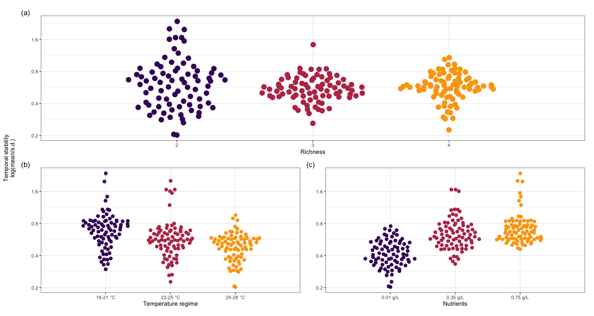
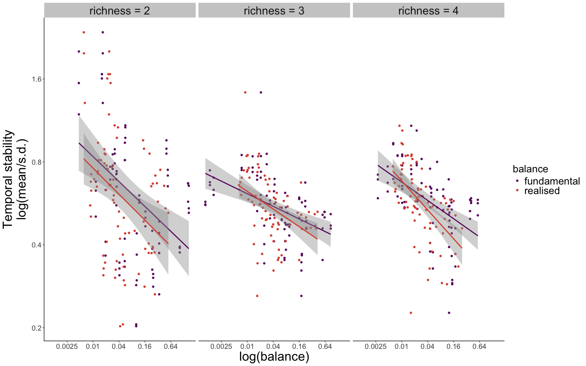
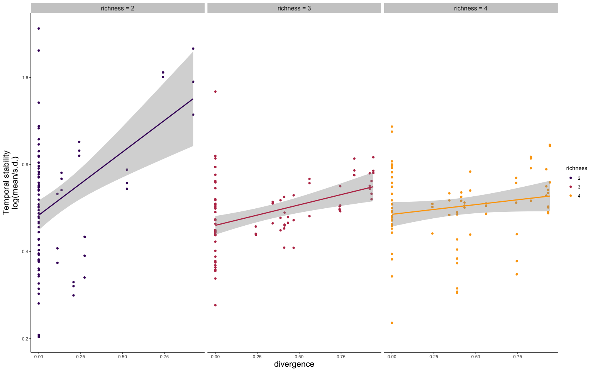
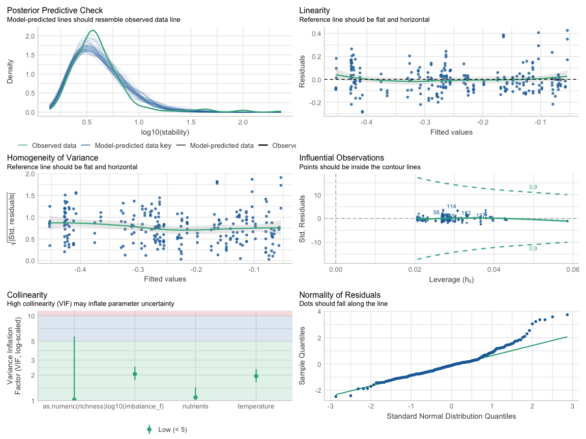
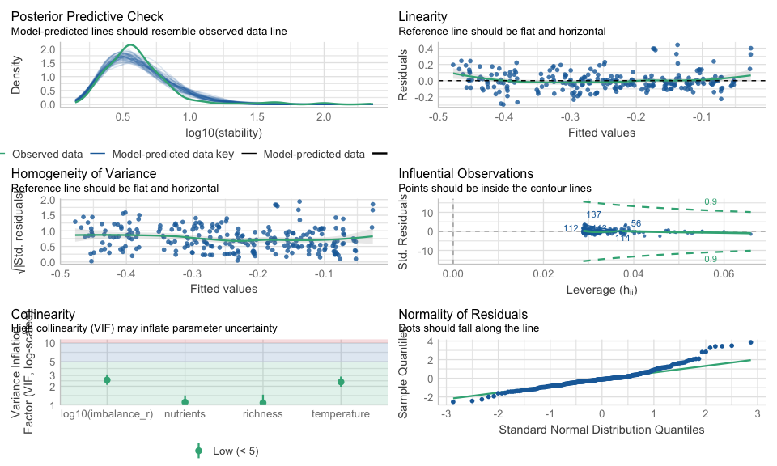
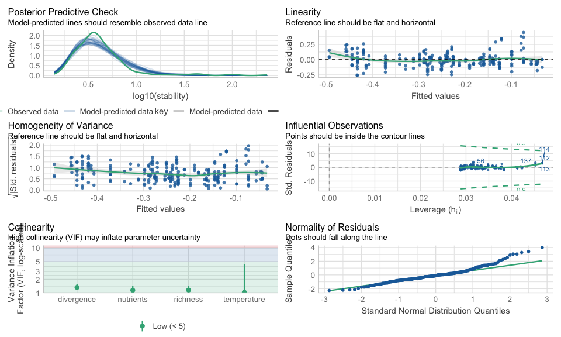
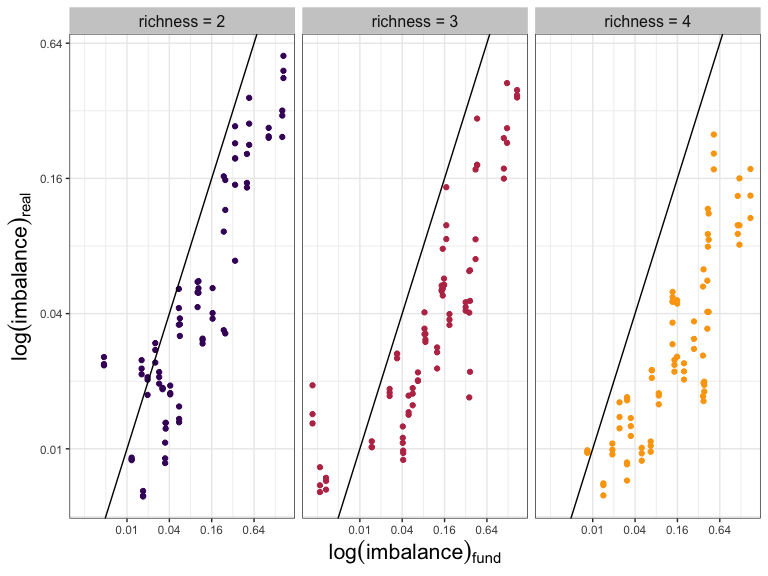
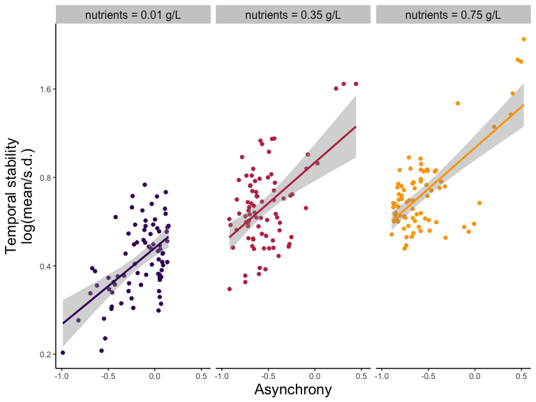
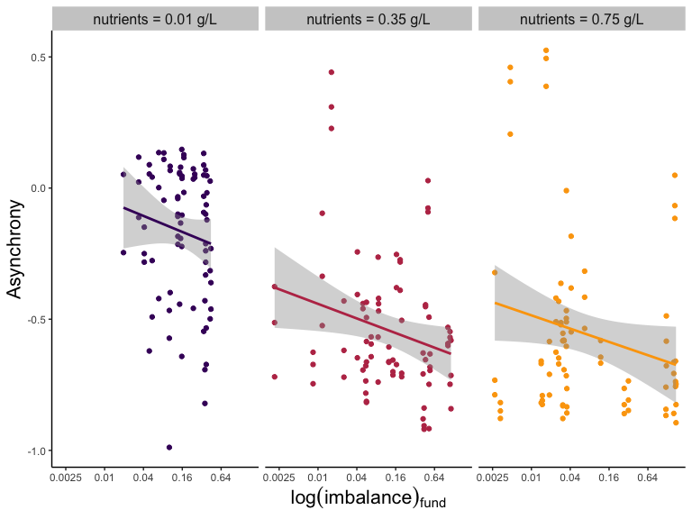
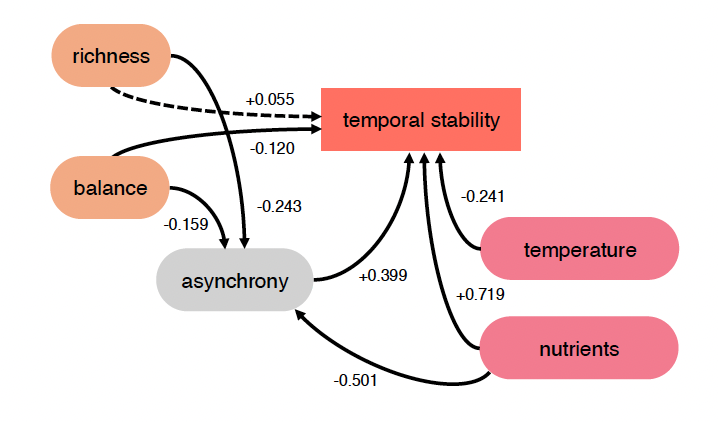

# Introduction

The purpose of this document is to provide a reproducible record of all analyses and figures in the main article. The main article is focused on the effect of response diversity on community stability in fluctuating environments. We are going to look at the effect of response diversity, richness, temperature and nutrients on community temporal stability. Specifically, we are going to look at the effect of fundamental and realized imbalance (our measurements of stability) on temporal stability. Finally, as response diversity is thought to stabilize temporal stability of aggregate community properties via asynchrony, we are going to look at the relationship between response diversity and asynchrony. 

This document is produced by an Rmarkdown file that includes code to reproduce from data all results presented in the main article.


# Load datasets


# Biomass

Let's have a look at the biomass dynamics in the different environmental treatments.

Is reaslised imbalance calculated in this chuck?


### tot biomass plot

<div class="figure" style="text-align: center">

<p class="caption">(\#fig:plot_biomass)Community total biomass during the experiment in different environmental treatments. Different color represent richness levels.</p>
</div>

# Main Results 

We now look at the main results of the experiment. We are going to look first at the effect of richness, temperature and nutrients on community temporal stability. Then, we are going to look at the effect of fundamental and realised imbalance on temporal stability. Finally, we are going to look at the relationship between response diversity and temporal stability.

In the whole analysis, we calculated the temporal stability of total community biomass as the inverse of the coefficient of variation (ICV) (i.e. $\frac{\sigma}{\mu}$). 


### Effect of T, N and R
<div class="figure" style="text-align: center">

<p class="caption">(\#fig:boxplots_TNR)Effects of richness (a), temperature (b), and nutrients (c) on community total biomass temporal stability.</p>
</div>


We can see that richness does not have a clear effect on community temporal stability, while stability was higher at lower temperature, and nutrients increased community temporal stability.

###Effect RD

We are now going to look at how response diversity (imbalance) affected temporal stability of total community biomass. We are going to look at the relationship between fundamental imbalance (so based only on species response surfaces measured in monoculture), an realised imbalance (measured accounting for species contribution to imbalance).

This is fundamentally testing our most important hypothesis.

<div class="figure" style="text-align: center">

<p class="caption">(\#fig:effect_RD)Effects of fundamental and realised response diversity (measured as imbalance) on total community biomass temporal stability.</p>
</div>

We can see that imbalance is always negative related to temporal stability, which means that response diversity promotes stability across richness levels. Interestingly, we see that there is not difference in the sign of the relationship between fundamental and realised imbalance. Yet, as the richness increases, the relationship between realised imbalance and stability becomes steeper compared to fundamental imbalance. 


We look also at the relationship between divergence (our original response diversity metric)

<div class="figure" style="text-align: center">

<p class="caption">(\#fig:divergence_CV)Relationship between Divergence and temporal stability of total community biomass.</p>
</div>
We can see that the positive relationship between temporal stability and response diversity measured as divergence holds, but it becomes shallower as richness increases. We could speculated that this due to divergence considering only the responses of the 2 most extreme species. Thus, when species richness increases, disregarding the responses of the other species in the community except the 2 responding the most makes the relationship between response diversity and stability weaker. 


# Linear models


## Model: Fundamental Imbalance
First we analyze the effect of fundamental imbalance, temperature, nutrients and richness on biomass temporal stability using a linear model. 


Check model's assumptions
<div class="figure" style="text-align: center">

<p class="caption">(\#fig:model_check1)model check 1.</p>
</div>
Summary table


<table class="table table-striped table-hover table-condensed" style="color: black; width: auto !important; margin-left: auto; margin-right: auto;">
 <thead>
  <tr>
   <th style="text-align:center;"> Term </th>
   <th style="text-align:center;"> Estimate </th>
   <th style="text-align:center;"> Lower 95% CI </th>
   <th style="text-align:center;"> Upper 95% CI </th>
   <th style="text-align:center;"> Std. Error </th>
   <th style="text-align:center;"> p-value </th>
  </tr>
 </thead>
<tbody>
  <tr>
   <td style="text-align:center;font-weight: bold;"> (Intercept) </td>
   <td style="text-align:center;font-weight: bold;"> -0.349 </td>
   <td style="text-align:center;font-weight: bold;"> -0.405 </td>
   <td style="text-align:center;font-weight: bold;"> -0.293 </td>
   <td style="text-align:center;font-weight: bold;"> 0.028 </td>
   <td style="text-align:center;font-weight: bold;"> 2.17e-27 </td>
  </tr>
  <tr>
   <td style="text-align:center;font-weight: bold;"> log10(imbalance_f) </td>
   <td style="text-align:center;font-weight: bold;"> -0.054 </td>
   <td style="text-align:center;font-weight: bold;"> -0.085 </td>
   <td style="text-align:center;font-weight: bold;"> -0.022 </td>
   <td style="text-align:center;font-weight: bold;"> 0.016 </td>
   <td style="text-align:center;font-weight: bold;"> 9.29e-04 </td>
  </tr>
  <tr>
   <td style="text-align:center;font-weight: bold;"> richness3 </td>
   <td style="text-align:center;font-weight: bold;"> -0.042 </td>
   <td style="text-align:center;font-weight: bold;"> -0.078 </td>
   <td style="text-align:center;font-weight: bold;"> -0.005 </td>
   <td style="text-align:center;font-weight: bold;"> 0.018 </td>
   <td style="text-align:center;font-weight: bold;"> 2.52e-02 </td>
  </tr>
  <tr>
   <td style="text-align:center;"> richness4 </td>
   <td style="text-align:center;"> -0.012 </td>
   <td style="text-align:center;"> -0.049 </td>
   <td style="text-align:center;"> 0.024 </td>
   <td style="text-align:center;"> 0.019 </td>
   <td style="text-align:center;"> 5.07e-01 </td>
  </tr>
  <tr>
   <td style="text-align:center;font-weight: bold;"> nutrients0.35 g/L </td>
   <td style="text-align:center;font-weight: bold;"> 0.180 </td>
   <td style="text-align:center;font-weight: bold;"> 0.143 </td>
   <td style="text-align:center;font-weight: bold;"> 0.216 </td>
   <td style="text-align:center;font-weight: bold;"> 0.019 </td>
   <td style="text-align:center;font-weight: bold;"> 8.60e-19 </td>
  </tr>
  <tr>
   <td style="text-align:center;font-weight: bold;"> nutrients0.75 g/L </td>
   <td style="text-align:center;font-weight: bold;"> 0.212 </td>
   <td style="text-align:center;font-weight: bold;"> 0.174 </td>
   <td style="text-align:center;font-weight: bold;"> 0.250 </td>
   <td style="text-align:center;font-weight: bold;"> 0.019 </td>
   <td style="text-align:center;font-weight: bold;"> 6.43e-23 </td>
  </tr>
  <tr>
   <td style="text-align:center;font-weight: bold;"> temperature22-25 °C </td>
   <td style="text-align:center;font-weight: bold;"> -0.078 </td>
   <td style="text-align:center;font-weight: bold;"> -0.114 </td>
   <td style="text-align:center;font-weight: bold;"> -0.041 </td>
   <td style="text-align:center;font-weight: bold;"> 0.019 </td>
   <td style="text-align:center;font-weight: bold;"> 3.81e-05 </td>
  </tr>
  <tr>
   <td style="text-align:center;font-weight: bold;"> temperature25-28 °C </td>
   <td style="text-align:center;font-weight: bold;"> -0.098 </td>
   <td style="text-align:center;font-weight: bold;"> -0.147 </td>
   <td style="text-align:center;font-weight: bold;"> -0.050 </td>
   <td style="text-align:center;font-weight: bold;"> 0.025 </td>
   <td style="text-align:center;font-weight: bold;"> 8.44e-05 </td>
  </tr>
</tbody>
</table>

## Model: Relised Imbalance
Then we analyze the effect of realised imbalance, temperature, nutrients and richness on biomass temporal stability using a linear model. 


chack model's assumptions
<div class="figure" style="text-align: center">

<p class="caption">(\#fig:model_check2)model check 2.</p>
</div>

Summary table


<table class="table table-striped table-hover table-condensed" style="color: black; width: auto !important; margin-left: auto; margin-right: auto;">
 <thead>
  <tr>
   <th style="text-align:center;"> Term </th>
   <th style="text-align:center;"> Estimate </th>
   <th style="text-align:center;"> Lower 95% CI </th>
   <th style="text-align:center;"> Upper 95% CI </th>
   <th style="text-align:center;"> Std. Error </th>
   <th style="text-align:center;"> p-value </th>
  </tr>
 </thead>
<tbody>
  <tr>
   <td style="text-align:center;font-weight: bold;"> (Intercept) </td>
   <td style="text-align:center;font-weight: bold;"> -0.364 </td>
   <td style="text-align:center;font-weight: bold;"> -0.450 </td>
   <td style="text-align:center;font-weight: bold;"> -0.278 </td>
   <td style="text-align:center;font-weight: bold;"> 0.044 </td>
   <td style="text-align:center;font-weight: bold;"> 5.50e-15 </td>
  </tr>
  <tr>
   <td style="text-align:center;font-weight: bold;"> log10(imbalance_r) </td>
   <td style="text-align:center;font-weight: bold;"> -0.054 </td>
   <td style="text-align:center;font-weight: bold;"> -0.104 </td>
   <td style="text-align:center;font-weight: bold;"> -0.004 </td>
   <td style="text-align:center;font-weight: bold;"> 0.025 </td>
   <td style="text-align:center;font-weight: bold;"> 3.45e-02 </td>
  </tr>
  <tr>
   <td style="text-align:center;font-weight: bold;"> richness3 </td>
   <td style="text-align:center;font-weight: bold;"> -0.047 </td>
   <td style="text-align:center;font-weight: bold;"> -0.085 </td>
   <td style="text-align:center;font-weight: bold;"> -0.010 </td>
   <td style="text-align:center;font-weight: bold;"> 0.019 </td>
   <td style="text-align:center;font-weight: bold;"> 1.29e-02 </td>
  </tr>
  <tr>
   <td style="text-align:center;"> richness4 </td>
   <td style="text-align:center;"> -0.033 </td>
   <td style="text-align:center;"> -0.072 </td>
   <td style="text-align:center;"> 0.005 </td>
   <td style="text-align:center;"> 0.019 </td>
   <td style="text-align:center;"> 8.92e-02 </td>
  </tr>
  <tr>
   <td style="text-align:center;font-weight: bold;"> nutrients0.35 g/L </td>
   <td style="text-align:center;font-weight: bold;"> 0.182 </td>
   <td style="text-align:center;font-weight: bold;"> 0.145 </td>
   <td style="text-align:center;font-weight: bold;"> 0.220 </td>
   <td style="text-align:center;font-weight: bold;"> 0.019 </td>
   <td style="text-align:center;font-weight: bold;"> 6.92e-19 </td>
  </tr>
  <tr>
   <td style="text-align:center;font-weight: bold;"> nutrients0.75 g/L </td>
   <td style="text-align:center;font-weight: bold;"> 0.218 </td>
   <td style="text-align:center;font-weight: bold;"> 0.180 </td>
   <td style="text-align:center;font-weight: bold;"> 0.257 </td>
   <td style="text-align:center;font-weight: bold;"> 0.020 </td>
   <td style="text-align:center;font-weight: bold;"> 2.35e-23 </td>
  </tr>
  <tr>
   <td style="text-align:center;font-weight: bold;"> temperature22-25 °C </td>
   <td style="text-align:center;font-weight: bold;"> -0.079 </td>
   <td style="text-align:center;font-weight: bold;"> -0.116 </td>
   <td style="text-align:center;font-weight: bold;"> -0.042 </td>
   <td style="text-align:center;font-weight: bold;"> 0.019 </td>
   <td style="text-align:center;font-weight: bold;"> 3.50e-05 </td>
  </tr>
  <tr>
   <td style="text-align:center;font-weight: bold;"> temperature25-28 °C </td>
   <td style="text-align:center;font-weight: bold;"> -0.111 </td>
   <td style="text-align:center;font-weight: bold;"> -0.164 </td>
   <td style="text-align:center;font-weight: bold;"> -0.058 </td>
   <td style="text-align:center;font-weight: bold;"> 0.027 </td>
   <td style="text-align:center;font-weight: bold;"> 5.33e-05 </td>
  </tr>
</tbody>
</table>


## Model: Divergence
Finally we analyze the effect of divergence, temperature, nutrients and richness on biomass temporal stability using a linear model. 


Check model's assumptions
<div class="figure" style="text-align: center">

<p class="caption">(\#fig:model_check3)model check 3.</p>
</div>

Summary table

<table class="table table-striped table-hover table-condensed" style="color: black; width: auto !important; margin-left: auto; margin-right: auto;">
 <thead>
  <tr>
   <th style="text-align:center;"> Term </th>
   <th style="text-align:center;"> Estimate </th>
   <th style="text-align:center;"> Lower 95% CI </th>
   <th style="text-align:center;"> Upper 95% CI </th>
   <th style="text-align:center;"> Std. Error </th>
   <th style="text-align:center;"> p-value </th>
  </tr>
 </thead>
<tbody>
  <tr>
   <td style="text-align:center;font-weight: bold;"> (Intercept) </td>
   <td style="text-align:center;font-weight: bold;"> -0.281 </td>
   <td style="text-align:center;font-weight: bold;"> -0.320 </td>
   <td style="text-align:center;font-weight: bold;"> -0.242 </td>
   <td style="text-align:center;font-weight: bold;"> 0.020 </td>
   <td style="text-align:center;font-weight: bold;"> 3.66e-33 </td>
  </tr>
  <tr>
   <td style="text-align:center;font-weight: bold;"> divergence </td>
   <td style="text-align:center;font-weight: bold;"> 0.093 </td>
   <td style="text-align:center;font-weight: bold;"> 0.042 </td>
   <td style="text-align:center;font-weight: bold;"> 0.144 </td>
   <td style="text-align:center;font-weight: bold;"> 0.026 </td>
   <td style="text-align:center;font-weight: bold;"> 3.68e-04 </td>
  </tr>
  <tr>
   <td style="text-align:center;font-weight: bold;"> richness3 </td>
   <td style="text-align:center;font-weight: bold;"> -0.060 </td>
   <td style="text-align:center;font-weight: bold;"> -0.098 </td>
   <td style="text-align:center;font-weight: bold;"> -0.023 </td>
   <td style="text-align:center;font-weight: bold;"> 0.019 </td>
   <td style="text-align:center;font-weight: bold;"> 1.76e-03 </td>
  </tr>
  <tr>
   <td style="text-align:center;font-weight: bold;"> richness4 </td>
   <td style="text-align:center;font-weight: bold;"> -0.047 </td>
   <td style="text-align:center;font-weight: bold;"> -0.086 </td>
   <td style="text-align:center;font-weight: bold;"> -0.009 </td>
   <td style="text-align:center;font-weight: bold;"> 0.020 </td>
   <td style="text-align:center;font-weight: bold;"> 1.71e-02 </td>
  </tr>
  <tr>
   <td style="text-align:center;font-weight: bold;"> nutrients0.35 g/L </td>
   <td style="text-align:center;font-weight: bold;"> 0.182 </td>
   <td style="text-align:center;font-weight: bold;"> 0.145 </td>
   <td style="text-align:center;font-weight: bold;"> 0.218 </td>
   <td style="text-align:center;font-weight: bold;"> 0.018 </td>
   <td style="text-align:center;font-weight: bold;"> 2.22e-19 </td>
  </tr>
  <tr>
   <td style="text-align:center;font-weight: bold;"> nutrients0.75 g/L </td>
   <td style="text-align:center;font-weight: bold;"> 0.207 </td>
   <td style="text-align:center;font-weight: bold;"> 0.169 </td>
   <td style="text-align:center;font-weight: bold;"> 0.246 </td>
   <td style="text-align:center;font-weight: bold;"> 0.020 </td>
   <td style="text-align:center;font-weight: bold;"> 9.79e-22 </td>
  </tr>
  <tr>
   <td style="text-align:center;font-weight: bold;"> temperature22-25 °C </td>
   <td style="text-align:center;font-weight: bold;"> -0.091 </td>
   <td style="text-align:center;font-weight: bold;"> -0.128 </td>
   <td style="text-align:center;font-weight: bold;"> -0.054 </td>
   <td style="text-align:center;font-weight: bold;"> 0.019 </td>
   <td style="text-align:center;font-weight: bold;"> 1.83e-06 </td>
  </tr>
  <tr>
   <td style="text-align:center;font-weight: bold;"> temperature25-28 °C </td>
   <td style="text-align:center;font-weight: bold;"> -0.152 </td>
   <td style="text-align:center;font-weight: bold;"> -0.188 </td>
   <td style="text-align:center;font-weight: bold;"> -0.116 </td>
   <td style="text-align:center;font-weight: bold;"> 0.018 </td>
   <td style="text-align:center;font-weight: bold;"> 1.17e-14 </td>
  </tr>
</tbody>
</table>


```
## Analysis of Variance Table
## 
## Model 1: log10(stability) ~ log10(imbalance_f) + richness + nutrients + 
##     temperature
## Model 2: log10(stability) ~ log10(imbalance_r) + richness + nutrients + 
##     temperature
## Model 3: log10(stability) ~ divergence + richness + nutrients + temperature
##   Res.Df    RSS Df Sum of Sq F Pr(>F)
## 1    235 3.2535                      
## 2    235 3.3448  0 -0.091329         
## 3    235 3.2296  0  0.115193
```

```
##               df       AIC
## lm_full        9 -340.5359
## lm_full_w      9 -333.8086
## lm_divergence  9 -342.3249
```


### sum vs. weighted_sum

We now look at how fundamental and realised imbalance are related to each other. 

<div class="figure" style="text-align: center">

<p class="caption">(\#fig:Cor_sum_weighted_sum)Relationship between fundamental and realised imbalance.</p>
</div>


# Asynchrony
Response diversity (aka imbalance) has been suggested as a mechanism that promotes temporal stability of community biomass by promoting species asynchrony.
We thus calculated the asynchrony index suggested by Gross et al. (2014) to calculate the effect of asynchrony on temporal stability and to see how reponse diversity relate to asynchrony.
The index ranges between -1 and 1, with -1 indicating perfect asyncrony and 1 being perfectly synchronous, and 0 indicating random variation.


### Plot stability vs. Asynchrony Gross
<div class="figure" style="text-align: center">

<p class="caption">(\#fig:async_plots)Relatioship temporal stability and asynchrony (Gross) divided by nutrient level.</p>
</div>
### Plot Asynchrony Gross vs fundamental imbalance

<div class="figure" style="text-align: center">

<p class="caption">(\#fig:async)Relatioship between asynchrony and fundamental imbalance divided by nutrient level.</p>
</div>


<div class="figure" style="text-align: center">

<p class="caption">(\#fig:SEM)SEM.</p>
</div>

Structural equation model (SEM) of the relationship between fundamental imbalance, asynchrony, richness, nutrients, temperature and temporal stability. The model shows that fundamental imbalance has a negative effect on asynchrony, which in turn has a positive effect on temporal stability. The model also shows that fundamental imbalance has a direct negative effect on temporal stability. Temperature has a direct negative effect on temporal stability, while nutrients have a direct positive effect on temporal stability. Richness has a direct negative effect on asynchrony, but no direct effect on temporal stability. 


<!-- # SEM and balance sim -->

<!-- ```{r interaction RD async} -->

<!-- # simulate random slopes -->


<!-- slopes<-rnorm(1000,mean=0,sd=0.1) -->

<!-- mean_s<-mean(df_slopes$slope) -->
<!-- sd_s<-sd(df_slopes$slope) -->

<!-- RD_df<-lapply(c(2,3,4,10),function(r){ -->

<!--   RD<-lapply(1:1000,function(c){ -->
<!--   slopes<-rnorm(r,mean=0,sd=sd_s) -->
<!--   balance<-abs(mean(slopes)) -->
<!--   divergence<-(max(slopes)-min(slopes)-abs(abs(max(slopes))-abs(min(slopes))))/(max(slopes)-min(slopes)) -->
<!--   adj_divergence<-abs(sum(slopes))/sum(abs(slopes)) -->
<!--   avg_magnitude<-mean(abs(slopes)) -->
<!--   RD_df<-data.frame(balance=balance,divergence=divergence,richness=r,adj_divergence=1-adj_divergence,avg_magnitude=avg_magnitude) -->

<!--   return(RD_df) -->
<!-- }) -->
<!--   RD<-do.call("rbind",RD) -->
<!-- }) -->

<!-- RD_df<-do.call("rbind",RD_df) -->


<!-- plot<-ggplot(data=RD_df,aes(x=balance,color=as.factor(richness)))+ -->
<!--   geom_density() -->

<!-- plot_sim_div_bal<-ggplot(data=RD_df,aes(x=adj_divergence,y=balance,color=avg_magnitude))+ -->
<!--   geom_point()+ -->
<!--   facet_wrap(~richness) -->


<!-- # Ensure the data is ungrouped before applying transformations -->
<!-- sem_aggr <- async_aggr %>% -->
<!--   ungroup() %>%  # Ensure there is no grouping -->
<!--   dplyr::mutate( -->
<!--     log_abs_sum_slope = log10(imbalance_f), -->
<!--     stability = log10(1 / CV), -->
<!--     richness = as.numeric(richness), -->
<!--     temperature=temperature, -->
<!--     log_magnitude=log10(magnitude), -->
<!--     sqrt_symm=sqrt(symmetry), -->
<!--     log_sum_abs=log10(sum_abs_slope), -->
<!--     RD=imbalance_f/sum_abs_slope, -->
<!--     log_syn_Gross=log10(1+synchrony_Gross), -->
<!--     symmetry_scaled=(symmetry/as.numeric(richness)), -->
<!--     asyn_Gross= (-synchrony_Gross), -->
<!--     log_asyn_Gross=log10((-synchrony_Gross)+1), -->
<!--     log_sum_abs_slope=log10(sum_abs_slope) -->
<!--     #Keep it as an ordered factor -->
<!--   ) -->

<!-- quantile(sem_aggr$log_abs_sum_slope) -->


<!-- sem_aggr$nutrients[sem_aggr$nutrients=="0.01 g/L"]<-0.01 -->
<!-- sem_aggr$nutrients[sem_aggr$nutrients=="0.35 g/L"]<-0.35 -->
<!-- sem_aggr$nutrients[sem_aggr$nutrients=="0.75 g/L"]<-0.75 -->

<!-- sem_aggr$temperature[sem_aggr$temperature=="18-21 °C"]=1 -->
<!-- sem_aggr$temperature[sem_aggr$temperature=="22-25 °C"]=2 -->
<!-- sem_aggr$temperature[sem_aggr$temperature=="25-28 °C"]=3 -->


<!-- #correct balance for magnitude -->
<!-- # the effect of magnitude goes down, the more divergence there is -->

<!-- # Load the lavaan package -->
<!-- library(lavaan) -->


<!-- model1A <- ' -->
<!--   stability ~ asyn_Gross+temperature+nutrients+symmetry_scaled+log_sum_abs_slope -->

<!--   asyn_Gross ~ nutrients+richness+log_sum_abs_slope+symmetry_scaled -->


<!-- ' -->
<!-- modl<-lm(data=sem_aggr,log_abs_sum_slope~symmetry_scaled+log_sum_abs_slope) -->


<!-- model1B <- ' -->
<!--   stability ~ asyn_Gross -->
<!--   +temperature -->
<!--   +nutrients -->
<!--   +log_abs_sum_slope+ -->
<!--   richness -->


<!--   asyn_Gross ~ log_abs_sum_slope -->
<!--   +nutrients -->
<!--   +richness -->
<!-- ' -->


<!-- model1C <- ' -->
<!--   stability ~ asyn_Gross+temperature+c("c1","c2","c1")*richness+log_abs_sum_slope -->

<!--   asyn_Gross ~ log_abs_sum_slope+c("d1","d2","d3")*richness -->

<!--   c1==0 -->
<!--   d2==0 -->
<!-- ' -->


<!-- # Define the SEM model using lavaan syntax -->
<!--  model2 <- ' -->
<!--   # Direct effects -->
<!--   stability ~ asyn_Gross+log_magnitude -->

<!--   # Indirect effect via synchrony -->
<!--   asyn_Gross ~ symmetry -->


<!-- ' -->


<!-- # Fit the model -->
<!-- fit <- sem(model2, data = sem_aggr%>%dplyr::filter(!is.na(synchrony_Gross),nutrients!="0.01 g/L")) -->


<!-- fit1A <- sem(model1A, estimator="MLM",meanstructure = TRUE,data = sem_aggr%>%dplyr::filter(!is.na(synchrony_Gross))) -->


<!-- fit1B <- sem(model1B, estimator="MLM",meanstructure = TRUE,data = sem_aggr%>%dplyr::filter(!is.na(synchrony_Gross))) -->

<!-- fit1C <- sem(model1C, estimator="MLM",meanstructure = TRUE,group="nutrients", data = sem_aggr%>%dplyr::filter(,!is.na(synchrony_Gross))) -->


<!--  ### model B slightly better -->
<!-- AICc(fit1C,fit1B) ### model B and C almost the same -->

<!-- anova(fit1Ba,fit1Bb) -->
<!-- # Summarize the results -->
<!-- summary(fit1B, standardized = TRUE,rsquare=T, fit.measures = TRUE) -->


<!-- modificationindices(fit1B) -->


<!-- lavaanPlot(model = fit1A, node_options = list(shape = "box", fontname = "Helvetica"), edge_options = list(color = "grey"), coefs = TRUE, sig = .05) -->

<!-- ``` -->

<!-- # interactions -->

<!-- ```{r stat averaging} -->

<!-- interactions_df <- read_csv("interactions_df_w_T.csv") -->

<!-- int_aggr<-full_join(interactions_df,async_aggr,join_by(sample_ID)) -->
<!-- int_aggr$mean_int_strength[is.na(int_aggr$mean_int_strength)]=0 -->
<!-- int_aggr$mean_interaction[is.na(int_aggr$mean_interaction)]=0 -->
<!-- int_aggr$sum_int_strength[is.na(int_aggr$sum_int_strength)]=0 -->

<!-- M_int<-lm(data=int_aggr,log10(stability)~log10(abs_sum_slope)+nutrients+temperature+richness+mean_int_strength) -->
<!-- anova(M_int,lm_full) -->


<!-- plot_int_syn<-ggplot(data=int_aggr,aes(y=synchrony_Gross,x=mean_int_strength,color=log10(abs_sum_slope)))+ -->
<!--   geom_point()+ -->
<!--   geom_smooth(method="lm") -->


<!-- ### above rep level -->
<!-- rep_aggr<-int_aggr%>%group_by(rep_var.y,richness,temperature,nutrients,composition)%>% dplyr::reframe(log_mean_fun_balance=log10(mean(abs_sum_slope)), -->
<!--                                                                                      mean_asyn_Gross=mean(-synchrony_Gross,na.rm=T), -->
<!--                                                                                      mean_int_rep_strength=mean(mean_int_strength), -->
<!--                                                                                      log_mean_stab=log10(mean(1/CV))) -->


<!-- M_int<-lm(data=rep_aggr,log_mean_stab~log_mean_fun_balance+nutrients+temperature+richness+mean_int_rep_strength) -->
<!-- anova(M_int,lm_full) -->


<!-- M_int_syn<-lm(data=rep_aggr,mean_asyn_Gross~log_mean_fun_balance+richness+temperature+mean_int_rep_strength+nutrients) -->
<!-- summary(M_int_syn) -->

<!-- plot_richness_int<-ggplot(data=rep_aggr,aes(x=mean_int_rep_strength))+ -->
<!--   geom_histogram(bins=10)+ -->
<!--   facet_wrap(~nutrients) -->
<!-- plot_int_syn<-ggplot(data=rep_aggr,aes(y=mean_asyn_Gross,x=mean_int_rep_strength))+ -->
<!--   geom_point()+ -->
<!--   geom_smooth(method="lm")+ -->
<!--   facet_wrap(~richness) -->

<!-- ### sem -->

<!-- rep_aggr<-rep_aggr%>%dplyr::mutate(richness=as.numeric(richness)) -->


<!-- model_int <- ' -->
<!--   log_mean_stab ~ mean_asyn_Gross -->
<!--   +temperature -->
<!--   +nutrients -->
<!--   +log_mean_fun_balance -->
<!--   +richness -->


<!--   mean_asyn_Gross ~ log_mean_fun_balance -->
<!--   +nutrients -->
<!--   +mean_int_rep_strength+ -->
<!--   +richness -->


<!-- ' -->
<!-- fit_int <- sem(model_int, estimator="MLM",meanstructure = TRUE,data = rep_aggr) -->


<!-- summary(fit_int, standardized = TRUE, fit.measures = TRUE,rsquare=T) -->

<!-- AICc(fit_int) -->

<!-- lm_r_int_syn<-lm(data=rep_aggr,mean_asyn_Gross~richness+mean_int_rep_strength+log_mean_fun_balance) -->


<!-- ##### load interactions from rgular CCM -->


<!-- interactions_df <- read_csv("interactions_df_regular.csv") -->

<!-- int_aggr2<-full_join(interactions_df,async_aggr,join_by(sample_ID)) -->
<!-- int_aggr2$mean_interaction_strength[is.na(int_aggr2$mean_interaction_strength)]=0 -->
<!-- int_aggr2$mean_sum_interactions[is.na(int_aggr2$mean_sum_interactions)]=0 -->


<!-- M_int<-lm(data=int_aggr2,log10(stability)~log10(abs_sum_slope)+nutrients.y+temperature.y+richness+mean_interaction_strength) -->
<!-- anova(M_int,lm_full) -->

<!-- ``` -->

<!-- ## Plot interaction vs Asnychrony -->


<!-- ```{r} -->

<!-- ``` -->


<!-- ##Poster -->

<!-- ```{r} -->

<!-- ### time series with nutrients==0.35 and T=22-25 -->

<!-- poster_ts<-complete_ts%>%filter(nutrients=="0.35 g/L", -->
<!--                                 temperature=="22-25 °C", -->
<!--                                 sample_ID=="DLPS_Tmp_22_25_Nut0.35_3") -->
<!-- dark2_palette <- brewer.pal(n = 8, name = "Dark2") -->
<!-- selected_colors <- dark2_palette[2:5] -->

<!-- plot_poster_ts <- ggplot(data = poster_ts, aes(x = day, y = biomass, color = predict_spec)) + -->
<!--   geom_line(linewidth=1.5) + ylab("Biomass")+xlab("Day")+ -->
<!--   theme_classic() + -->
<!--   scale_color_manual(values = selected_colors) + -->
<!--   theme(legend.position = "none",        -->
<!--         axis.text.y = element_blank(),        # Remove the y-axis  -->
<!--         axis.ticks.y = element_blank(), -->
<!--         axis.title.x = element_text(size=16), -->
<!--         axis.title.y=element_text(size=16))      -->

<!-- plot_poster_ts -->

<!-- cake_df<-poster_ts%>%group_by(predict_spec)%>%summarize(mean_biom=mean(biomass)) -->


<!-- cake_df <- tibble::tibble( -->
<!--   predict_spec = c("Dexiostoma", "Loxocephalus", "Paramecium", "Spirostomum"), -->
<!--   mean_biom = c(0.000000843, 0.000000808, 0.00000520, 0.000000237) -->
<!-- ) -->

<!-- # percentages -->
<!-- cake_df <- cake_df %>% -->
<!--   dplyr::mutate(percentage = mean_biom / sum(mean_biom) * 100) -->

<!-- # cake diagramm -->
<!-- plot_cake <- ggplot(cake_df, aes(x = "", y = percentage, fill = predict_spec)) + -->
<!--   scale_fill_manual(values = selected_colors) + -->
<!--   geom_bar(stat = "identity", width = 1) +  -->
<!--   coord_polar(theta = "y") +                    # Titel und Legende -->
<!--   theme_void()+ -->
<!--   labs(fill="Species")+ -->
<!--   theme(legend.direction = "vertical",legend.position="right", -->
<!--         legend.title = element_text(size=16))# Verwende eine Farbpalette -->


<!-- plot_cake+plot_poster_ts+ plot_layout(ncol = 2,widths=c(1,2))   # Title for the combined plot -->
<!-- weight_plot <- wrap_elements(plot_cake + theme(plot.margin = margin( b = 150))) +  # Move the cake plot up -->
<!--   plot_spacer() + -->
<!--   plot_poster_ts +  -->
<!--   plot_layout(ncol = 3, widths = c(1, 0.2, 1)) -->

<!-- weight_plot -->

<!-- #ggsave("weight.pdf", plot = weight_plot, width = 10, height = 6) -->


<!-- # create temperature regime plot -->

<!-- regime1<-data.frame(temperature=rep(c(18,18,18,21,21,21),length.out=60),regime= "18-21 °C") -->
<!-- regime2<-data.frame(temperature=rep(c(22,22,22,25,25,25),length.out=60),regime= "22-25 °C") -->
<!-- regime3<-data.frame(temperature=rep(c(25,25,25,28,28,28),length.out=60),regime= "25-28 °C") -->
<!-- day= -->

<!-- df_Temp<-rbind(regime1,regime2,regime3) -->
<!-- df_Temp<-cbind(df_Temp,day=rep(1:60)) -->

<!-- plot_temp<-ggplot(data=df_Temp,aes(x=day,y=temperature,linetype=regime))+ -->
<!--   geom_line()+  theme_classic() + -->
<!--   ylab("Temperature °C")+xlab("Day")+ -->
<!--   labs(linetype="Temperature regime")+ -->
<!--   scale_y_continuous(breaks = c(28, 25, 22, 21, 18)) + -->
<!--   theme(legend.direction = "vertical",legend.position="right",         -->
<!--         axis.title.x = element_text(size=16), -->
<!--         axis.title.y=element_text(size=16)) -->


<!-- ggsave("temp_regime.pdf", plot = plot_temp, width = 8, height = 6) -->


<!-- ############ Main results plot -->


<!-- balance_dd<-complete_aggr%>%dplyr::select(abs_sum_slope,richness,CV)%>% -->
<!--   cbind(type="no")%>%dplyr::mutate(abs_sum_slope=abs_sum_slope/as.numeric(richness)) -->
<!-- names(balance_dd)[names(balance_dd)=="abs_sum_slope"]<-"balance" -->

<!-- weighted_balance_dd<-complete_aggr%>%dplyr::select(avg_w_sumslopes,richness,CV)%>% -->
<!--   cbind(type="yes") -->
<!-- names(weighted_balance_dd)[names(weighted_balance_dd)=="avg_w_sumslopes"]<-"balance" -->

<!-- main_r_dd<-rbind(balance_dd,weighted_balance_dd) -->

<!-- plot_main <- main_r_dd %>% -->
<!--   ggplot(aes(x = log10(balance), y = log10(1/CV), color = type)) + -->
<!--   geom_point(aes(x = log10(balance), y = log10(1/CV))) + -->
<!--   geom_smooth(method = "lm", aes(x = log10(balance), y = log10(1/CV))) + -->
<!--   theme_classic() + -->
<!--   scale_color_viridis_d(option = "inferno", begin = 0.3, end = 0.6) + -->
<!--   scale_x_continuous( -->
<!--     breaks = log10(c(0.0025,0.01, 0.04, 0.16, 0.64)), -->
<!--     labels = c("0.0025","0.01", "0.04", "0.16", "0.64") -->
<!--   ) + -->
<!--   ylab(expression("temporal stability: "~log[10]("mean/s.d.")))+ -->
<!--   xlab(expression(log[10]("Balance"))) + -->
<!--   theme(axis.title.x = element_text(size = 16), -->
<!--         axis.title.y = element_text(size = 16), -->
<!--         strip.background = element_rect(fill = "grey80", color = NA),   -->
<!--     strip.text = element_text(size = 12)) + -->
<!--   labs(color = "Weighted") +   -->
<!--   facet_wrap(~richness, labeller = as_labeller(function(x) paste0("richness = ", x))) -->

<!-- ggsave("main_plot.pdf", plot = plot_main, width = 10, height = 6) -->


<!-- ### linear model summary table -->

<!-- # Install and load the broom package if you haven't already -->

<!-- library(broom) -->

<!-- # Fit the model -->
<!-- lm_full<-lm(data=complete_aggr, log10(stability)~log10(abs_sum_slope)+richness+temperature+nutrients) -->

<!-- # Tidy up the summary -->
<!-- tidy_model <- tidy(lm_full_w) -->

<!-- # View the tidied model -->
<!-- tidy_model -->


<!-- library(broom) -->
<!-- library(writexl) -->


<!-- # Step 3: Tidy the model output using broom -->
<!-- model_summary <- tidy(lm_full) -->

<!-- # Step 4: Add significance stars for p-values -->
<!-- model_summary <- model_summary %>% -->
<!--   dplyr::mutate(Significance = case_when( -->
<!--     p.value < 0.001 ~ "***", -->
<!--     p.value < 0.01 ~ "**", -->
<!--     p.value < 0.05 ~ "*", -->
<!--     p.value < 0.1 ~ ".", -->
<!--     TRUE ~ "" -->
<!--   )) -->

<!-- # Step 5: Rename columns for a nicer presentation -->
<!-- names(model_summary) <- c("Term", "Estimate", "Std. Error", "t value", "p value", "Significance") -->

<!-- # Step 6: Write the summary to an Excel file -->
<!-- write_xlsx(model_summary, "full_model_summary.xlsx") -->


<!-- # Step 3: Tidy the model output using broom -->
<!-- model_summary <- tidy(lm_full_w) -->

<!-- # Step 4: Add significance stars for p-values -->
<!-- model_summary <- model_summary %>% -->
<!--   dplyr::mutate(Significance = case_when( -->
<!--     p.value < 0.001 ~ "***", -->
<!--     p.value < 0.01 ~ "**", -->
<!--     p.value < 0.05 ~ "*", -->
<!--     p.value < 0.1 ~ ".", -->
<!--     TRUE ~ "" -->
<!--   )) -->

<!-- # Step 5: Rename columns for a nicer presentation -->
<!-- names(model_summary) <- c("Term", "Estimate", "Std. Error", "t value", "p value", "Significance") -->

<!-- # Step 6: Write the summary to an Excel file -->
<!-- write_xlsx(model_summary, "full_model_w_summary.xlsx") -->


<!-- ``` -->

