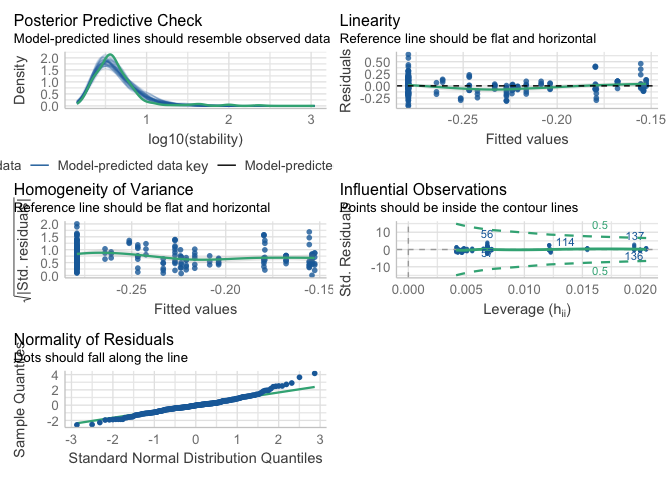
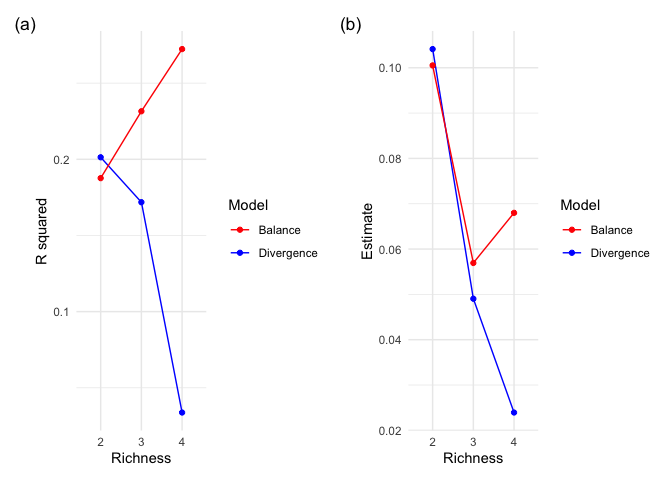
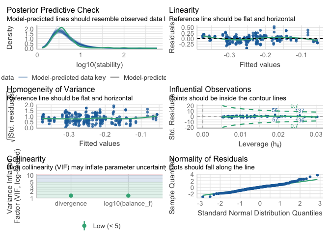
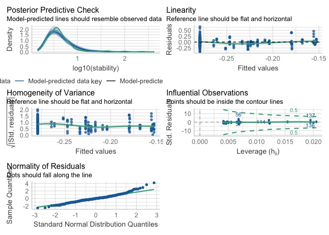
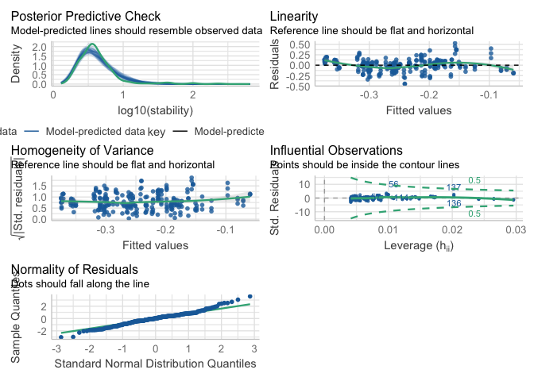
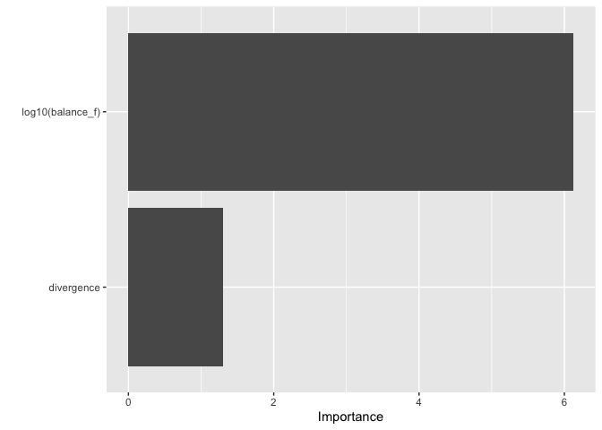
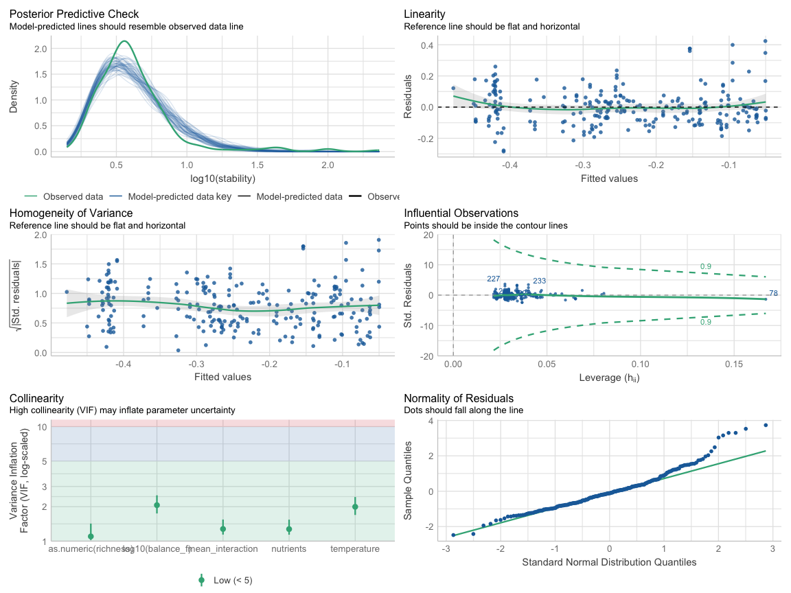
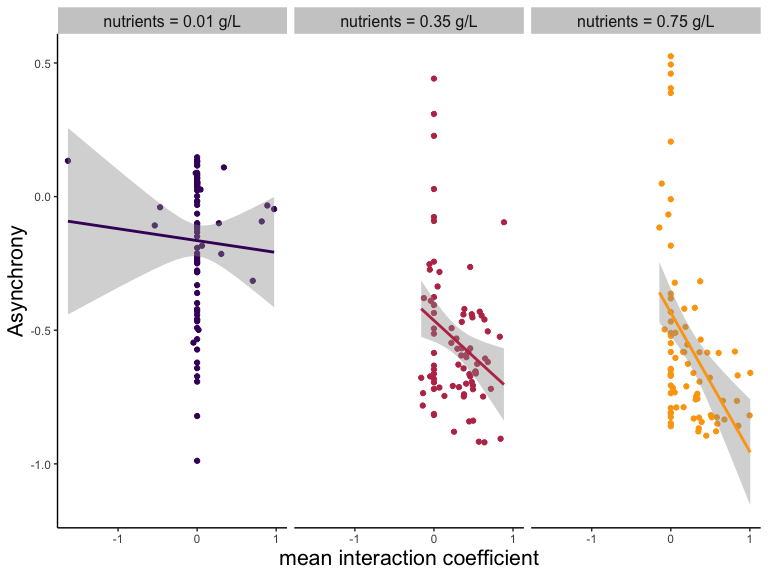

# Introduction

The purpose of this document is to provide a reproducible record of all analyses and figures in the main article. The main article is focused on the effect of response diversity on community stability in fluctuating environments. We are going to look at the effect of response diversity, richness, temperature and nutrients on community temporal stability. Specifically, we are going to look at the effect of fundamental and realized balance (our measurements of stability) on temporal stability. Finally, as response diversity is thought to stabilize temporal stability of aggregate community properties via asynchrony, we are going to look at the relationship between response diversity and asynchrony. 

This document is produced by an Rmarkdown file that includes code to reproduce from data all results presented in the main article.


# Load datasets


# Biomass

Let's have a look at the biomass dynamics in the different environmental treatments.

Is realised balance calculated in this chuck?


### tot biomass plot

<div class="figure" style="text-align: center">

<p class="caption">(\#fig:plot_biomass)Community total biomass during the experiment in different environmental treatments. Different color represent richness levels.</p>
</div>


# Main Results 

We now look at the main results of the experiment. We are going to look first at the effect of richness, temperature and nutrients on community temporal stability. Then, we are going to look at the effect of fundamental and realised balance on temporal stability. Finally, we are going to look at the relationship between response diversity and temporal stability.

In the whole analysis, we calculated the temporal stability of total community biomass as the inverse of the coefficient of variation (ICV) (i.e. $\frac{\sigma}{\mu}$). 


### Effect of T, N and R
<div class="figure" style="text-align: center">

<p class="caption">(\#fig:boxplots_TNR)Effects of richness (a), temperature (b), and nutrients (c) on community total biomass temporal stability.</p>
</div>


We can see that richness does not have a clear effect on community temporal stability, while stability was higher at lower temperature, and nutrients increased community temporal stability.

### Effect of Divergence

We look at the relationship between divergence (our original response diversity metric)

<div class="figure" style="text-align: center">

<p class="caption">(\#fig:divergence_CV)Relationship between Divergence and temporal stability of total community biomass.</p>
</div>

Divergence is negatively related to temporal stability, suggesting that response diversity promotes stability. However, the relationship between divergence and stability becomes weaker as richness increases. This is why, after running the experiment, we developed another metric to measure response diversity, which we called balance, and that is presented in the main text of the publication. 

Here, we provide extensive evidence of why balance is a better metric to measure response diversity than divergence, and thus justifying focusing the analysis around balance.

# Comparing Divergence and Balance

We fist compare the predictive power of divergence vs balance. 


Balance

``` r
# 

mod1 <- lm(data=complete_aggr,log10(stability)~log10(balance_f))
check_model(mod1)
```

<!-- -->

``` r
performance(mod1)
```

```
## # Indices of model performance
## 
## AIC     |    AICc |     BIC |    R2 | R2 (adj.) |  RMSE | Sigma
## ---------------------------------------------------------------
## -89.273 | -89.173 | -78.794 | 0.192 |     0.188 | 0.151 | 0.152
```


Divergence

``` r
mod2 <- lm(data=complete_aggr,log10(stability)~(divergence))
check_model(mod2)
```

<!-- -->


``` r
performance(mod2)
```

```
## # Indices of model performance
## 
## AIC     |    AICc |     BIC |    R2 | R2 (adj.) |  RMSE | Sigma
## ---------------------------------------------------------------
## -55.716 | -55.615 | -45.237 | 0.072 |     0.068 | 0.162 | 0.163
```


Divergence and balance are both negatively related to stability, but balance explains more of the variance in stability than divergence.

Moreover, from the plot above, it looks like divergence declines in performance as richness increases. Let's test this analyticaly.


``` r
# getting model estimates for each richness level
lm_divergence_richness_E <- complete_aggr %>%
  nest(data = -richness) %>%
  mutate(
    model = map(data, ~ lm(log10(stability) ~ scale(divergence), data = .x)),
    results = map(model, broom::tidy)
  ) %>%
  unnest(results) %>% dplyr::filter(term=="scale(divergence)") 


# getting model R squared for each richness level

lm_divergence_richness_R <- complete_aggr %>%
  nest(data = -richness) %>%
  mutate(
    model = map(data, ~ lm(log10(stability) ~ scale(divergence), data = .x)),
    results = map(model, broom::glance)
  ) %>%
  unnest(results) 

lm_divergence_richness_R
```

```
## # A tibble: 3 × 15
##   richness data     model  r.squared adj.r.squared sigma statistic p.value    df
##   <fct>    <list>   <list>     <dbl>         <dbl> <dbl>     <dbl>   <dbl> <dbl>
## 1 2        <tibble> <lm>      0.201         0.191  0.209     19.9  2.66e-5     1
## 2 3        <tibble> <lm>      0.172         0.161  0.108     16.4  1.19e-4     1
## 3 4        <tibble> <lm>      0.0337        0.0215 0.129      2.76 1.01e-1     1
## # ℹ 6 more variables: logLik <dbl>, AIC <dbl>, BIC <dbl>, deviance <dbl>,
## #   df.residual <int>, nobs <int>
```


``` r
# getting model estimatesf or each richness level
lm_balance_richness_E <- complete_aggr %>%
  nest(data = -richness) %>%
  mutate(
    model = map(data, ~ lm(log10(stability) ~ scale(log10(balance_f)), data = .x)),
    results = map(model, broom::tidy)
  ) %>%
  unnest(results) %>% dplyr::filter(term=="scale(log10(balance_f))") 

summary(lm(log10(stability) ~ scale((divergence)), data = complete_aggr))
```

```
## 
## Call:
## lm(formula = log10(stability) ~ scale((divergence)), data = complete_aggr)
## 
## Residuals:
##      Min       1Q   Median       3Q      Max 
## -0.41454 -0.08948 -0.00742  0.09164  0.65272 
## 
## Coefficients:
##                     Estimate Std. Error t value Pr(>|t|)    
## (Intercept)         -0.24267    0.01042 -23.278  < 2e-16 ***
## scale((divergence))  0.04520    0.01045   4.327 2.22e-05 ***
## ---
## Signif. codes:  0 '***' 0.001 '**' 0.01 '*' 0.05 '.' 0.1 ' ' 1
## 
## Residual standard error: 0.1625 on 241 degrees of freedom
## Multiple R-squared:  0.07208,	Adjusted R-squared:  0.06823 
## F-statistic: 18.72 on 1 and 241 DF,  p-value: 2.218e-05
```

``` r
# getting model R squared for each richness level
lm_balance_richness_R <- complete_aggr %>%
  nest(data = -richness) %>%
  mutate(
    model = map(data, ~ lm(log10(stability) ~ scale(log10(balance_f)), data = .x)),
    results = map(model, broom::glance)
  ) %>%
  unnest(results) 

lm_balance_richness_R
```

```
## # A tibble: 3 × 15
##   richness data     model  r.squared adj.r.squared sigma statistic p.value    df
##   <fct>    <list>   <list>     <dbl>         <dbl> <dbl>     <dbl>   <dbl> <dbl>
## 1 2        <tibble> <lm>       0.188         0.177 0.210      18.2 5.36e-5     1
## 2 3        <tibble> <lm>       0.232         0.222 0.104      23.8 5.44e-6     1
## 3 4        <tibble> <lm>       0.272         0.263 0.112      29.6 5.84e-7     1
## # ℹ 6 more variables: logLik <dbl>, AIC <dbl>, BIC <dbl>, deviance <dbl>,
## #   df.residual <int>, nobs <int>
```


<!-- -->

We can see that the relationship between divergence and stability becomes weaker as richness increases, while the relationship between balance and stability remains stable across richness levels. 


Now we build a linear model were stability is modelled as a function of balance and divergence. 
Then, we compared the variance explained by the full model compared to a model containing either only balance or only divergence.


``` r
lm_div_balance <- lm(data=complete_aggr,log10(stability)~log10(balance_f)+divergence)
check_model(lm_div_balance)
```

<!-- -->


``` r
performance(lm_div_balance)
```

```
## # Indices of model performance
## 
## AIC     |    AICc |     BIC |    R2 | R2 (adj.) |  RMSE | Sigma
## ---------------------------------------------------------------
## -88.977 | -88.809 | -75.005 | 0.197 |     0.191 | 0.151 | 0.151
```
model with only divergence

``` r
lm_div <- lm(data=complete_aggr,log10(stability)~divergence)
check_model(lm_div)
```

<!-- -->


``` r
performance(lm_div)
```

```
## # Indices of model performance
## 
## AIC     |    AICc |     BIC |    R2 | R2 (adj.) |  RMSE | Sigma
## ---------------------------------------------------------------
## -55.716 | -55.615 | -45.237 | 0.072 |     0.068 | 0.162 | 0.163
```

model with only balance

``` r
lm_balance <- lm(data=complete_aggr,log10(stability)~log10(balance_f))
check_model(lm_balance)
```

<!-- -->


```
## # Indices of model performance
## 
## AIC     |    AICc |     BIC |    R2 | R2 (adj.) |  RMSE | Sigma
## ---------------------------------------------------------------
## -89.273 | -89.173 | -78.794 | 0.192 |     0.188 | 0.151 | 0.152
```


``` r
anova(lm_div_balance,  lm_balance)
```

```
## Analysis of Variance Table
## 
## Model 1: log10(stability) ~ log10(balance_f) + divergence
## Model 2: log10(stability) ~ log10(balance_f)
##   Res.Df    RSS Df Sum of Sq      F Pr(>F)
## 1    240 5.5044                           
## 2    241 5.5432 -1 -0.038724 1.6884 0.1951
```


``` r
anova(lm_div_balance,  lm_div)
```

```
## Analysis of Variance Table
## 
## Model 1: log10(stability) ~ log10(balance_f) + divergence
## Model 2: log10(stability) ~ divergence
##   Res.Df    RSS Df Sum of Sq      F    Pr(>F)    
## 1    240 5.5044                                  
## 2    241 6.3640 -1  -0.85959 37.479 3.741e-09 ***
## ---
## Signif. codes:  0 '***' 0.001 '**' 0.01 '*' 0.05 '.' 0.1 ' ' 1
```

Balance explains more of the variance in stability than divergence, and there is virtually no difference between a model containing only balance and the full model.
Richness had to transformed to numeric and to be centered to avoid collinearity with divergence

``` r
lm_rich_div <- lm(data=complete_aggr,log10(stability)~divergence*scale(as.numeric(richness)))
check_model(lm_rich_div)
```

<!-- -->


``` r
anova(lm_rich_div)
```

```
## Analysis of Variance Table
## 
## Response: log10(stability)
##                                         Df Sum Sq Mean Sq F value    Pr(>F)    
## divergence                               1 0.4943 0.49435 19.8282 1.301e-05 ***
## scale(as.numeric(richness))              1 0.1558 0.15579  6.2487  0.013100 *  
## divergence:scale(as.numeric(richness))   1 0.2496 0.24958 10.0106  0.001758 ** 
## Residuals                              239 5.9587 0.02493                      
## ---
## Signif. codes:  0 '***' 0.001 '**' 0.01 '*' 0.05 '.' 0.1 ' ' 1
```


Divergence significantly interact with richness, suggesting that the relationship between divergence and stability changes with richness. 
While an ideal metric of response diversity should be independent of richness.


We repeat the same model using balance instead of divergence.

``` r
lm_rich_balance <- lm(data=complete_aggr,log10(stability)~log10(balance_f)*scale(as.numeric(richness)))
check_model(lm_rich_balance)
```

<!-- -->


``` r
anova(lm_rich_balance)
```

```
## Analysis of Variance Table
## 
## Response: log10(stability)
##                                               Df Sum Sq Mean Sq F value
## log10(balance_f)                               1 1.3152 1.31522 57.1274
## scale(as.numeric(richness))                    1 0.0003 0.00028  0.0122
## log10(balance_f):scale(as.numeric(richness))   1 0.0405 0.04050  1.7589
## Residuals                                    239 5.5024 0.02302        
##                                                 Pr(>F)    
## log10(balance_f)                             8.694e-13 ***
## scale(as.numeric(richness))                     0.9123    
## log10(balance_f):scale(as.numeric(richness))    0.1860    
## Residuals                                                 
## ---
## Signif. codes:  0 '***' 0.001 '**' 0.01 '*' 0.05 '.' 0.1 ' ' 1
```

Balance does not significantly interact with richness, suggesting that the relationship between balance and stability is stable across richness levels.

Finally, we assess variable importance using the relative importance of predictors in the full model.
We use the package vip (https://cran.r-project.org/web/packages/vip/vignettes/vip.html) to calculate the relative importance of predictors in the full model.
The function vip::vip for multiple linear regression, or linear models (LMs), uses the absolute value of the 𝑡
-statistic  as a measure of VI.7. Motivation for the use of the associated 𝑡-statistic is given in Bring (1994) [https://www.tandfonline.com/doi/abs/10.1080/00031305.1994.10476059].


``` r
vip::vip(lm_div_balance)
```

<!-- -->


We believe that the extensive evidence here provided justifies focusing the analysis around balance, and not divergence, as a metric of response diversity.
We will thus only look at balance for the rest of the analysis. 


### Effect RD

We are now going to look at how response diversity (balance) affected temporal stability of total community biomass. We are going to look at the relationship between fundamental baalance (so based only on species response surfaces measured in monoculture), an realised balance (measured accounting for species contribution to balance).

This is fundamentally testing our most important hypothesis.

<div class="figure" style="text-align: center">

<p class="caption">(\#fig:effect_RD)Effects of fundamental and realised response diversity (measured as balance) on total community biomass temporal stability.</p>
</div>

We can see that balance is always negatively related to temporal stability, which means that response diversity promotes stability across richness levels. Interestingly, we see that there is little difference between fundamental and realised balance. Yet, as the richness increases, the relationship between realised balance and stability becomes steeper compared to fundamental balance. 


We can see that the positive relationship between temporal stability and response diversity measured as divergence holds, but it becomes shallower as richness increases. We could speculated that this due to divergence considering only the responses of the 2 most "responding" species. Thus, when species richness increases, disregarding the responses of the other species in the community except the 2 responding the most makes the relationship between response diversity and stability weaker. 


# Linear models


## Model: Fundamental balance

First we analyze the effect of fundamental balance, temperature, nutrients and richness on biomass temporal stability using a linear model. 
balance and richness were modelled as continuous variables, while temperature and nutrients were modelled as categorical variables. balance was log-transformed to meet the assumptions of linear models.


``` r
lm_full<-lm(data=complete_aggr,log10(stability)~log10(balance_f)+as.numeric(richness)+nutrients+temperature)
```


Check model's assumptions
<div class="figure" style="text-align: center">

<p class="caption">(\#fig:model_check1)model check 1.</p>
</div>


```
## 
## Call:
## lm(formula = log10(stability) ~ log10(balance_f) + as.numeric(richness) + 
##     nutrients + temperature, data = complete_aggr)
## 
## Residuals:
##      Min       1Q   Median       3Q      Max 
## -0.28605 -0.07635 -0.01196  0.04542  0.42770 
## 
## Coefficients:
##                       Estimate Std. Error t value Pr(>|t|)    
## (Intercept)          -0.350905   0.033407 -10.504  < 2e-16 ***
## log10(balance_f)     -0.050863   0.016041  -3.171  0.00172 ** 
## as.numeric(richness) -0.006457   0.009431  -0.685  0.49425    
## nutrients0.35 g/L     0.179918   0.018750   9.596  < 2e-16 ***
## nutrients0.75 g/L     0.213112   0.019473  10.944  < 2e-16 ***
## temperature22-25 °C  -0.078022   0.018683  -4.176 4.18e-05 ***
## temperature25-28 °C  -0.100991   0.024737  -4.083 6.10e-05 ***
## ---
## Signif. codes:  0 '***' 0.001 '**' 0.01 '*' 0.05 '.' 0.1 ' ' 1
## 
## Residual standard error: 0.1186 on 236 degrees of freedom
## Multiple R-squared:  0.5158,	Adjusted R-squared:  0.5035 
## F-statistic:  41.9 on 6 and 236 DF,  p-value: < 2.2e-16
```


```
## Analysis of Variance Table
## 
## Response: log10(stability)
##                       Df Sum Sq Mean Sq F value    Pr(>F)    
## log10(balance_f)       1 1.3152 1.31522 93.4656 < 2.2e-16 ***
## as.numeric(richness)   1 0.0003 0.00028  0.0199    0.8879    
## nutrients              2 1.8841 0.94203 66.9447 < 2.2e-16 ***
## temperature            2 0.3379 0.16896 12.0071 1.081e-05 ***
## Residuals            236 3.3209 0.01407                      
## ---
## Signif. codes:  0 '***' 0.001 '**' 0.01 '*' 0.05 '.' 0.1 ' ' 1
```

A linear model was fitted to examine the effects of resource balance, richness, nutrients, and temperature on community stability (measured as log₁₀(stability)). The model explained a significant portion of the variance (Adjusted R² = 0.5115, F(7, 235) = 37.2, p < 2.2e-16).

The intercept of the model was estimated at -0.349 (SE = 0.028, p < 2e-16), indicating the baseline log₁₀(stability) when all predictor variables are at their reference levels.

Among the predictors, log₁₀(balance) showed a significant negative effect on stability (Estimate = -0.054, SE = 0.016, p = 0.0009). This suggests that as balance increases (more balance), stability tends to decrease.


Nutrient concentration also had a significant positive effect on stability, with estimates for 0.35 g/L (Estimate = 0.180, SE = 0.019, p < 2e-16) and 0.75 g/L (Estimate = 0.212, SE = 0.019, p < 2e-16) indicating increased stability with higher nutrient levels.

Finally, temperature regimes showed a significant effect on stability. Both 22–25 °C (Estimate = -0.078, SE = 0.019, p = 3.81e-05) and 25–28 °C (Estimate = -0.098, SE = 0.025, p = 8.44e-05) significantly reduced stability when compared to the baseline (18–21 °C).

Richness did not show a significant effect on stability (Estimate = 0.002, SE = 0.019, p = 0.91), which suggests that it is not richness *per se* that affects stability in this system. Similar results have been previously reported in the literature, e.g. (Petchey et al. 2002)[https://nsojournals.onlinelibrary.wiley.com/doi/full/10.1034/j.1600-0706.2002.990203.x?casa_token=THaSxpjziQcAAAAA%3Ay_0gJhnL_rcPsrolHEmZvI0VF14a43WRDTy_UB_kDPQOxq2EA98NQT65Co63J58NCeW-SiTIjoDkgelQ] and (Gonzalez and Descamps-Julien 2004) [https://nsojournals.onlinelibrary.wiley.com/doi/full/10.1111/j.0030-1299.2004.12925.x?casa_token=4OtlkUcK3YgAAAAA%3ASFjll62wMQW8CBV9qDe5lbGGDXVcRiWna6slN1GaVvTMSRJKDAnpSd_jEBsFKKRsL7muxbJ0Tv3T] who found that species richness did not significantly impact temporal stability in fluctuating environment.

In summary, our findings show that temporal stability is significantly influenced by response diversity (balance), nutrient concentration, and temperature, with higher nutrient concentrations enhancing stability and higher temperatures reducing it. However, species richness was not a significant determinant of stability within the conditions of this study.

Prepare publication-ready table 

Summary table


```{=html}
<div id="rlrxrsctnq" style="padding-left:0px;padding-right:0px;padding-top:10px;padding-bottom:10px;overflow-x:auto;overflow-y:auto;width:auto;height:auto;">
<style>#rlrxrsctnq table {
  font-family: system-ui, 'Segoe UI', Roboto, Helvetica, Arial, sans-serif, 'Apple Color Emoji', 'Segoe UI Emoji', 'Segoe UI Symbol', 'Noto Color Emoji';
  -webkit-font-smoothing: antialiased;
  -moz-osx-font-smoothing: grayscale;
}

#rlrxrsctnq thead, #rlrxrsctnq tbody, #rlrxrsctnq tfoot, #rlrxrsctnq tr, #rlrxrsctnq td, #rlrxrsctnq th {
  border-style: none;
}

#rlrxrsctnq p {
  margin: 0;
  padding: 0;
}

#rlrxrsctnq .gt_table {
  display: table;
  border-collapse: collapse;
  line-height: normal;
  margin-left: auto;
  margin-right: auto;
  color: #333333;
  font-size: 16px;
  font-weight: normal;
  font-style: normal;
  background-color: #FFFFFF;
  width: auto;
  border-top-style: solid;
  border-top-width: 2px;
  border-top-color: #A8A8A8;
  border-right-style: none;
  border-right-width: 2px;
  border-right-color: #D3D3D3;
  border-bottom-style: solid;
  border-bottom-width: 2px;
  border-bottom-color: #A8A8A8;
  border-left-style: none;
  border-left-width: 2px;
  border-left-color: #D3D3D3;
}

#rlrxrsctnq .gt_caption {
  padding-top: 4px;
  padding-bottom: 4px;
}

#rlrxrsctnq .gt_title {
  color: #333333;
  font-size: 125%;
  font-weight: initial;
  padding-top: 4px;
  padding-bottom: 4px;
  padding-left: 5px;
  padding-right: 5px;
  border-bottom-color: #FFFFFF;
  border-bottom-width: 0;
}

#rlrxrsctnq .gt_subtitle {
  color: #333333;
  font-size: 85%;
  font-weight: initial;
  padding-top: 3px;
  padding-bottom: 5px;
  padding-left: 5px;
  padding-right: 5px;
  border-top-color: #FFFFFF;
  border-top-width: 0;
}

#rlrxrsctnq .gt_heading {
  background-color: #FFFFFF;
  text-align: center;
  border-bottom-color: #FFFFFF;
  border-left-style: none;
  border-left-width: 1px;
  border-left-color: #D3D3D3;
  border-right-style: none;
  border-right-width: 1px;
  border-right-color: #D3D3D3;
}

#rlrxrsctnq .gt_bottom_border {
  border-bottom-style: solid;
  border-bottom-width: 2px;
  border-bottom-color: #D3D3D3;
}

#rlrxrsctnq .gt_col_headings {
  border-top-style: solid;
  border-top-width: 2px;
  border-top-color: #D3D3D3;
  border-bottom-style: solid;
  border-bottom-width: 2px;
  border-bottom-color: #D3D3D3;
  border-left-style: none;
  border-left-width: 1px;
  border-left-color: #D3D3D3;
  border-right-style: none;
  border-right-width: 1px;
  border-right-color: #D3D3D3;
}

#rlrxrsctnq .gt_col_heading {
  color: #333333;
  background-color: #FFFFFF;
  font-size: 100%;
  font-weight: normal;
  text-transform: inherit;
  border-left-style: none;
  border-left-width: 1px;
  border-left-color: #D3D3D3;
  border-right-style: none;
  border-right-width: 1px;
  border-right-color: #D3D3D3;
  vertical-align: bottom;
  padding-top: 5px;
  padding-bottom: 6px;
  padding-left: 5px;
  padding-right: 5px;
  overflow-x: hidden;
}

#rlrxrsctnq .gt_column_spanner_outer {
  color: #333333;
  background-color: #FFFFFF;
  font-size: 100%;
  font-weight: normal;
  text-transform: inherit;
  padding-top: 0;
  padding-bottom: 0;
  padding-left: 4px;
  padding-right: 4px;
}

#rlrxrsctnq .gt_column_spanner_outer:first-child {
  padding-left: 0;
}

#rlrxrsctnq .gt_column_spanner_outer:last-child {
  padding-right: 0;
}

#rlrxrsctnq .gt_column_spanner {
  border-bottom-style: solid;
  border-bottom-width: 2px;
  border-bottom-color: #D3D3D3;
  vertical-align: bottom;
  padding-top: 5px;
  padding-bottom: 5px;
  overflow-x: hidden;
  display: inline-block;
  width: 100%;
}

#rlrxrsctnq .gt_spanner_row {
  border-bottom-style: hidden;
}

#rlrxrsctnq .gt_group_heading {
  padding-top: 8px;
  padding-bottom: 8px;
  padding-left: 5px;
  padding-right: 5px;
  color: #333333;
  background-color: #FFFFFF;
  font-size: 100%;
  font-weight: initial;
  text-transform: inherit;
  border-top-style: solid;
  border-top-width: 2px;
  border-top-color: #D3D3D3;
  border-bottom-style: solid;
  border-bottom-width: 2px;
  border-bottom-color: #D3D3D3;
  border-left-style: none;
  border-left-width: 1px;
  border-left-color: #D3D3D3;
  border-right-style: none;
  border-right-width: 1px;
  border-right-color: #D3D3D3;
  vertical-align: middle;
  text-align: left;
}

#rlrxrsctnq .gt_empty_group_heading {
  padding: 0.5px;
  color: #333333;
  background-color: #FFFFFF;
  font-size: 100%;
  font-weight: initial;
  border-top-style: solid;
  border-top-width: 2px;
  border-top-color: #D3D3D3;
  border-bottom-style: solid;
  border-bottom-width: 2px;
  border-bottom-color: #D3D3D3;
  vertical-align: middle;
}

#rlrxrsctnq .gt_from_md > :first-child {
  margin-top: 0;
}

#rlrxrsctnq .gt_from_md > :last-child {
  margin-bottom: 0;
}

#rlrxrsctnq .gt_row {
  padding-top: 8px;
  padding-bottom: 8px;
  padding-left: 5px;
  padding-right: 5px;
  margin: 10px;
  border-top-style: solid;
  border-top-width: 1px;
  border-top-color: #D3D3D3;
  border-left-style: none;
  border-left-width: 1px;
  border-left-color: #D3D3D3;
  border-right-style: none;
  border-right-width: 1px;
  border-right-color: #D3D3D3;
  vertical-align: middle;
  overflow-x: hidden;
}

#rlrxrsctnq .gt_stub {
  color: #333333;
  background-color: #FFFFFF;
  font-size: 100%;
  font-weight: initial;
  text-transform: inherit;
  border-right-style: solid;
  border-right-width: 2px;
  border-right-color: #D3D3D3;
  padding-left: 5px;
  padding-right: 5px;
}

#rlrxrsctnq .gt_stub_row_group {
  color: #333333;
  background-color: #FFFFFF;
  font-size: 100%;
  font-weight: initial;
  text-transform: inherit;
  border-right-style: solid;
  border-right-width: 2px;
  border-right-color: #D3D3D3;
  padding-left: 5px;
  padding-right: 5px;
  vertical-align: top;
}

#rlrxrsctnq .gt_row_group_first td {
  border-top-width: 2px;
}

#rlrxrsctnq .gt_row_group_first th {
  border-top-width: 2px;
}

#rlrxrsctnq .gt_summary_row {
  color: #333333;
  background-color: #FFFFFF;
  text-transform: inherit;
  padding-top: 8px;
  padding-bottom: 8px;
  padding-left: 5px;
  padding-right: 5px;
}

#rlrxrsctnq .gt_first_summary_row {
  border-top-style: solid;
  border-top-color: #D3D3D3;
}

#rlrxrsctnq .gt_first_summary_row.thick {
  border-top-width: 2px;
}

#rlrxrsctnq .gt_last_summary_row {
  padding-top: 8px;
  padding-bottom: 8px;
  padding-left: 5px;
  padding-right: 5px;
  border-bottom-style: solid;
  border-bottom-width: 2px;
  border-bottom-color: #D3D3D3;
}

#rlrxrsctnq .gt_grand_summary_row {
  color: #333333;
  background-color: #FFFFFF;
  text-transform: inherit;
  padding-top: 8px;
  padding-bottom: 8px;
  padding-left: 5px;
  padding-right: 5px;
}

#rlrxrsctnq .gt_first_grand_summary_row {
  padding-top: 8px;
  padding-bottom: 8px;
  padding-left: 5px;
  padding-right: 5px;
  border-top-style: double;
  border-top-width: 6px;
  border-top-color: #D3D3D3;
}

#rlrxrsctnq .gt_last_grand_summary_row_top {
  padding-top: 8px;
  padding-bottom: 8px;
  padding-left: 5px;
  padding-right: 5px;
  border-bottom-style: double;
  border-bottom-width: 6px;
  border-bottom-color: #D3D3D3;
}

#rlrxrsctnq .gt_striped {
  background-color: rgba(128, 128, 128, 0.05);
}

#rlrxrsctnq .gt_table_body {
  border-top-style: solid;
  border-top-width: 2px;
  border-top-color: #D3D3D3;
  border-bottom-style: solid;
  border-bottom-width: 2px;
  border-bottom-color: #D3D3D3;
}

#rlrxrsctnq .gt_footnotes {
  color: #333333;
  background-color: #FFFFFF;
  border-bottom-style: none;
  border-bottom-width: 2px;
  border-bottom-color: #D3D3D3;
  border-left-style: none;
  border-left-width: 2px;
  border-left-color: #D3D3D3;
  border-right-style: none;
  border-right-width: 2px;
  border-right-color: #D3D3D3;
}

#rlrxrsctnq .gt_footnote {
  margin: 0px;
  font-size: 90%;
  padding-top: 4px;
  padding-bottom: 4px;
  padding-left: 5px;
  padding-right: 5px;
}

#rlrxrsctnq .gt_sourcenotes {
  color: #333333;
  background-color: #FFFFFF;
  border-bottom-style: none;
  border-bottom-width: 2px;
  border-bottom-color: #D3D3D3;
  border-left-style: none;
  border-left-width: 2px;
  border-left-color: #D3D3D3;
  border-right-style: none;
  border-right-width: 2px;
  border-right-color: #D3D3D3;
}

#rlrxrsctnq .gt_sourcenote {
  font-size: 90%;
  padding-top: 4px;
  padding-bottom: 4px;
  padding-left: 5px;
  padding-right: 5px;
}

#rlrxrsctnq .gt_left {
  text-align: left;
}

#rlrxrsctnq .gt_center {
  text-align: center;
}

#rlrxrsctnq .gt_right {
  text-align: right;
  font-variant-numeric: tabular-nums;
}

#rlrxrsctnq .gt_font_normal {
  font-weight: normal;
}

#rlrxrsctnq .gt_font_bold {
  font-weight: bold;
}

#rlrxrsctnq .gt_font_italic {
  font-style: italic;
}

#rlrxrsctnq .gt_super {
  font-size: 65%;
}

#rlrxrsctnq .gt_footnote_marks {
  font-size: 75%;
  vertical-align: 0.4em;
  position: initial;
}

#rlrxrsctnq .gt_asterisk {
  font-size: 100%;
  vertical-align: 0;
}

#rlrxrsctnq .gt_indent_1 {
  text-indent: 5px;
}

#rlrxrsctnq .gt_indent_2 {
  text-indent: 10px;
}

#rlrxrsctnq .gt_indent_3 {
  text-indent: 15px;
}

#rlrxrsctnq .gt_indent_4 {
  text-indent: 20px;
}

#rlrxrsctnq .gt_indent_5 {
  text-indent: 25px;
}

#rlrxrsctnq .katex-display {
  display: inline-flex !important;
  margin-bottom: 0.75em !important;
}

#rlrxrsctnq div.Reactable > div.rt-table > div.rt-thead > div.rt-tr.rt-tr-group-header > div.rt-th-group:after {
  height: 0px !important;
}
</style>
<table class="gt_table" data-quarto-disable-processing="false" data-quarto-bootstrap="false">
  <thead>
    <tr class="gt_col_headings">
      <th class="gt_col_heading gt_columns_bottom_border gt_left" rowspan="1" colspan="1" scope="col" id="label"><span class='gt_from_md'><strong>Characteristic</strong></span></th>
      <th class="gt_col_heading gt_columns_bottom_border gt_center" rowspan="1" colspan="1" scope="col" id="estimate"><span class='gt_from_md'><strong>Beta</strong></span></th>
      <th class="gt_col_heading gt_columns_bottom_border gt_center" rowspan="1" colspan="1" scope="col" id="conf.low"><span class='gt_from_md'><strong>95% CI</strong></span><span class="gt_footnote_marks" style="white-space:nowrap;font-style:italic;font-weight:normal;line-height:0;"><sup>1</sup></span></th>
      <th class="gt_col_heading gt_columns_bottom_border gt_center" rowspan="1" colspan="1" scope="col" id="p.value"><span class='gt_from_md'><strong>p-value</strong></span></th>
    </tr>
  </thead>
  <tbody class="gt_table_body">
    <tr><td headers="label" class="gt_row gt_left">log10(balance_f)</td>
<td headers="estimate" class="gt_row gt_center">-0.05</td>
<td headers="conf.low" class="gt_row gt_center">-0.08, -0.02</td>
<td headers="p.value" class="gt_row gt_center">0.002</td></tr>
    <tr><td headers="label" class="gt_row gt_left">as.numeric(richness)</td>
<td headers="estimate" class="gt_row gt_center">-0.01</td>
<td headers="conf.low" class="gt_row gt_center">-0.03, 0.01</td>
<td headers="p.value" class="gt_row gt_center">0.5</td></tr>
    <tr><td headers="label" class="gt_row gt_left">nutrients</td>
<td headers="estimate" class="gt_row gt_center"><br /></td>
<td headers="conf.low" class="gt_row gt_center"><br /></td>
<td headers="p.value" class="gt_row gt_center"><br /></td></tr>
    <tr><td headers="label" class="gt_row gt_left">    0.01 g/L</td>
<td headers="estimate" class="gt_row gt_center">—</td>
<td headers="conf.low" class="gt_row gt_center">—</td>
<td headers="p.value" class="gt_row gt_center"><br /></td></tr>
    <tr><td headers="label" class="gt_row gt_left">    0.35 g/L</td>
<td headers="estimate" class="gt_row gt_center">0.18</td>
<td headers="conf.low" class="gt_row gt_center">0.14, 0.22</td>
<td headers="p.value" class="gt_row gt_center"><0.001</td></tr>
    <tr><td headers="label" class="gt_row gt_left">    0.75 g/L</td>
<td headers="estimate" class="gt_row gt_center">0.21</td>
<td headers="conf.low" class="gt_row gt_center">0.17, 0.25</td>
<td headers="p.value" class="gt_row gt_center"><0.001</td></tr>
    <tr><td headers="label" class="gt_row gt_left">temperature</td>
<td headers="estimate" class="gt_row gt_center"><br /></td>
<td headers="conf.low" class="gt_row gt_center"><br /></td>
<td headers="p.value" class="gt_row gt_center"><br /></td></tr>
    <tr><td headers="label" class="gt_row gt_left">    18-21 °C</td>
<td headers="estimate" class="gt_row gt_center">—</td>
<td headers="conf.low" class="gt_row gt_center">—</td>
<td headers="p.value" class="gt_row gt_center"><br /></td></tr>
    <tr><td headers="label" class="gt_row gt_left">    22-25 °C</td>
<td headers="estimate" class="gt_row gt_center">-0.08</td>
<td headers="conf.low" class="gt_row gt_center">-0.11, -0.04</td>
<td headers="p.value" class="gt_row gt_center"><0.001</td></tr>
    <tr><td headers="label" class="gt_row gt_left">    25-28 °C</td>
<td headers="estimate" class="gt_row gt_center">-0.10</td>
<td headers="conf.low" class="gt_row gt_center">-0.15, -0.05</td>
<td headers="p.value" class="gt_row gt_center"><0.001</td></tr>
  </tbody>
  
  <tfoot class="gt_footnotes">
    <tr>
      <td class="gt_footnote" colspan="4"><span class="gt_footnote_marks" style="white-space:nowrap;font-style:italic;font-weight:normal;line-height:0;"><sup>1</sup></span> <span class='gt_from_md'>CI = Confidence Interval</span></td>
    </tr>
  </tfoot>
</table>
</div>
```


### sum vs. weighted_sum

We now look at how fundamental and realised balance are related to each other. 

<div class="figure" style="text-align: center">

<p class="caption">(\#fig:Cor_sum_weighted_sum)Relationship between fundamental and realised balance.</p>
</div>


# Asynchrony
Response diversity (aka balance) has been suggested as a mechanism that promotes temporal stability of community biomass by promoting species asynchrony.
We thus calculated the asynchrony index suggested by Gross et al. (2014) to calculate the effect of asynchrony on temporal stability and to see how reponse diversity relate to asynchrony.
The index ranges between -1 and 1, with -1 indicating perfect asyncrony and 1 being perfectly synchronous, and 0 indicating random variation.


### Plot stability vs. Asynchrony Gross
<div class="figure" style="text-align: center">

<p class="caption">(\#fig:async_plots)Relatioship temporal stability and asynchrony (Gross) divided by nutrient level.</p>
</div>
### Plot Asynchrony Gross vs fundamental balance

<div class="figure" style="text-align: center">

<p class="caption">(\#fig:async)Relatioship between asynchrony and fundamental balance divided by nutrient level.</p>
</div>


# SEM 


Now, we use a structural equation model (SEM) to explore how stability is influenced by asynchrony, temperature, nutrient levels, balance, and richness, with asynchrony also modeled as dependent on balance, nutrients, and richness.


```
## lavaan 0.6-19 ended normally after 1 iteration
## 
##   Estimator                                         ML
##   Optimization method                           NLMINB
##   Number of model parameters                        12
## 
##   Number of observations                           241
## 
## Model Test User Model:
##                                               Standard      Scaled
##   Test Statistic                                 1.777       1.537
##   Degrees of freedom                                 1           1
##   P-value (Chi-square)                           0.183       0.215
##   Scaling correction factor                                  1.156
##     Satorra-Bentler correction                                    
## 
## Model Test Baseline Model:
## 
##   Test statistic                               295.357     353.081
##   Degrees of freedom                                 9           9
##   P-value                                        0.000       0.000
##   Scaling correction factor                                  0.837
## 
## User Model versus Baseline Model:
## 
##   Comparative Fit Index (CFI)                    0.997       0.998
##   Tucker-Lewis Index (TLI)                       0.976       0.986
##                                                                   
##   Robust Comparative Fit Index (CFI)                         0.998
##   Robust Tucker-Lewis Index (TLI)                            0.981
## 
## Loglikelihood and Information Criteria:
## 
##   Loglikelihood user model (H0)                152.706     152.706
##   Loglikelihood unrestricted model (H1)             NA          NA
##                                                                   
##   Akaike (AIC)                                -281.411    -281.411
##   Bayesian (BIC)                              -239.594    -239.594
##   Sample-size adjusted Bayesian (SABIC)       -277.631    -277.631
## 
## Root Mean Square Error of Approximation:
## 
##   RMSEA                                          0.057       0.047
##   90 Percent confidence interval - lower         0.000       0.000
##   90 Percent confidence interval - upper         0.192       0.176
##   P-value H_0: RMSEA <= 0.050                    0.306       0.356
##   P-value H_0: RMSEA >= 0.080                    0.531       0.469
##                                                                   
##   Robust RMSEA                                               0.051
##   90 Percent confidence interval - lower                     0.000
##   90 Percent confidence interval - upper                     0.200
##   P-value H_0: Robust RMSEA <= 0.050                         0.327
##   P-value H_0: Robust RMSEA >= 0.080                         0.525
## 
## Standardized Root Mean Square Residual:
## 
##   SRMR                                           0.012       0.012
## 
## Parameter Estimates:
## 
##   Standard errors                           Robust.sem
##   Information                                 Expected
##   Information saturated (h1) model          Structured
## 
## Regressions:
##                      Estimate  Std.Err  z-value  P(>|z|)   Std.lv  Std.all
##   stability ~                                                             
##     asynchrny_Grss      0.195    0.033    5.947    0.000    0.195    0.399
##     temperature        -0.049    0.011   -4.454    0.000   -0.049   -0.241
##     nutrients           0.147    0.011   13.216    0.000    0.147    0.719
##     log_balance_f      -0.029    0.012   -2.452    0.014   -0.029   -0.120
##     richness            0.011    0.010    1.181    0.238    0.011    0.055
##   asynchrony_Gross ~                                                      
##     log_balance_f      -0.080    0.029   -2.719    0.007   -0.080   -0.159
##     nutrients          -0.210    0.022   -9.373    0.000   -0.210   -0.501
##     richness           -0.102    0.023   -4.404    0.000   -0.102   -0.243
## 
## Intercepts:
##                    Estimate  Std.Err  z-value  P(>|z|)   Std.lv  Std.all
##    .stability        -0.407    0.040  -10.122    0.000   -0.407   -2.441
##    .asynchrny_Grss    0.125    0.065    1.921    0.055    0.125    0.367
## 
## Variances:
##                    Estimate  Std.Err  z-value  P(>|z|)   Std.lv  Std.all
##    .stability         0.012    0.001   10.670    0.000    0.012    0.430
##    .asynchrny_Grss    0.081    0.009    8.917    0.000    0.081    0.694
## 
## R-Square:
##                    Estimate
##     stability         0.570
##     asynchrny_Grss    0.306
```
**Model Fit**

The model fit indices suggest a good fit:

Comparative Fit Index (CFI) = 0.998 and Tucker-Lewis Index (TLI) = 0.986, both indicating a good fit as values close to 1 are considered strong.
Root Mean Square Error of Approximation (RMSEA) = 0.047 (with robust RMSEA at 0.051) and Standardized Root Mean Square Residual (SRMR) = 0.012. These values indicate a good fit, with RMSEA and SRMR values below 0.05 generally preferred.


Interpretation of Pathways


**Stability**:

*Asynchrony*: Positive and highly significant effect on stability, suggesting that asynchrony (indicating lack of synchrony or compensatory dynamics) is associated with greater stability.

*Temperature*: Negative effect, where higher temperature values correlate with lower stability, potentially due to physiological stress or disruption in community dynamics at higher temperatures.

*Nutrients*: Positive and highly significant, suggesting that greater nutrient availability enhances stability, possibly through support for higher productivity or resource buffering.

*balance*: Negative and significant effect, where greater balance reduces stability.
Richness: Not significant, indicating that within this model, richness does not have a notable effect on stability.


**Asynchrony**:

*balance*: Negative and significant, suggesting that greater balance reduces asynchrony.

*Nutrients*: Negative and highly significant effect, indicating that higher nutrient concentrations are associated with lower asynchrony, possibly due to homogenizing effects of nutrient availability.

*Richness*: Negative and significant, where increased richness is associated with reduced asynchrony, possibly indicating increased interactions or overlap in resource use among species.

**Explained Variance**

*Stability*: The model explains 57% of the variance in stability, suggesting a substantial amount of stability is accounted for by these factors.

*Asynchrony*: The model explains 30.6% of the variance in asynchrony, indicating that while balance, nutrients, and richness contribute, other factors may also play a role in driving asynchrony.

**Summary**

This SEM model demonstrates that stability in the ecosystem is positively associated with asynchrony and nutrient levels, but negatively associated with temperature and balance. Interestingly, species richness has no direct impact on stability but does reduce asynchrony, indicating indirect complexity in the stability-dynamics relationship. This highlights the role of environmental and community factors in ecosystem stability, with asynchrony serving as a crucial intermediary in maintaining stability in fluctuating conditions.

<div class="figure" style="text-align: center">

<p class="caption">(\#fig:SEM)SEM.</p>
</div>

Structural equation model (SEM) of the relationship between fundamental balance, asynchrony, richness, nutrients, temperature and temporal stability. The model shows that fundamental balance has a negative effect on asynchrony, which in turn has a positive effect on temporal stability. The model also shows that fundamental balance has a direct negative effect on temporal stability. Temperature has a direct negative effect on temporal stability, while nutrients have a direct positive effect on temporal stability. Richness has a direct negative effect on asynchrony, but no direct effect on temporal stability. 


# Species Interactions


check model assumptions
<div class="figure" style="text-align: center">

<p class="caption">(\#fig:model_check_mixed)model check 1.</p>
</div>


```
## 
## Call:
## lm(formula = log10(stability) ~ log10(balance_f) + nutrients + 
##     temperature + as.numeric(richness) + mean_interaction, data = int_aggr %>% 
##     dplyr::filter(theta %in% c("none", "var")))
## 
## Residuals:
##      Min       1Q   Median       3Q      Max 
## -0.28476 -0.07871 -0.01339  0.05215  0.42394 
## 
## Coefficients:
##                       Estimate Std. Error t value Pr(>|t|)    
## (Intercept)          -0.361637   0.034009 -10.634  < 2e-16 ***
## log10(balance_f)     -0.051656   0.016001  -3.228 0.001423 ** 
## nutrients0.35 g/L     0.191222   0.020048   9.538  < 2e-16 ***
## nutrients0.75 g/L     0.222208   0.020270  10.962  < 2e-16 ***
## temperature22-25 °C  -0.073573   0.018844  -3.904 0.000123 ***
## temperature25-28 °C  -0.096327   0.024842  -3.878 0.000137 ***
## as.numeric(richness) -0.002464   0.009745  -0.253 0.800622    
## mean_interaction     -0.044347   0.028417  -1.561 0.119970    
## ---
## Signif. codes:  0 '***' 0.001 '**' 0.01 '*' 0.05 '.' 0.1 ' ' 1
## 
## Residual standard error: 0.1183 on 235 degrees of freedom
## Multiple R-squared:  0.5208,	Adjusted R-squared:  0.5065 
## F-statistic: 36.48 on 7 and 235 DF,  p-value: < 2.2e-16
```


```
## Analysis of Variance Table
## 
## Response: log10(stability)
##                       Df Sum Sq Mean Sq F value    Pr(>F)    
## log10(balance_f)       1 1.3152 1.31522 94.0340 < 2.2e-16 ***
## nutrients              2 1.8824 0.94120 67.2926 < 2.2e-16 ***
## temperature            2 0.3333 0.16663 11.9136  1.18e-05 ***
## as.numeric(richness)   1 0.0066 0.00660  0.4716    0.4929    
## mean_interaction       1 0.0341 0.03406  2.4354    0.1200    
## Residuals            235 3.2869 0.01399                      
## ---
## Signif. codes:  0 '***' 0.001 '**' 0.01 '*' 0.05 '.' 0.1 ' ' 1
```


<div class="figure" style="text-align: center">

<p class="caption">(\#fig:interactions)Relatioship between asynchrony and fundamental balance divided by nutrient level.</p>
</div>

