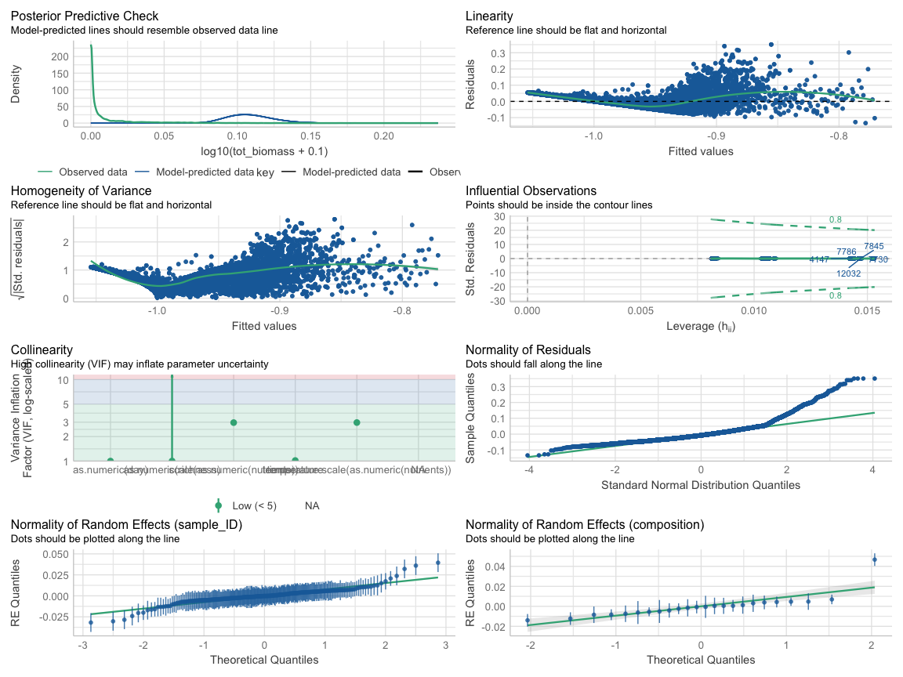
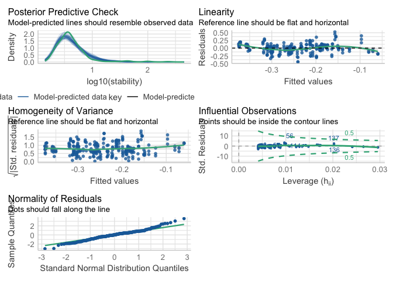
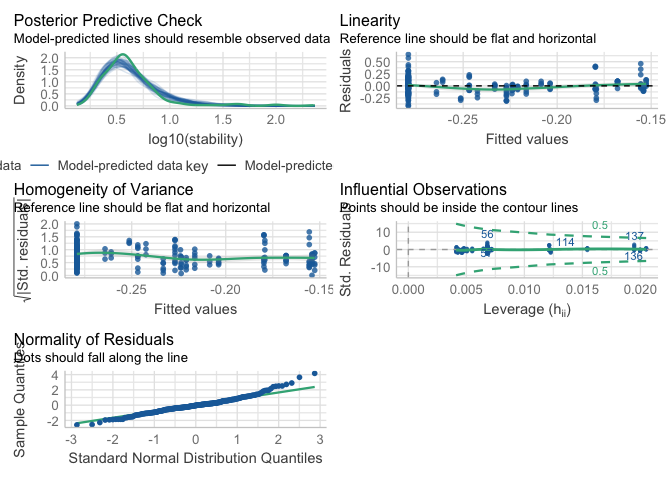
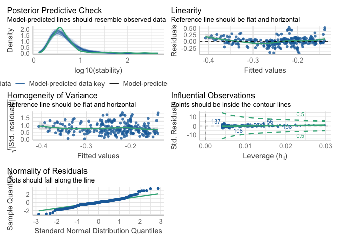

# Introduction

The purpose of this document is to provide a reproducible record of all analyses and figures in the main article. The main article is focused on the effect of response diversity on community stability in fluctuating environments. We are going to look at the effect of response diversity, richness, temperature and nutrients on community temporal stability. Specifically, we are going to look at the effect of fundamental and realized imbalance (our measurements of stability) on temporal stability. Finally, as response diversity is thought to stabilize temporal stability of aggregate community properties via asynchrony, we are going to look at the relationship between response diversity and asynchrony. 

This document is produced by an Rmarkdown file that includes code to reproduce from data all results presented in the main article.


# Load datasets


# Biomass

Let's have a look at the biomass dynamics in the different environmental treatments.

Is realised imbalance calculated in this chuck?


### tot biomass plot

<div class="figure" style="text-align: center">

<p class="caption">(\#fig:plot_biomass)Community total biomass during the experiment in different environmental treatments. Different color represent richness levels.</p>
</div>


First we analyze the effect of diversity, time, nutrients, temperature, and of the interaction between nutrients and temperature on biomass using a mixed model with composition and microcosm ID as random effects. Nutrients was centered on the mean to remove collinearity with temperature. Total community biomass was log transformed. Composition and microcosm ID were added as random effects to account for differential biomass production across communities and to account for the repeated nature of the measurements.


``` r
# Fit the linear mixed model
lmm <- lmer(
  log10(tot_biomass + 0.1) ~ as.numeric(day)  + (temperature) * scale(as.numeric(nutrients)) + as.numeric(richness) +
    (1 | sample_ID) + (1 | composition),
  data = df_biomass_mod
)
```

Check model's assumptions
<div class="figure" style="text-align: center">

<p class="caption">(\#fig:model_check0)model check 1.</p>
</div>


```
## Linear mixed model fit by REML. t-tests use Satterthwaite's method [
## lmerModLmerTest]
## Formula: log10(tot_biomass + 0.1) ~ as.numeric(day) + (temperature) *  
##     scale(as.numeric(nutrients)) + as.numeric(richness) + (1 |  
##     sample_ID) + (1 | composition)
##    Data: df_biomass_mod
## 
## REML criterion at convergence: -63618.9
## 
## Scaled residuals: 
##     Min      1Q  Median      3Q     Max 
## -3.0048 -0.6387 -0.1640  0.4122  7.8776 
## 
## Random effects:
##  Groups      Name        Variance  Std.Dev.
##  sample_ID   (Intercept) 9.493e-05 0.009743
##  composition (Intercept) 1.519e-04 0.012324
##  Residual                1.986e-03 0.044563
## Number of obs: 18954, groups:  sample_ID, 243; composition, 24
## 
## Fixed effects:
##                                                 Estimate Std. Error         df
## (Intercept)                                   -8.898e-01  1.011e-02  2.317e+01
## as.numeric(day)                               -1.801e-03  1.857e-05  1.869e+04
## temperature22-25                              -1.078e-02  1.955e-03  2.036e+02
## temperature25-28                              -2.398e-02  1.936e-03  2.026e+02
## scale(as.numeric(nutrients))                   3.435e-02  1.371e-03  2.039e+02
## as.numeric(richness)                          -4.329e-03  3.452e-03  2.209e+01
## temperature22-25:scale(as.numeric(nutrients)) -9.430e-03  1.968e-03  2.055e+02
## temperature25-28:scale(as.numeric(nutrients)) -1.842e-02  1.968e-03  2.061e+02
##                                               t value Pr(>|t|)    
## (Intercept)                                   -88.022  < 2e-16 ***
## as.numeric(day)                               -96.981  < 2e-16 ***
## temperature22-25                               -5.513 1.06e-07 ***
## temperature25-28                              -12.386  < 2e-16 ***
## scale(as.numeric(nutrients))                   25.053  < 2e-16 ***
## as.numeric(richness)                           -1.254    0.223    
## temperature22-25:scale(as.numeric(nutrients))  -4.790 3.18e-06 ***
## temperature25-28:scale(as.numeric(nutrients))  -9.364  < 2e-16 ***
## ---
## Signif. codes:  0 '***' 0.001 '**' 0.01 '*' 0.05 '.' 0.1 ' ' 1
## 
## Correlation of Fixed Effects:
##             (Intr) as.nmrc(d) tm22-25 tm25-28 s(.()) as.nmrc(r) t22-25:
## as.nmrc(dy) -0.053                                                     
## tmprtr22-25 -0.074  0.000                                              
## tmprtr25-28 -0.072  0.000      0.547                                   
## scl(s.nm())  0.028  0.000      0.066   0.000                           
## as.nmrc(rc) -0.957  0.000     -0.021  -0.027  -0.025                   
## t22-25:(.() -0.020  0.000     -0.036   0.050  -0.719  0.015            
## t25-28:(.() -0.024  0.000     -0.009   0.036  -0.701  0.016      0.528
```


```
## Type III Analysis of Variance Table with Satterthwaite's method
##                                           Sum Sq Mean Sq NumDF   DenDF
## as.numeric(day)                          18.6778 18.6778     1 18690.4
## temperature                               0.3092  0.1546     2   203.1
## scale(as.numeric(nutrients))              1.9474  1.9474     1   204.2
## as.numeric(richness)                      0.0031  0.0031     1    22.1
## temperature:scale(as.numeric(nutrients))  0.1742  0.0871     2   205.2
##                                            F value Pr(>F)    
## as.numeric(day)                          9405.3092 <2e-16 ***
## temperature                                77.8507 <2e-16 ***
## scale(as.numeric(nutrients))              980.6282 <2e-16 ***
## as.numeric(richness)                        1.5724  0.223    
## temperature:scale(as.numeric(nutrients))   43.8564 <2e-16 ***
## ---
## Signif. codes:  0 '***' 0.001 '**' 0.01 '*' 0.05 '.' 0.1 ' ' 1
```


**Time** and **nutrients** independently impact biomass, with biomass decreasing slightly over time and increasing with nutrient levels.

**Temperature** alone also significantly impact biomass, with biomass decreasing as temperature increases.

**temperature-nutrient interactions** are significant, suggesting the positive impact of nutrients on biomass is less pronounced at higher temperatures.

**Richness** does not appear to have a statistically significant effect on total biomass. 


# Main Results 

We now look at the main results of the experiment. We are going to look first at the effect of richness, temperature and nutrients on community temporal stability. Then, we are going to look at the effect of fundamental and realised imbalance on temporal stability. Finally, we are going to look at the relationship between response diversity and temporal stability.

In the whole analysis, we calculated the temporal stability of total community biomass as the inverse of the coefficient of variation (ICV) (i.e. $\frac{\sigma}{\mu}$). 


### Effect of T, N and R
<div class="figure" style="text-align: center">

<p class="caption">(\#fig:boxplots_TNR)Effects of richness (a), temperature (b), and nutrients (c) on community total biomass temporal stability.</p>
</div>


We can see that richness does not have a clear effect on community temporal stability, while stability was higher at lower temperature, and nutrients increased community temporal stability.

### Effect RD

We are now going to look at how response diversity (imbalance) affected temporal stability of total community biomass. We are going to look at the relationship between fundamental imbalance (so based only on species response surfaces measured in monoculture), an realised imbalance (measured accounting for species contribution to imbalance).

This is fundamentally testing our most important hypothesis.

<div class="figure" style="text-align: center">

<p class="caption">(\#fig:effect_RD)Effects of fundamental and realised response diversity (measured as imbalance) on total community biomass temporal stability.</p>
</div>

We can see that imbalance is always negatively related to temporal stability, which means that response diversity promotes stability across richness levels. Interestingly, we see that there is little difference between fundamental and realised imbalance. Yet, as the richness increases, the relationship between realised imbalance and stability becomes steeper compared to fundamental imbalance. 


We look also at the relationship between divergence (our original response diversity metric)

<div class="figure" style="text-align: center">

<p class="caption">(\#fig:divergence_CV)Relationship between Divergence and temporal stability of total community biomass.</p>
</div>
We can see that the positive relationship between temporal stability and response diversity measured as divergence holds, but it becomes shallower as richness increases. We could speculated that this due to divergence considering only the responses of the 2 most "responding" species. Thus, when species richness increases, disregarding the responses of the other species in the community except the 2 responding the most makes the relationship between response diversity and stability weaker. 


# Linear models


## Model: Fundamental Imbalance

First we analyze the effect of fundamental imbalance, temperature, nutrients and richness on biomass temporal stability using a linear model. 
imbalance and richness were modelled as continuous variables, while temperature and nutrients were modelled as categorical variables. Imbalance was log-transformed to meet the assumptions of linear models.


``` r
lm_full<-lm(data=complete_aggr,log10(stability)~log10(imbalance_f)+as.numeric(richness)+nutrients+temperature)
```


Check model's assumptions
<div class="figure" style="text-align: center">

<p class="caption">(\#fig:model_check1)model check 1.</p>
</div>


```
## 
## Call:
## lm(formula = log10(stability) ~ log10(imbalance_f) + as.numeric(richness) + 
##     nutrients + temperature, data = complete_aggr)
## 
## Residuals:
##      Min       1Q   Median       3Q      Max 
## -0.28605 -0.07635 -0.01196  0.04542  0.42770 
## 
## Coefficients:
##                       Estimate Std. Error t value Pr(>|t|)    
## (Intercept)          -0.350905   0.033407 -10.504  < 2e-16 ***
## log10(imbalance_f)   -0.050863   0.016041  -3.171  0.00172 ** 
## as.numeric(richness) -0.006457   0.009431  -0.685  0.49425    
## nutrients0.35 g/L     0.179918   0.018750   9.596  < 2e-16 ***
## nutrients0.75 g/L     0.213112   0.019473  10.944  < 2e-16 ***
## temperature22-25 °C  -0.078022   0.018683  -4.176 4.18e-05 ***
## temperature25-28 °C  -0.100991   0.024737  -4.083 6.10e-05 ***
## ---
## Signif. codes:  0 '***' 0.001 '**' 0.01 '*' 0.05 '.' 0.1 ' ' 1
## 
## Residual standard error: 0.1186 on 236 degrees of freedom
## Multiple R-squared:  0.5158,	Adjusted R-squared:  0.5035 
## F-statistic:  41.9 on 6 and 236 DF,  p-value: < 2.2e-16
```


A linear model was fitted to examine the effects of resource imbalance, richness, nutrients, and temperature on community stability (measured as log₁₀(stability)). The model explained a significant portion of the variance (Adjusted R² = 0.5115, F(7, 235) = 37.2, p < 2.2e-16).

The intercept of the model was estimated at -0.349 (SE = 0.028, p < 2e-16), indicating the baseline log₁₀(stability) when all predictor variables are at their reference levels.

Among the predictors, log₁₀(imbalance) showed a significant negative effect on stability (Estimate = -0.054, SE = 0.016, p = 0.0009). This suggests that as imbalance increases (more balance), stability tends to decrease.


Nutrient concentration also had a significant positive effect on stability, with estimates for 0.35 g/L (Estimate = 0.180, SE = 0.019, p < 2e-16) and 0.75 g/L (Estimate = 0.212, SE = 0.019, p < 2e-16) indicating increased stability with higher nutrient levels.

Finally, temperature regimes showed a significant effect on stability. Both 22–25 °C (Estimate = -0.078, SE = 0.019, p = 3.81e-05) and 25–28 °C (Estimate = -0.098, SE = 0.025, p = 8.44e-05) significantly reduced stability when compared to the baseline (18–21 °C).

Richness did not show a significant effect on stability (Estimate = 0.002, SE = 0.019, p = 0.91), which suggests that it is not richness per se that affects stability in this system. Similar results have been previously reported in the literature, e.g. (Petchey et al. 2002)[https://nsojournals.onlinelibrary.wiley.com/doi/full/10.1034/j.1600-0706.2002.990203.x?casa_token=THaSxpjziQcAAAAA%3Ay_0gJhnL_rcPsrolHEmZvI0VF14a43WRDTy_UB_kDPQOxq2EA98NQT65Co63J58NCeW-SiTIjoDkgelQ] who found that species richness did not significantly impact temporal stability in fluctuating environment.

In summary, our findings show that temporal stability is significantly influenced by response diversity (imbalance), nutrient concentration, and temperature, with higher nutrient concentrations enhancing stability and higher temperatures reducing it. However, species richness was not a significant determinant of stability within the conditions of this study.

Prepare publication-ready table 

Summary table


<table class="table table-striped table-hover table-condensed" style="color: black; width: auto !important; margin-left: auto; margin-right: auto;">
 <thead>
  <tr>
   <th style="text-align:center;"> Term </th>
   <th style="text-align:center;"> Estimate </th>
   <th style="text-align:center;"> Lower 95% CI </th>
   <th style="text-align:center;"> Upper 95% CI </th>
   <th style="text-align:center;"> t value </th>
   <th style="text-align:center;"> p-value </th>
  </tr>
 </thead>
<tbody>
  <tr>
   <td style="text-align:center;font-weight: bold;"> (Intercept) </td>
   <td style="text-align:center;font-weight: bold;"> -0.351 </td>
   <td style="text-align:center;font-weight: bold;"> -0.417 </td>
   <td style="text-align:center;font-weight: bold;"> -0.285 </td>
   <td style="text-align:center;font-weight: bold;"> -10.504 </td>
   <td style="text-align:center;font-weight: bold;"> 2.01e-21 </td>
  </tr>
  <tr>
   <td style="text-align:center;font-weight: bold;"> log10(imbalance_f) </td>
   <td style="text-align:center;font-weight: bold;"> -0.051 </td>
   <td style="text-align:center;font-weight: bold;"> -0.082 </td>
   <td style="text-align:center;font-weight: bold;"> -0.019 </td>
   <td style="text-align:center;font-weight: bold;"> -3.171 </td>
   <td style="text-align:center;font-weight: bold;"> 1.72e-03 </td>
  </tr>
  <tr>
   <td style="text-align:center;"> as.numeric(richness) </td>
   <td style="text-align:center;"> -0.006 </td>
   <td style="text-align:center;"> -0.025 </td>
   <td style="text-align:center;"> 0.012 </td>
   <td style="text-align:center;"> -0.685 </td>
   <td style="text-align:center;"> 4.94e-01 </td>
  </tr>
  <tr>
   <td style="text-align:center;font-weight: bold;"> nutrients0.35 g/L </td>
   <td style="text-align:center;font-weight: bold;"> 0.180 </td>
   <td style="text-align:center;font-weight: bold;"> 0.143 </td>
   <td style="text-align:center;font-weight: bold;"> 0.217 </td>
   <td style="text-align:center;font-weight: bold;"> 9.596 </td>
   <td style="text-align:center;font-weight: bold;"> 1.27e-18 </td>
  </tr>
  <tr>
   <td style="text-align:center;font-weight: bold;"> nutrients0.75 g/L </td>
   <td style="text-align:center;font-weight: bold;"> 0.213 </td>
   <td style="text-align:center;font-weight: bold;"> 0.175 </td>
   <td style="text-align:center;font-weight: bold;"> 0.251 </td>
   <td style="text-align:center;font-weight: bold;"> 10.944 </td>
   <td style="text-align:center;font-weight: bold;"> 8.20e-23 </td>
  </tr>
  <tr>
   <td style="text-align:center;font-weight: bold;"> temperature22-25 °C </td>
   <td style="text-align:center;font-weight: bold;"> -0.078 </td>
   <td style="text-align:center;font-weight: bold;"> -0.115 </td>
   <td style="text-align:center;font-weight: bold;"> -0.041 </td>
   <td style="text-align:center;font-weight: bold;"> -4.176 </td>
   <td style="text-align:center;font-weight: bold;"> 4.18e-05 </td>
  </tr>
  <tr>
   <td style="text-align:center;font-weight: bold;"> temperature25-28 °C </td>
   <td style="text-align:center;font-weight: bold;"> -0.101 </td>
   <td style="text-align:center;font-weight: bold;"> -0.150 </td>
   <td style="text-align:center;font-weight: bold;"> -0.052 </td>
   <td style="text-align:center;font-weight: bold;"> -4.083 </td>
   <td style="text-align:center;font-weight: bold;"> 6.10e-05 </td>
  </tr>
</tbody>
</table>

## Model: Relised Imbalance
Then we analyze the effect of realised imbalance, temperature, nutrients and richness on biomass temporal stability using a linear model. 


``` r
lm_full_w<-lm(data=complete_aggr,log10(stability)~log10(imbalance_r)+as.numeric(richness)+nutrients+temperature)
```

check model's assumptions
<div class="figure" style="text-align: center">

<p class="caption">(\#fig:model_check2)model check 2.</p>
</div>

Summary table


<table class="table table-striped table-hover table-condensed" style="color: black; width: auto !important; margin-left: auto; margin-right: auto;">
 <thead>
  <tr>
   <th style="text-align:center;"> Term </th>
   <th style="text-align:center;"> Estimate </th>
   <th style="text-align:center;"> Lower 95% CI </th>
   <th style="text-align:center;"> Upper 95% CI </th>
   <th style="text-align:center;"> t value </th>
   <th style="text-align:center;"> p-value </th>
  </tr>
 </thead>
<tbody>
  <tr>
   <td style="text-align:center;font-weight: bold;"> (Intercept) </td>
   <td style="text-align:center;font-weight: bold;"> -0.359 </td>
   <td style="text-align:center;font-weight: bold;"> -0.446 </td>
   <td style="text-align:center;font-weight: bold;"> -0.272 </td>
   <td style="text-align:center;font-weight: bold;"> -8.134 </td>
   <td style="text-align:center;font-weight: bold;"> 2.36e-14 </td>
  </tr>
  <tr>
   <td style="text-align:center;font-weight: bold;"> log10(imbalance_r) </td>
   <td style="text-align:center;font-weight: bold;"> -0.055 </td>
   <td style="text-align:center;font-weight: bold;"> -0.105 </td>
   <td style="text-align:center;font-weight: bold;"> -0.005 </td>
   <td style="text-align:center;font-weight: bold;"> -2.153 </td>
   <td style="text-align:center;font-weight: bold;"> 3.23e-02 </td>
  </tr>
  <tr>
   <td style="text-align:center;"> as.numeric(richness) </td>
   <td style="text-align:center;"> -0.017 </td>
   <td style="text-align:center;"> -0.036 </td>
   <td style="text-align:center;"> 0.003 </td>
   <td style="text-align:center;"> -1.707 </td>
   <td style="text-align:center;"> 8.91e-02 </td>
  </tr>
  <tr>
   <td style="text-align:center;font-weight: bold;"> nutrients0.35 g/L </td>
   <td style="text-align:center;font-weight: bold;"> 0.182 </td>
   <td style="text-align:center;font-weight: bold;"> 0.145 </td>
   <td style="text-align:center;font-weight: bold;"> 0.220 </td>
   <td style="text-align:center;font-weight: bold;"> 9.631 </td>
   <td style="text-align:center;font-weight: bold;"> 9.97e-19 </td>
  </tr>
  <tr>
   <td style="text-align:center;font-weight: bold;"> nutrients0.75 g/L </td>
   <td style="text-align:center;font-weight: bold;"> 0.218 </td>
   <td style="text-align:center;font-weight: bold;"> 0.179 </td>
   <td style="text-align:center;font-weight: bold;"> 0.257 </td>
   <td style="text-align:center;font-weight: bold;"> 11.048 </td>
   <td style="text-align:center;font-weight: bold;"> 3.81e-23 </td>
  </tr>
  <tr>
   <td style="text-align:center;font-weight: bold;"> temperature22-25 °C </td>
   <td style="text-align:center;font-weight: bold;"> -0.079 </td>
   <td style="text-align:center;font-weight: bold;"> -0.116 </td>
   <td style="text-align:center;font-weight: bold;"> -0.042 </td>
   <td style="text-align:center;font-weight: bold;"> -4.194 </td>
   <td style="text-align:center;font-weight: bold;"> 3.88e-05 </td>
  </tr>
  <tr>
   <td style="text-align:center;font-weight: bold;"> temperature25-28 °C </td>
   <td style="text-align:center;font-weight: bold;"> -0.110 </td>
   <td style="text-align:center;font-weight: bold;"> -0.164 </td>
   <td style="text-align:center;font-weight: bold;"> -0.057 </td>
   <td style="text-align:center;font-weight: bold;"> -4.068 </td>
   <td style="text-align:center;font-weight: bold;"> 6.47e-05 </td>
  </tr>
</tbody>
</table>


## Model: Divergence
Finally we analyze the effect of divergence, temperature, nutrients and richness on biomass temporal stability using a linear model. 


``` r
lm_divergence<-lm(data=complete_aggr,log10(stability)~divergence + as.numeric(richness)+nutrients+temperature)
```


Check model's assumptions
<div class="figure" style="text-align: center">

<p class="caption">(\#fig:model_check3)model check 3.</p>
</div>

Summary table


<table class="table table-striped table-hover table-condensed" style="color: black; width: auto !important; margin-left: auto; margin-right: auto;">
 <thead>
  <tr>
   <th style="text-align:center;"> Term </th>
   <th style="text-align:center;"> Estimate </th>
   <th style="text-align:center;"> Lower 95% CI </th>
   <th style="text-align:center;"> Upper 95% CI </th>
   <th style="text-align:center;"> t value </th>
   <th style="text-align:center;"> p-value </th>
  </tr>
 </thead>
<tbody>
  <tr>
   <td style="text-align:center;font-weight: bold;"> (Intercept) </td>
   <td style="text-align:center;font-weight: bold;"> -0.270 </td>
   <td style="text-align:center;font-weight: bold;"> -0.320 </td>
   <td style="text-align:center;font-weight: bold;"> -0.220 </td>
   <td style="text-align:center;font-weight: bold;"> -10.637 </td>
   <td style="text-align:center;font-weight: bold;"> 7.65e-22 </td>
  </tr>
  <tr>
   <td style="text-align:center;font-weight: bold;"> divergence </td>
   <td style="text-align:center;font-weight: bold;"> 0.088 </td>
   <td style="text-align:center;font-weight: bold;"> 0.037 </td>
   <td style="text-align:center;font-weight: bold;"> 0.138 </td>
   <td style="text-align:center;font-weight: bold;"> 3.389 </td>
   <td style="text-align:center;font-weight: bold;"> 8.21e-04 </td>
  </tr>
  <tr>
   <td style="text-align:center;font-weight: bold;"> as.numeric(richness) </td>
   <td style="text-align:center;font-weight: bold;"> -0.023 </td>
   <td style="text-align:center;font-weight: bold;"> -0.043 </td>
   <td style="text-align:center;font-weight: bold;"> -0.003 </td>
   <td style="text-align:center;font-weight: bold;"> -2.309 </td>
   <td style="text-align:center;font-weight: bold;"> 2.18e-02 </td>
  </tr>
  <tr>
   <td style="text-align:center;font-weight: bold;"> nutrients0.35 g/L </td>
   <td style="text-align:center;font-weight: bold;"> 0.182 </td>
   <td style="text-align:center;font-weight: bold;"> 0.145 </td>
   <td style="text-align:center;font-weight: bold;"> 0.219 </td>
   <td style="text-align:center;font-weight: bold;"> 9.776 </td>
   <td style="text-align:center;font-weight: bold;"> 3.61e-19 </td>
  </tr>
  <tr>
   <td style="text-align:center;font-weight: bold;"> nutrients0.75 g/L </td>
   <td style="text-align:center;font-weight: bold;"> 0.209 </td>
   <td style="text-align:center;font-weight: bold;"> 0.170 </td>
   <td style="text-align:center;font-weight: bold;"> 0.248 </td>
   <td style="text-align:center;font-weight: bold;"> 10.588 </td>
   <td style="text-align:center;font-weight: bold;"> 1.09e-21 </td>
  </tr>
  <tr>
   <td style="text-align:center;font-weight: bold;"> temperature22-25 °C </td>
   <td style="text-align:center;font-weight: bold;"> -0.090 </td>
   <td style="text-align:center;font-weight: bold;"> -0.127 </td>
   <td style="text-align:center;font-weight: bold;"> -0.054 </td>
   <td style="text-align:center;font-weight: bold;"> -4.824 </td>
   <td style="text-align:center;font-weight: bold;"> 2.52e-06 </td>
  </tr>
  <tr>
   <td style="text-align:center;font-weight: bold;"> temperature25-28 °C </td>
   <td style="text-align:center;font-weight: bold;"> -0.152 </td>
   <td style="text-align:center;font-weight: bold;"> -0.189 </td>
   <td style="text-align:center;font-weight: bold;"> -0.115 </td>
   <td style="text-align:center;font-weight: bold;"> -8.174 </td>
   <td style="text-align:center;font-weight: bold;"> 1.83e-14 </td>
  </tr>
</tbody>
</table>


```
## Analysis of Variance Table
## 
## Model 1: log10(stability) ~ log10(imbalance_f) + as.numeric(richness) + 
##     nutrients + temperature
## Model 2: log10(stability) ~ log10(imbalance_r) + as.numeric(richness) + 
##     nutrients + temperature
## Model 3: log10(stability) ~ divergence + as.numeric(richness) + nutrients + 
##     temperature
##   Res.Df    RSS Df Sum of Sq F Pr(>F)
## 1    236 3.3209                      
## 2    236 3.3957  0 -0.074784         
## 3    236 3.3017  0  0.094008
```


```
##               df       AIC
## lm_full        8 -337.5510
## lm_full_w      8 -332.1396
## lm_divergence  8 -338.9618
```

<!-- -->

```
## 
## Call:
## lm(formula = log10(stability) ~ log10(imbalance_f), data = complete_aggr)
## 
## Residuals:
##      Min       1Q   Median       3Q      Max 
## -0.45292 -0.08388  0.00328  0.08204  0.53061 
## 
## Coefficients:
##                    Estimate Std. Error t value Pr(>|t|)    
## (Intercept)        -0.34850    0.01704 -20.446  < 2e-16 ***
## log10(imbalance_f) -0.10806    0.01429  -7.562 8.32e-13 ***
## ---
## Signif. codes:  0 '***' 0.001 '**' 0.01 '*' 0.05 '.' 0.1 ' ' 1
## 
## Residual standard error: 0.1517 on 241 degrees of freedom
## Multiple R-squared:  0.1918,	Adjusted R-squared:  0.1884 
## F-statistic: 57.18 on 1 and 241 DF,  p-value: 8.317e-13
```


<!-- -->

```
## 
## Call:
## lm(formula = log10(stability) ~ (divergence), data = complete_aggr)
## 
## Residuals:
##      Min       1Q   Median       3Q      Max 
## -0.41454 -0.08948 -0.00742  0.09164  0.65272 
## 
## Coefficients:
##             Estimate Std. Error t value Pr(>|t|)    
## (Intercept) -0.27915    0.01341 -20.819  < 2e-16 ***
## divergence   0.13421    0.03102   4.327 2.22e-05 ***
## ---
## Signif. codes:  0 '***' 0.001 '**' 0.01 '*' 0.05 '.' 0.1 ' ' 1
## 
## Residual standard error: 0.1625 on 241 degrees of freedom
## Multiple R-squared:  0.07208,	Adjusted R-squared:  0.06823 
## F-statistic: 18.72 on 1 and 241 DF,  p-value: 2.218e-05
```

<!-- -->

```
## 
## Call:
## lm(formula = log10(stability) ~ log10(imbalance_r), data = complete_aggr)
## 
## Residuals:
##      Min       1Q   Median       3Q      Max 
## -0.44831 -0.07679  0.00482  0.07732  0.52305 
## 
## Coefficients:
##                    Estimate Std. Error t value Pr(>|t|)    
## (Intercept)        -0.44115    0.03166 -13.933  < 2e-16 ***
## log10(imbalance_r) -0.13683    0.02072  -6.604 2.53e-10 ***
## ---
## Signif. codes:  0 '***' 0.001 '**' 0.01 '*' 0.05 '.' 0.1 ' ' 1
## 
## Residual standard error: 0.1552 on 241 degrees of freedom
## Multiple R-squared:  0.1532,	Adjusted R-squared:  0.1497 
## F-statistic: 43.61 on 1 and 241 DF,  p-value: 2.533e-10
```
### sum vs. weighted_sum

We now look at how fundamental and realised imbalance are related to each other. 

<div class="figure" style="text-align: center">

<p class="caption">(\#fig:Cor_sum_weighted_sum)Relationship between fundamental and realised imbalance.</p>
</div>


# Asynchrony
Response diversity (aka imbalance) has been suggested as a mechanism that promotes temporal stability of community biomass by promoting species asynchrony.
We thus calculated the asynchrony index suggested by Gross et al. (2014) to calculate the effect of asynchrony on temporal stability and to see how reponse diversity relate to asynchrony.
The index ranges between -1 and 1, with -1 indicating perfect asyncrony and 1 being perfectly synchronous, and 0 indicating random variation.


### Plot stability vs. Asynchrony Gross
<div class="figure" style="text-align: center">

<p class="caption">(\#fig:async_plots)Relatioship temporal stability and asynchrony (Gross) divided by nutrient level.</p>
</div>
### Plot Asynchrony Gross vs fundamental imbalance

<div class="figure" style="text-align: center">

<p class="caption">(\#fig:async)Relatioship between asynchrony and fundamental imbalance divided by nutrient level.</p>
</div>


# SEM 


Now, we use a structural equation model (SEM) to explore how stability is influenced by asynchrony, temperature, nutrient levels, imbalance, and richness, with asynchrony also modeled as dependent on imbalance, nutrients, and richness.


```
## lavaan 0.6-19 ended normally after 1 iteration
## 
##   Estimator                                         ML
##   Optimization method                           NLMINB
##   Number of model parameters                        12
## 
##   Number of observations                           241
## 
## Model Test User Model:
##                                               Standard      Scaled
##   Test Statistic                                 1.777       1.537
##   Degrees of freedom                                 1           1
##   P-value (Chi-square)                           0.183       0.215
##   Scaling correction factor                                  1.156
##     Satorra-Bentler correction                                    
## 
## Model Test Baseline Model:
## 
##   Test statistic                               295.357     353.081
##   Degrees of freedom                                 9           9
##   P-value                                        0.000       0.000
##   Scaling correction factor                                  0.837
## 
## User Model versus Baseline Model:
## 
##   Comparative Fit Index (CFI)                    0.997       0.998
##   Tucker-Lewis Index (TLI)                       0.976       0.986
##                                                                   
##   Robust Comparative Fit Index (CFI)                         0.998
##   Robust Tucker-Lewis Index (TLI)                            0.981
## 
## Loglikelihood and Information Criteria:
## 
##   Loglikelihood user model (H0)                152.706     152.706
##   Loglikelihood unrestricted model (H1)             NA          NA
##                                                                   
##   Akaike (AIC)                                -281.411    -281.411
##   Bayesian (BIC)                              -239.594    -239.594
##   Sample-size adjusted Bayesian (SABIC)       -277.631    -277.631
## 
## Root Mean Square Error of Approximation:
## 
##   RMSEA                                          0.057       0.047
##   90 Percent confidence interval - lower         0.000       0.000
##   90 Percent confidence interval - upper         0.192       0.176
##   P-value H_0: RMSEA <= 0.050                    0.306       0.356
##   P-value H_0: RMSEA >= 0.080                    0.531       0.469
##                                                                   
##   Robust RMSEA                                               0.051
##   90 Percent confidence interval - lower                     0.000
##   90 Percent confidence interval - upper                     0.200
##   P-value H_0: Robust RMSEA <= 0.050                         0.327
##   P-value H_0: Robust RMSEA >= 0.080                         0.525
## 
## Standardized Root Mean Square Residual:
## 
##   SRMR                                           0.012       0.012
## 
## Parameter Estimates:
## 
##   Standard errors                           Robust.sem
##   Information                                 Expected
##   Information saturated (h1) model          Structured
## 
## Regressions:
##                      Estimate  Std.Err  z-value  P(>|z|)   Std.lv  Std.all
##   stability ~                                                             
##     asynchrny_Grss      0.195    0.033    5.947    0.000    0.195    0.399
##     temperature        -0.049    0.011   -4.454    0.000   -0.049   -0.241
##     nutrients           0.147    0.011   13.216    0.000    0.147    0.719
##     log_imbalanc_f     -0.029    0.012   -2.452    0.014   -0.029   -0.120
##     richness            0.011    0.010    1.181    0.238    0.011    0.055
##   asynchrony_Gross ~                                                      
##     log_imbalanc_f     -0.080    0.029   -2.719    0.007   -0.080   -0.159
##     nutrients          -0.210    0.022   -9.373    0.000   -0.210   -0.501
##     richness           -0.102    0.023   -4.404    0.000   -0.102   -0.243
## 
## Intercepts:
##                    Estimate  Std.Err  z-value  P(>|z|)   Std.lv  Std.all
##    .stability        -0.407    0.040  -10.122    0.000   -0.407   -2.441
##    .asynchrny_Grss    0.125    0.065    1.921    0.055    0.125    0.367
## 
## Variances:
##                    Estimate  Std.Err  z-value  P(>|z|)   Std.lv  Std.all
##    .stability         0.012    0.001   10.670    0.000    0.012    0.430
##    .asynchrny_Grss    0.081    0.009    8.917    0.000    0.081    0.694
## 
## R-Square:
##                    Estimate
##     stability         0.570
##     asynchrny_Grss    0.306
```
**Model Fit**

The model fit indices suggest a good fit:

Comparative Fit Index (CFI) = 0.998 and Tucker-Lewis Index (TLI) = 0.986, both indicating a good fit as values close to 1 are considered strong.
Root Mean Square Error of Approximation (RMSEA) = 0.047 (with robust RMSEA at 0.051) and Standardized Root Mean Square Residual (SRMR) = 0.012. These values indicate a good fit, with RMSEA and SRMR values below 0.05 generally preferred.


Interpretation of Pathways


**Stability**:

*Asynchrony*: Positive and highly significant effect on stability, suggesting that asynchrony (indicating lack of synchrony or compensatory dynamics) is associated with greater stability.

*Temperature*: Negative effect, where higher temperature values correlate with lower stability, potentially due to physiological stress or disruption in community dynamics at higher temperatures.

*Nutrients*: Positive and highly significant, suggesting that greater nutrient availability enhances stability, possibly through support for higher productivity or resource buffering.

*Imbalance*: Negative and significant effect, where greater imbalance reduces stability.
Richness: Not significant, indicating that within this model, richness does not have a notable effect on stability.


**Asynchrony**:

*Imbalance*: Negative and significant, suggesting that greater imbalance reduces asynchrony.

*Nutrients*: Negative and highly significant effect, indicating that higher nutrient concentrations are associated with lower asynchrony, possibly due to homogenizing effects of nutrient availability.

*Richness*: Negative and significant, where increased richness is associated with reduced asynchrony, possibly indicating increased interactions or overlap in resource use among species.

**Explained Variance**

*Stability*: The model explains 57% of the variance in stability, suggesting a substantial amount of stability is accounted for by these factors.

*Asynchrony*: The model explains 30.6% of the variance in asynchrony, indicating that while imbalance, nutrients, and richness contribute, other factors may also play a role in driving asynchrony.

**Summary**

This SEM model demonstrates that stability in the ecosystem is positively associated with asynchrony and nutrient levels, but negatively associated with temperature and imbalance. Interestingly, species richness has no direct impact on stability but does reduce asynchrony, indicating indirect complexity in the stability-dynamics relationship. This highlights the role of environmental and community factors in ecosystem stability, with asynchrony serving as a crucial intermediary in maintaining stability in fluctuating conditions.

<div class="figure" style="text-align: center">

<p class="caption">(\#fig:SEM)SEM.</p>
</div>

Structural equation model (SEM) of the relationship between fundamental imbalance, asynchrony, richness, nutrients, temperature and temporal stability. The model shows that fundamental imbalance has a negative effect on asynchrony, which in turn has a positive effect on temporal stability. The model also shows that fundamental imbalance has a direct negative effect on temporal stability. Temperature has a direct negative effect on temporal stability, while nutrients have a direct positive effect on temporal stability. Richness has a direct negative effect on asynchrony, but no direct effect on temporal stability. 


<!-- # SEM and balance sim -->

<!-- ```{r interaction RD async} -->

<!-- # simulate random slopes -->


<!-- slopes<-rnorm(1000,mean=0,sd=0.1) -->

<!-- mean_s<-mean(df_slopes$slope) -->
<!-- sd_s<-sd(df_slopes$slope) -->

<!-- RD_df<-lapply(c(2,3,4,10),function(r){ -->

<!--   RD<-lapply(1:1000,function(c){ -->
<!--   slopes<-rnorm(r,mean=0,sd=sd_s) -->
<!--   balance<-abs(mean(slopes)) -->
<!--   divergence<-(max(slopes)-min(slopes)-abs(abs(max(slopes))-abs(min(slopes))))/(max(slopes)-min(slopes)) -->
<!--   adj_divergence<-abs(sum(slopes))/sum(abs(slopes)) -->
<!--   avg_magnitude<-mean(abs(slopes)) -->
<!--   RD_df<-data.frame(balance=balance,divergence=divergence,richness=r,adj_divergence=1-adj_divergence,avg_magnitude=avg_magnitude) -->

<!--   return(RD_df) -->
<!-- }) -->
<!--   RD<-do.call("rbind",RD) -->
<!-- }) -->

<!-- RD_df<-do.call("rbind",RD_df) -->


<!-- plot<-ggplot(data=RD_df,aes(x=balance,color=as.factor(richness)))+ -->
<!--   geom_density() -->

<!-- plot_sim_div_bal<-ggplot(data=RD_df,aes(x=adj_divergence,y=balance,color=avg_magnitude))+ -->
<!--   geom_point()+ -->
<!--   facet_wrap(~richness) -->


<!-- # Ensure the data is ungrouped before applying transformations -->
<!-- sem_aggr <- async_aggr %>% -->
<!--   ungroup() %>%  # Ensure there is no grouping -->
<!--   dplyr::mutate( -->
<!--     log_abs_sum_slope = log10(imbalance_f), -->
<!--     stability = log10(1 / CV), -->
<!--     richness = as.numeric(richness), -->
<!--     temperature=temperature, -->
<!--     log_magnitude=log10(magnitude), -->
<!--     sqrt_symm=sqrt(symmetry), -->
<!--     log_sum_abs=log10(sum_abs_slope), -->
<!--     RD=imbalance_f/sum_abs_slope, -->
<!--     log_syn_Gross=log10(1+synchrony_Gross), -->
<!--     symmetry_scaled=(symmetry/as.numeric(richness)), -->
<!--     asyn_Gross= (-synchrony_Gross), -->
<!--     log_asyn_Gross=log10((-synchrony_Gross)+1), -->
<!--     log_sum_abs_slope=log10(sum_abs_slope) -->
<!--     #Keep it as an ordered factor -->
<!--   ) -->

<!-- quantile(sem_aggr$log_abs_sum_slope) -->


<!-- sem_aggr$nutrients[sem_aggr$nutrients=="0.01 g/L"]<-0.01 -->
<!-- sem_aggr$nutrients[sem_aggr$nutrients=="0.35 g/L"]<-0.35 -->
<!-- sem_aggr$nutrients[sem_aggr$nutrients=="0.75 g/L"]<-0.75 -->

<!-- sem_aggr$temperature[sem_aggr$temperature=="18-21 °C"]=1 -->
<!-- sem_aggr$temperature[sem_aggr$temperature=="22-25 °C"]=2 -->
<!-- sem_aggr$temperature[sem_aggr$temperature=="25-28 °C"]=3 -->


<!-- #correct balance for magnitude -->
<!-- # the effect of magnitude goes down, the more divergence there is -->

<!-- # Load the lavaan package -->
<!-- library(lavaan) -->


<!-- model1A <- ' -->
<!--   stability ~ asyn_Gross+temperature+nutrients+symmetry_scaled+log_sum_abs_slope -->

<!--   asyn_Gross ~ nutrients+richness+log_sum_abs_slope+symmetry_scaled -->


<!-- ' -->
<!-- modl<-lm(data=sem_aggr,log_abs_sum_slope~symmetry_scaled+log_sum_abs_slope) -->


<!-- model1B <- ' -->
<!--   stability ~ asyn_Gross -->
<!--   +temperature -->
<!--   +nutrients -->
<!--   +log_abs_sum_slope+ -->
<!--   richness -->


<!--   asyn_Gross ~ log_abs_sum_slope -->
<!--   +nutrients -->
<!--   +richness -->
<!-- ' -->


<!-- model1C <- ' -->
<!--   stability ~ asyn_Gross+temperature+c("c1","c2","c1")*richness+log_abs_sum_slope -->

<!--   asyn_Gross ~ log_abs_sum_slope+c("d1","d2","d3")*richness -->

<!--   c1==0 -->
<!--   d2==0 -->
<!-- ' -->


<!-- # Define the SEM model using lavaan syntax -->
<!--  model2 <- ' -->
<!--   # Direct effects -->
<!--   stability ~ asyn_Gross+log_magnitude -->

<!--   # Indirect effect via synchrony -->
<!--   asyn_Gross ~ symmetry -->


<!-- ' -->


<!-- # Fit the model -->
<!-- fit <- sem(model2, data = sem_aggr%>%dplyr::filter(!is.na(synchrony_Gross),nutrients!="0.01 g/L")) -->


<!-- fit1A <- sem(model1A, estimator="MLM",meanstructure = TRUE,data = sem_aggr%>%dplyr::filter(!is.na(synchrony_Gross))) -->


<!-- fit1B <- sem(model1B, estimator="MLM",meanstructure = TRUE,data = sem_aggr%>%dplyr::filter(!is.na(synchrony_Gross))) -->

<!-- fit1C <- sem(model1C, estimator="MLM",meanstructure = TRUE,group="nutrients", data = sem_aggr%>%dplyr::filter(,!is.na(synchrony_Gross))) -->


<!--  ### model B slightly better -->
<!-- AICc(fit1C,fit1B) ### model B and C almost the same -->

<!-- anova(fit1Ba,fit1Bb) -->
<!-- # Summarize the results -->
<!-- summary(fit1B, standardized = TRUE,rsquare=T, fit.measures = TRUE) -->


<!-- modificationindices(fit1B) -->


<!-- lavaanPlot(model = fit1A, node_options = list(shape = "box", fontname = "Helvetica"), edge_options = list(color = "grey"), coefs = TRUE, sig = .05) -->

<!-- ``` -->

<!-- # interactions -->

<!-- ```{r stat averaging} -->

<!-- interactions_df <- read_csv("interactions_df_w_T.csv") -->

<!-- int_aggr<-full_join(interactions_df,async_aggr,join_by(sample_ID)) -->
<!-- int_aggr$mean_int_strength[is.na(int_aggr$mean_int_strength)]=0 -->
<!-- int_aggr$mean_interaction[is.na(int_aggr$mean_interaction)]=0 -->
<!-- int_aggr$sum_int_strength[is.na(int_aggr$sum_int_strength)]=0 -->

<!-- M_int<-lm(data=int_aggr,log10(stability)~log10(abs_sum_slope)+nutrients+temperature+richness+mean_int_strength) -->
<!-- anova(M_int,lm_full) -->


<!-- plot_int_syn<-ggplot(data=int_aggr,aes(y=synchrony_Gross,x=mean_int_strength,color=log10(abs_sum_slope)))+ -->
<!--   geom_point()+ -->
<!--   geom_smooth(method="lm") -->


<!-- ### above rep level -->
<!-- rep_aggr<-int_aggr%>%group_by(rep_var.y,richness,temperature,nutrients,composition)%>% dplyr::reframe(log_mean_fun_balance=log10(mean(abs_sum_slope)), -->
<!--                                                                                      mean_asyn_Gross=mean(-synchrony_Gross,na.rm=T), -->
<!--                                                                                      mean_int_rep_strength=mean(mean_int_strength), -->
<!--                                                                                      log_mean_stab=log10(mean(1/CV))) -->


<!-- M_int<-lm(data=rep_aggr,log_mean_stab~log_mean_fun_balance+nutrients+temperature+richness+mean_int_rep_strength) -->
<!-- anova(M_int,lm_full) -->


<!-- M_int_syn<-lm(data=rep_aggr,mean_asyn_Gross~log_mean_fun_balance+richness+temperature+mean_int_rep_strength+nutrients) -->
<!-- summary(M_int_syn) -->

<!-- plot_richness_int<-ggplot(data=rep_aggr,aes(x=mean_int_rep_strength))+ -->
<!--   geom_histogram(bins=10)+ -->
<!--   facet_wrap(~nutrients) -->
<!-- plot_int_syn<-ggplot(data=rep_aggr,aes(y=mean_asyn_Gross,x=mean_int_rep_strength))+ -->
<!--   geom_point()+ -->
<!--   geom_smooth(method="lm")+ -->
<!--   facet_wrap(~richness) -->

<!-- ### sem -->

<!-- rep_aggr<-rep_aggr%>%dplyr::mutate(richness=as.numeric(richness)) -->


<!-- model_int <- ' -->
<!--   log_mean_stab ~ mean_asyn_Gross -->
<!--   +temperature -->
<!--   +nutrients -->
<!--   +log_mean_fun_balance -->
<!--   +richness -->


<!--   mean_asyn_Gross ~ log_mean_fun_balance -->
<!--   +nutrients -->
<!--   +mean_int_rep_strength+ -->
<!--   +richness -->


<!-- ' -->
<!-- fit_int <- sem(model_int, estimator="MLM",meanstructure = TRUE,data = rep_aggr) -->


<!-- summary(fit_int, standardized = TRUE, fit.measures = TRUE,rsquare=T) -->

<!-- AICc(fit_int) -->

<!-- lm_r_int_syn<-lm(data=rep_aggr,mean_asyn_Gross~richness+mean_int_rep_strength+log_mean_fun_balance) -->


<!-- ##### load interactions from rgular CCM -->


<!-- interactions_df <- read_csv("interactions_df_regular.csv") -->

<!-- int_aggr2<-full_join(interactions_df,async_aggr,join_by(sample_ID)) -->
<!-- int_aggr2$mean_interaction_strength[is.na(int_aggr2$mean_interaction_strength)]=0 -->
<!-- int_aggr2$mean_sum_interactions[is.na(int_aggr2$mean_sum_interactions)]=0 -->


<!-- M_int<-lm(data=int_aggr2,log10(stability)~log10(abs_sum_slope)+nutrients.y+temperature.y+richness+mean_interaction_strength) -->
<!-- anova(M_int,lm_full) -->

<!-- ``` -->

<!-- ## Plot interaction vs Asnychrony -->


<!-- ```{r} -->

<!-- ``` -->


<!-- ##Poster -->

<!-- ```{r} -->

<!-- ### time series with nutrients==0.35 and T=22-25 -->

<!-- poster_ts<-complete_ts%>%filter(nutrients=="0.35 g/L", -->
<!--                                 temperature=="22-25 °C", -->
<!--                                 sample_ID=="DLPS_Tmp_22_25_Nut0.35_3") -->
<!-- dark2_palette <- brewer.pal(n = 8, name = "Dark2") -->
<!-- selected_colors <- dark2_palette[2:5] -->

<!-- plot_poster_ts <- ggplot(data = poster_ts, aes(x = day, y = biomass, color = predict_spec)) + -->
<!--   geom_line(linewidth=1.5) + ylab("Biomass")+xlab("Day")+ -->
<!--   theme_classic() + -->
<!--   scale_color_manual(values = selected_colors) + -->
<!--   theme(legend.position = "none",        -->
<!--         axis.text.y = element_blank(),        # Remove the y-axis  -->
<!--         axis.ticks.y = element_blank(), -->
<!--         axis.title.x = element_text(size=16), -->
<!--         axis.title.y=element_text(size=16))      -->

<!-- plot_poster_ts -->

<!-- cake_df<-poster_ts%>%group_by(predict_spec)%>%summarize(mean_biom=mean(biomass)) -->


<!-- cake_df <- tibble::tibble( -->
<!--   predict_spec = c("Dexiostoma", "Loxocephalus", "Paramecium", "Spirostomum"), -->
<!--   mean_biom = c(0.000000843, 0.000000808, 0.00000520, 0.000000237) -->
<!-- ) -->

<!-- # percentages -->
<!-- cake_df <- cake_df %>% -->
<!--   dplyr::mutate(percentage = mean_biom / sum(mean_biom) * 100) -->

<!-- # cake diagramm -->
<!-- plot_cake <- ggplot(cake_df, aes(x = "", y = percentage, fill = predict_spec)) + -->
<!--   scale_fill_manual(values = selected_colors) + -->
<!--   geom_bar(stat = "identity", width = 1) +  -->
<!--   coord_polar(theta = "y") +                    # Titel und Legende -->
<!--   theme_void()+ -->
<!--   labs(fill="Species")+ -->
<!--   theme(legend.direction = "vertical",legend.position="right", -->
<!--         legend.title = element_text(size=16))# Verwende eine Farbpalette -->


<!-- plot_cake+plot_poster_ts+ plot_layout(ncol = 2,widths=c(1,2))   # Title for the combined plot -->
<!-- weight_plot <- wrap_elements(plot_cake + theme(plot.margin = margin( b = 150))) +  # Move the cake plot up -->
<!--   plot_spacer() + -->
<!--   plot_poster_ts +  -->
<!--   plot_layout(ncol = 3, widths = c(1, 0.2, 1)) -->

<!-- weight_plot -->

<!-- #ggsave("weight.pdf", plot = weight_plot, width = 10, height = 6) -->


<!-- # create temperature regime plot -->

<!-- regime1<-data.frame(temperature=rep(c(18,18,18,21,21,21),length.out=60),regime= "18-21 °C") -->
<!-- regime2<-data.frame(temperature=rep(c(22,22,22,25,25,25),length.out=60),regime= "22-25 °C") -->
<!-- regime3<-data.frame(temperature=rep(c(25,25,25,28,28,28),length.out=60),regime= "25-28 °C") -->
<!-- day= -->

<!-- df_Temp<-rbind(regime1,regime2,regime3) -->
<!-- df_Temp<-cbind(df_Temp,day=rep(1:60)) -->

<!-- plot_temp<-ggplot(data=df_Temp,aes(x=day,y=temperature,linetype=regime))+ -->
<!--   geom_line()+  theme_classic() + -->
<!--   ylab("Temperature °C")+xlab("Day")+ -->
<!--   labs(linetype="Temperature regime")+ -->
<!--   scale_y_continuous(breaks = c(28, 25, 22, 21, 18)) + -->
<!--   theme(legend.direction = "vertical",legend.position="right",         -->
<!--         axis.title.x = element_text(size=16), -->
<!--         axis.title.y=element_text(size=16)) -->


<!-- ggsave("temp_regime.pdf", plot = plot_temp, width = 8, height = 6) -->


<!-- ############ Main results plot -->


<!-- balance_dd<-complete_aggr%>%dplyr::select(abs_sum_slope,richness,CV)%>% -->
<!--   cbind(type="no")%>%dplyr::mutate(abs_sum_slope=abs_sum_slope/as.numeric(richness)) -->
<!-- names(balance_dd)[names(balance_dd)=="abs_sum_slope"]<-"balance" -->

<!-- weighted_balance_dd<-complete_aggr%>%dplyr::select(avg_w_sumslopes,richness,CV)%>% -->
<!--   cbind(type="yes") -->
<!-- names(weighted_balance_dd)[names(weighted_balance_dd)=="avg_w_sumslopes"]<-"balance" -->

<!-- main_r_dd<-rbind(balance_dd,weighted_balance_dd) -->

<!-- plot_main <- main_r_dd %>% -->
<!--   ggplot(aes(x = log10(balance), y = log10(1/CV), color = type)) + -->
<!--   geom_point(aes(x = log10(balance), y = log10(1/CV))) + -->
<!--   geom_smooth(method = "lm", aes(x = log10(balance), y = log10(1/CV))) + -->
<!--   theme_classic() + -->
<!--   scale_color_viridis_d(option = "inferno", begin = 0.3, end = 0.6) + -->
<!--   scale_x_continuous( -->
<!--     breaks = log10(c(0.0025,0.01, 0.04, 0.16, 0.64)), -->
<!--     labels = c("0.0025","0.01", "0.04", "0.16", "0.64") -->
<!--   ) + -->
<!--   ylab(expression("temporal stability: "~log[10]("mean/s.d.")))+ -->
<!--   xlab(expression(log[10]("Balance"))) + -->
<!--   theme(axis.title.x = element_text(size = 16), -->
<!--         axis.title.y = element_text(size = 16), -->
<!--         strip.background = element_rect(fill = "grey80", color = NA),   -->
<!--     strip.text = element_text(size = 12)) + -->
<!--   labs(color = "Weighted") +   -->
<!--   facet_wrap(~richness, labeller = as_labeller(function(x) paste0("richness = ", x))) -->

<!-- ggsave("main_plot.pdf", plot = plot_main, width = 10, height = 6) -->


<!-- ### linear model summary table -->

<!-- # Install and load the broom package if you haven't already -->

<!-- library(broom) -->

<!-- # Fit the model -->
<!-- lm_full<-lm(data=complete_aggr, log10(stability)~log10(abs_sum_slope)+richness+temperature+nutrients) -->

<!-- # Tidy up the summary -->
<!-- tidy_model <- tidy(lm_full_w) -->

<!-- # View the tidied model -->
<!-- tidy_model -->


<!-- library(broom) -->
<!-- library(writexl) -->


<!-- # Step 3: Tidy the model output using broom -->
<!-- model_summary <- tidy(lm_full) -->

<!-- # Step 4: Add significance stars for p-values -->
<!-- model_summary <- model_summary %>% -->
<!--   dplyr::mutate(Significance = case_when( -->
<!--     p.value < 0.001 ~ "***", -->
<!--     p.value < 0.01 ~ "**", -->
<!--     p.value < 0.05 ~ "*", -->
<!--     p.value < 0.1 ~ ".", -->
<!--     TRUE ~ "" -->
<!--   )) -->

<!-- # Step 5: Rename columns for a nicer presentation -->
<!-- names(model_summary) <- c("Term", "Estimate", "Std. Error", "t value", "p value", "Significance") -->

<!-- # Step 6: Write the summary to an Excel file -->
<!-- write_xlsx(model_summary, "full_model_summary.xlsx") -->


<!-- # Step 3: Tidy the model output using broom -->
<!-- model_summary <- tidy(lm_full_w) -->

<!-- # Step 4: Add significance stars for p-values -->
<!-- model_summary <- model_summary %>% -->
<!--   dplyr::mutate(Significance = case_when( -->
<!--     p.value < 0.001 ~ "***", -->
<!--     p.value < 0.01 ~ "**", -->
<!--     p.value < 0.05 ~ "*", -->
<!--     p.value < 0.1 ~ ".", -->
<!--     TRUE ~ "" -->
<!--   )) -->

<!-- # Step 5: Rename columns for a nicer presentation -->
<!-- names(model_summary) <- c("Term", "Estimate", "Std. Error", "t value", "p value", "Significance") -->

<!-- # Step 6: Write the summary to an Excel file -->
<!-- write_xlsx(model_summary, "full_model_w_summary.xlsx") -->


<!-- ``` -->

